<div align="center">

# 🌾 Aapla Kisan Growth System

### Product Strategy, Pilot Blueprint & Fresh Supply Chain Operating Model

A proof-of-work portfolio case study for designing a **farm-to-consumer + farm-to-business fresh produce platform** connecting farmers, vendors, collection points, dark stores, consumers, and B2B buyers.

The project demonstrates product strategy, business analysis, UI/UX thinking, operations planning, SOP design, stakeholder journey mapping, pilot execution, and data-led supply chain decision-making.

<br>


<br>

**Quick Links:**  
[🎨 Design System](docs/00-design-system-and-ui-guidelines.md) •
[📘 Business Model](docs/01-business-model.md) •
[🚀 Pilot Plan](docs/02-pilot-execution-plan.md) •
[🧩 MVP Features](docs/03-mvp-feature-list.md) •
[💰 Procurement Model](docs/04-procurement-and-pricing-model.md) •
[🧾 SOP & Operations](docs/05-sop-and-operations-design.md) •
[🗺️ Stakeholder Journeys](docs/06-stakeholder-journey-maps.md) •
[🖼️ Visual Assets](assets/images)

</div>

---

<p align="center">
  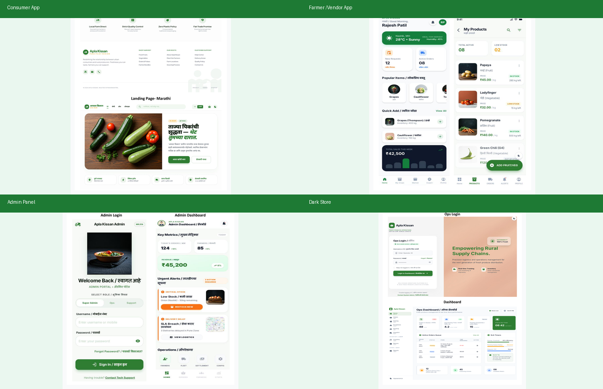
</p>

---

## 🚀 Executive Snapshot

| Area | Details |
|---|---|
| **Project Type** | Product Strategy + Business Model + Pilot Execution Case Study |
| **Industry** | Agri-commerce, Fresh Produce, Rural Commerce, Local Supply Chain |
| **Core Model** | B2C fresh produce ordering + B2B recurring supply |
| **Primary Users** | Farmers, Vendors, Consumers, B2B Buyers, Admin Team, Dark Store Operators |
| **Strategic Goal** | Predictable quality, predictable pricing, lower wastage, and reliable fulfilment |
| **Portfolio Focus** | Business analysis, product thinking, operations design, UI/UX planning, SOPs, stakeholder journeys, pilot strategy |

---

## 📱 Product Layer Preview

All four product layers have been wireframed and planned. These previews show the platform as a complete operating system, not just an ordering app.

| Preview | Product Layer | Strategic Purpose |
|---|---|---|
|  | **Consumer App** | Mobile-first fresh produce browsing, cart, checkout, delivery slot, tracking, and order history |
|  | **Farmer / Vendor App** | Supplier onboarding, KYC, product listing, stock update, order requests, payout, and reports |
|  | **Admin Panel** | Governance, approvals, customer/farmer management, pricing, orders, reports, and roles |
|  | **Dark Store Platform** | Fulfilment, picking, packing, stock exceptions, dispatch, handover, and inventory control |

---

## 🧭 Case Study Positioning

Aapla Kisan is designed as a **fresh produce operating system**, not only as a grocery ordering app.

The case study explores how a structured platform can improve:

- Farmer and vendor onboarding
- Harvest and supply declaration
- Digital quality grading
- Collection and fulfilment operations
- Consumer ordering experience
- B2B recurring supply
- Dark store inventory control
- Admin governance and reporting
- SOP-led operational discipline
- Stakeholder journey clarity
- KPI-based pilot execution

---

## 🧩 Problem Landscape

Fresh produce supply chains are difficult to scale because they are affected by demand uncertainty, price volatility, quality inconsistency, weak inventory control, and high wastage.

| Stakeholder | Core Problem | Platform Response |
|---|---|---|
| **Farmers / Vendors** | Uncertain demand, price volatility, limited structured buyer access | Onboarding, supply declaration, pricing logic, payout visibility |
| **Consumers** | Inconsistent quality, fluctuating prices, limited freshness trust | Clear product listing, delivery slot, order tracking, quality promise |
| **B2B Buyers** | Daily supply inconsistency, quality variation, procurement uncertainty | Recurring order model, rate-card logic, scheduled dispatch |
| **Operations Team** | Stockouts, wastage, dispatch delays, weak inventory visibility | Dark store dashboard, picklist, stock inward, dispatch queue, SOP rhythm |
| **Platform Team** | Need for governance, dashboards, SOPs, and role-based workflows | Admin panel, KPI tracking, approvals, reports, permissions, journey mapping |

---

## 🏗️ Proposed Solution

Aapla Kisan proposes a connected fresh supply chain model where produce moves through structured digital and operational checkpoints.

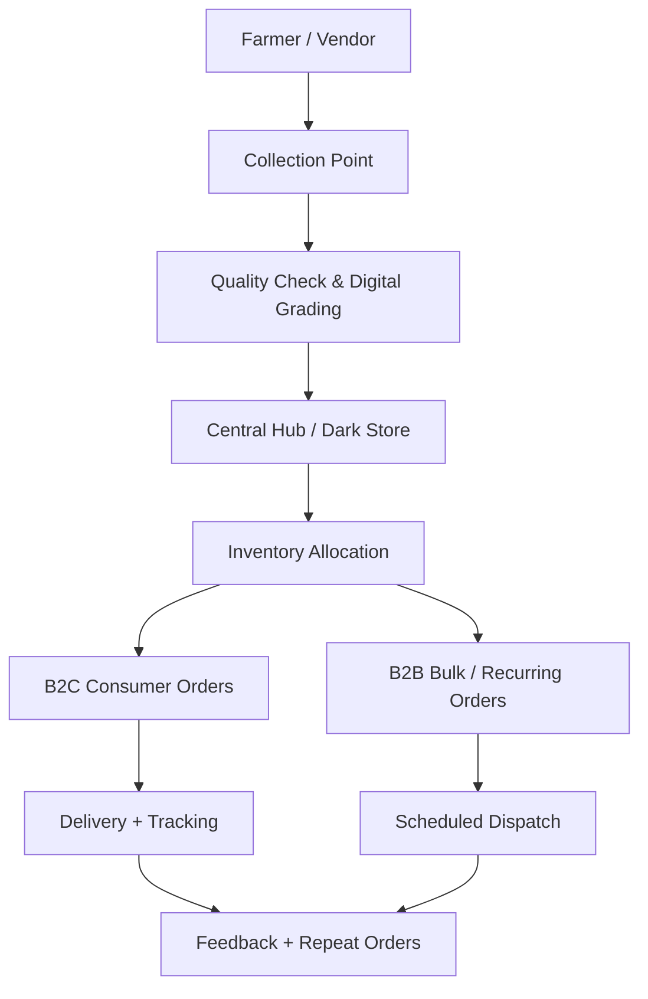
```mermaid
flowchart TD
    A[Farmer / Vendor] --> B[Collection Point]
    B --> C[Quality Check & Digital Grading]
    C --> D[Central Hub / Dark Store]
    D --> E[Inventory Allocation]
    E --> F[B2C Consumer Orders]
    E --> G[B2B Bulk / Recurring Orders]
    F --> H[Delivery + Tracking]
    G --> I[Scheduled Dispatch]
    H --> J[Feedback + Repeat Orders]
    I --> J
```

---

## 🗂️ Repository Structure

```text
aapla-kisan-growth-system/
│
├── README.md
│
├── assets/
│   └── images/
│       ├── aapla-kisan-hero-preview.png
│       ├── consumer-app-preview.png
│       ├── farmer-vendor-app-preview.png
│       ├── admin-panel-preview.png
│       ├── dark-store-preview.png
│       ├── supply_chain_flow.png
│       ├── user_journey_map.png
│       ├── ui_components.png
│       ├── analytics_template.png
│       ├── dashboard_template.png
│       ├── wastage_infographic.jpeg
│       ├── wastage_sensitivity_graph.png
│       ├── whatsapp_pilot_architecture.png
│       └── more visual assets...
│
├── docs/
│   ├── 00-design-system-and-ui-guidelines.md
│   ├── 01-business-model.md
│   ├── 02-pilot-execution-plan.md
│   ├── 03-mvp-feature-list.md
│   ├── 04-procurement-and-pricing-model.md
│   ├── 05-sop-and-operations-design.md
│   └── 06-stakeholder-journey-maps.md
│
├── wireframes/
│   ├── consumer-app.pdf
│   ├── farmer-vendor-app.pdf
│   ├── admin-panel.pdf
│   └── dark-store.pdf
│
├── diagrams/
│   ├── system-flow.drawio
│   ├── supply-chain-flow.pdf
│   ├── system-design.pdf
│   └── whatsapp-pilot-flow.pdf
│
└── marketing-assets/
    ├── posters-en/
    └── posters-mr/
```

---

## 📚 Documentation Library

| Document | Purpose | Link |
|---|---|---|
| 🎨 **Design System & UI/UX Guidelines** | Defines visual identity, typography, components, role-based UX, and accessibility direction | [Open](docs/00-design-system-and-ui-guidelines.md) |
| 📘 **Business Model** | Explains the farm-to-consumer + farm-to-business operating model | [Open](docs/01-business-model.md) |
| 🚀 **Pilot Execution Plan** | Converts the idea into a phase-wise pilot roadmap | [Open](docs/02-pilot-execution-plan.md) |
| 🧩 **MVP Feature List** | Prioritizes Day 1, Phase 2, and later features across all product layers | [Open](docs/03-mvp-feature-list.md) |
| 💰 **Procurement & Pricing Model** | Explains sourcing lanes, fixed + market-linked pricing, inventory health, and risk controls | [Open](docs/04-procurement-and-pricing-model.md) |
| 🧾 **SOP & Operations Design** | Defines sourcing, QC, collection center, dark store, wastage, dispatch, and KPI operating routines | [Open](docs/05-sop-and-operations-design.md) |
| 🗺️ **Stakeholder Journey Maps** | Maps farmer, vendor, agent, dark store, B2C, B2B, and admin journeys with KPI links | [Open](docs/06-stakeholder-journey-maps.md) |

---

## 🎨 UI/UX Design Direction

The product experience follows a **farmer-first, bilingual, clean, and operationally clear design language**.

| Design Principle | Direction |
|---|---|
| **Freshness** | Green-led visual system, produce imagery, clean backgrounds |
| **Trust** | Clear status labels, transparent payouts, visible order states |
| **Simplicity** | Large buttons, step-based forms, mobile-first actions |
| **Local Usability** | English + Marathi interface support |
| **Operational Clarity** | Dashboards, alerts, SLA timers, picklists, approval queues |
| **Scalability** | Reusable cards, tables, badges, modules, and role-based navigation |

---

## 🎨 Visual Theme

| Usage | Color Name | Hex Code |
|---|---|---|
| **Primary Actions** | Seed Green | `#1E7A34` |
| **Success / Freshness** | Leaf Green | `#2E8B57` |
| **Soft Backgrounds** | Farm Mist | `#EAF7EF` |
| **Text / Headings** | Soil Black | `#1F2937` |
| **Secondary Text** | Market Gray | `#6B7280` |
| **Warnings** | Harvest Amber | `#F59E0B` |
| **Errors / Rejections** | Tomato Red | `#EF4444` |
| **Information / Tracking** | Sky Info | `#2563EB` |

---

## 🖼️ UI & Design Asset Gallery

These images represent the visual system, dashboard direction, UI components, forms, and user experience thinking behind the Aapla Kisan platform.

| Visual | Asset | Purpose |
|---|---|---|
| 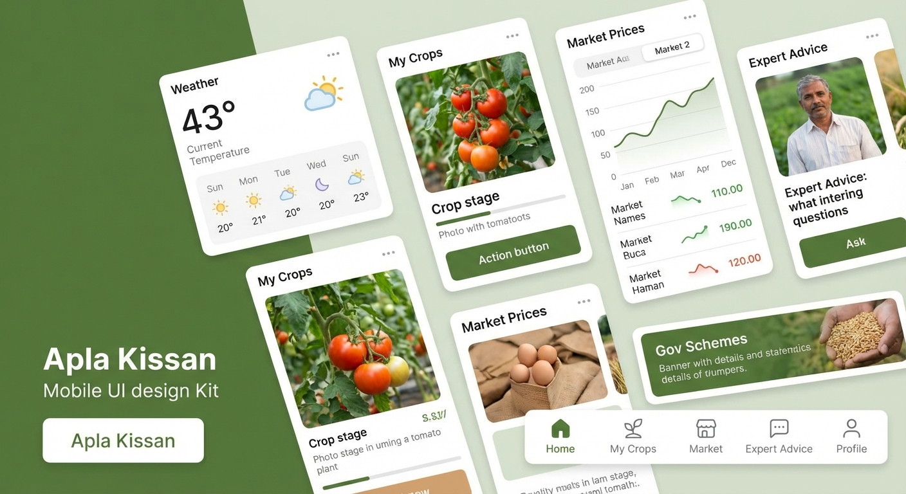 | **UI Components** | Buttons, cards, badges, forms, and reusable design components |
| 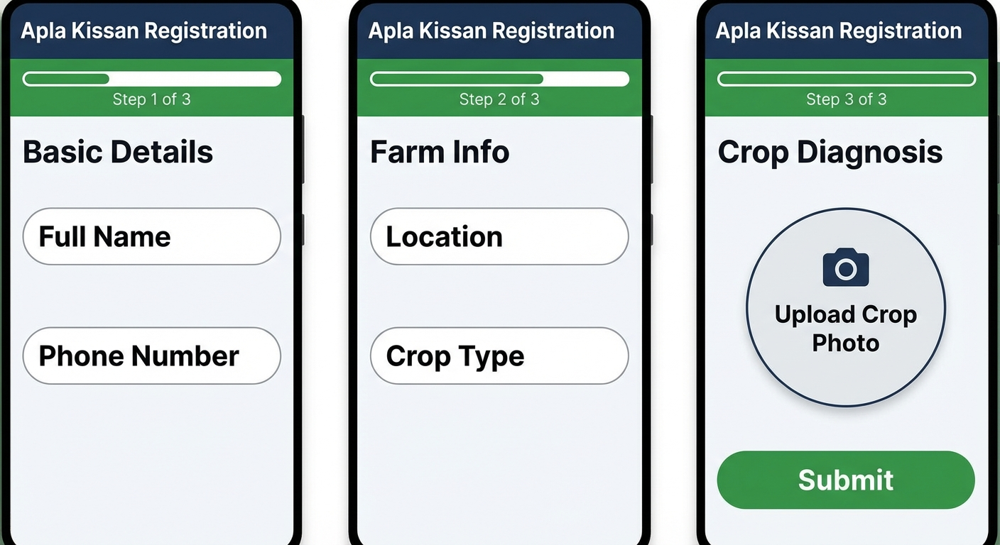 | **Forms Template** | Form design direction for onboarding and operational data capture |
|  | **Dashboard Template** | Dashboard style for monitoring KPIs, orders, inventory, and operations |
| 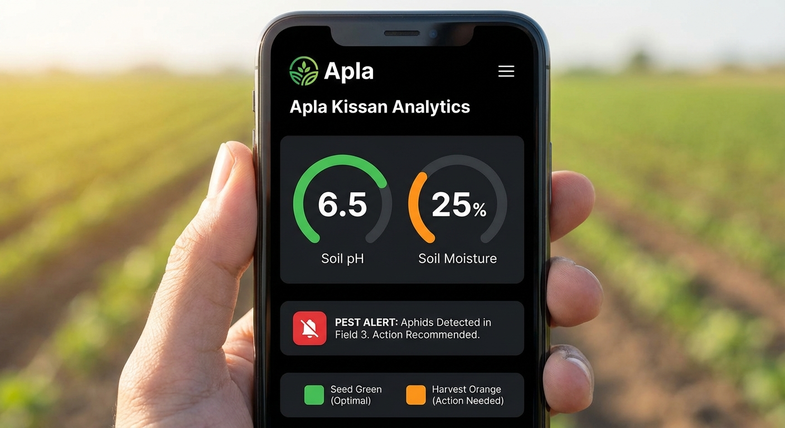 | **Analytics Template** | Analytics and reporting direction for pilot review |
| 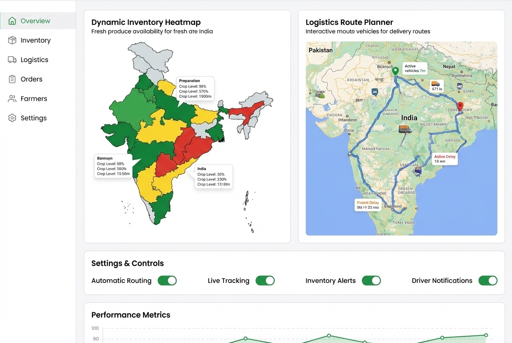 | **Admin Dashboard** | Admin-facing view for platform monitoring and controls |
| 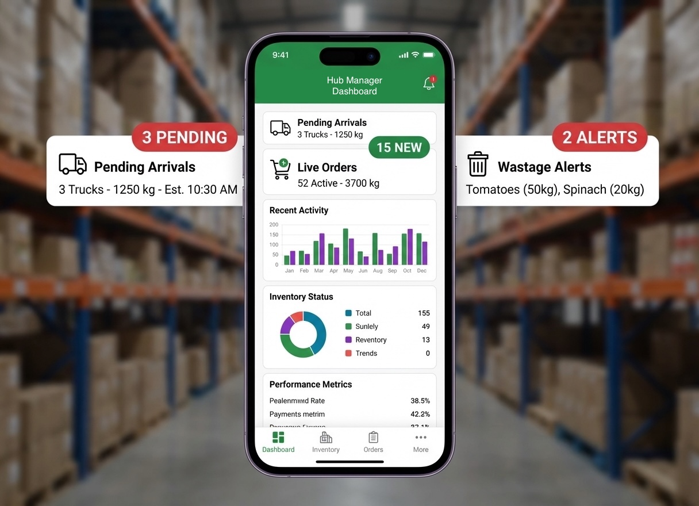 | **Hub Manager Console** | Hub/dark-store operations management concept |

---

## 🧑‍🌾 Supply Chain & Operations Asset Gallery

These visuals show sourcing, collection, grading, logistics, crate handling, dark-store workflow, and regional distribution logic.

| Visual | Asset | What It Shows |
|---|---|---|
|  | **Supply Chain Flow** | End-to-end movement from sourcing to fulfilment |
| 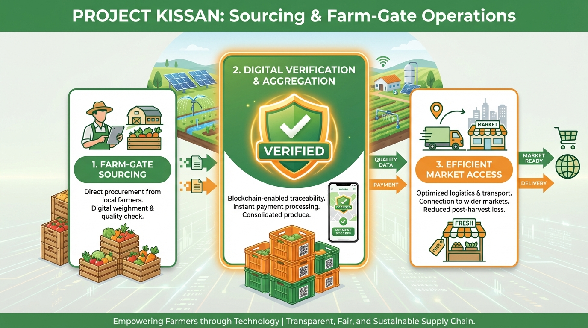 | **Farm Gate Sourcing** | Farmer/vendor sourcing and collection logic |
|  | **Cluster Hub Grading** | Collection hub and grading workflow |
|  | **Integrated Logistics** | Movement between supplier, hub, and customer layers |
| 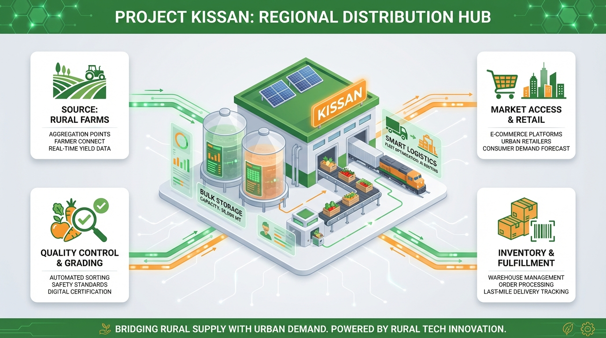 | **Regional Distribution** | Zone-wise fulfilment and distribution thinking |
| 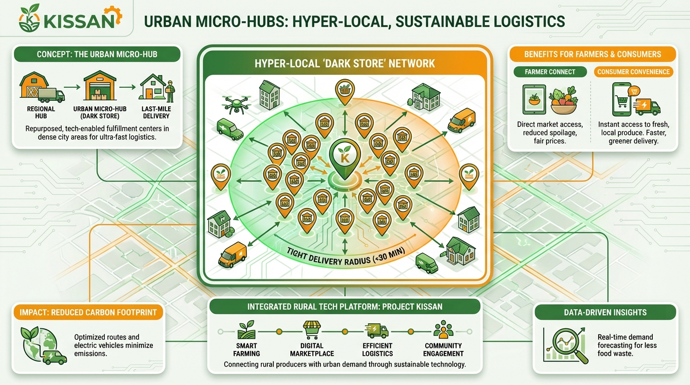 | **Urban Micro Hubs** | Micro-hub model for local delivery areas |
|  | **Crate Stacking SOP** | Handling discipline for fresh produce movement |
| 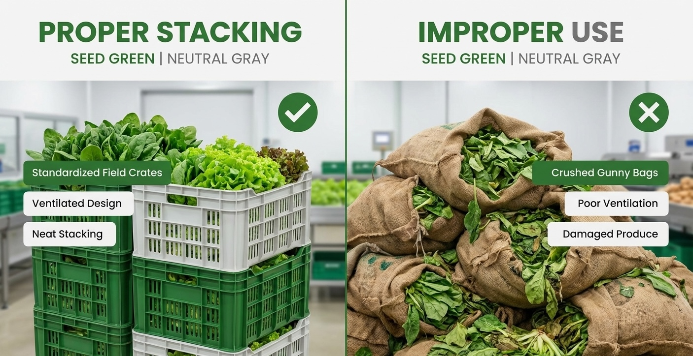 | **Field Crate Stacking** | Field-level crate handling visual reference |
|  | **Pass / Fail Guide** | Quality check and acceptance/rejection logic |
|  | **Temperature Chart** | Temperature and freshness management reference |

---

## 📊 Analytics, KPI & Risk Asset Gallery

These visuals support dashboard thinking, KPI planning, wastage control, traceability, and data-led operations.

| Visual | Asset | What It Shows |
|---|---|---|
|  | **Wastage Infographic** | Wastage control and freshness loss communication |
| 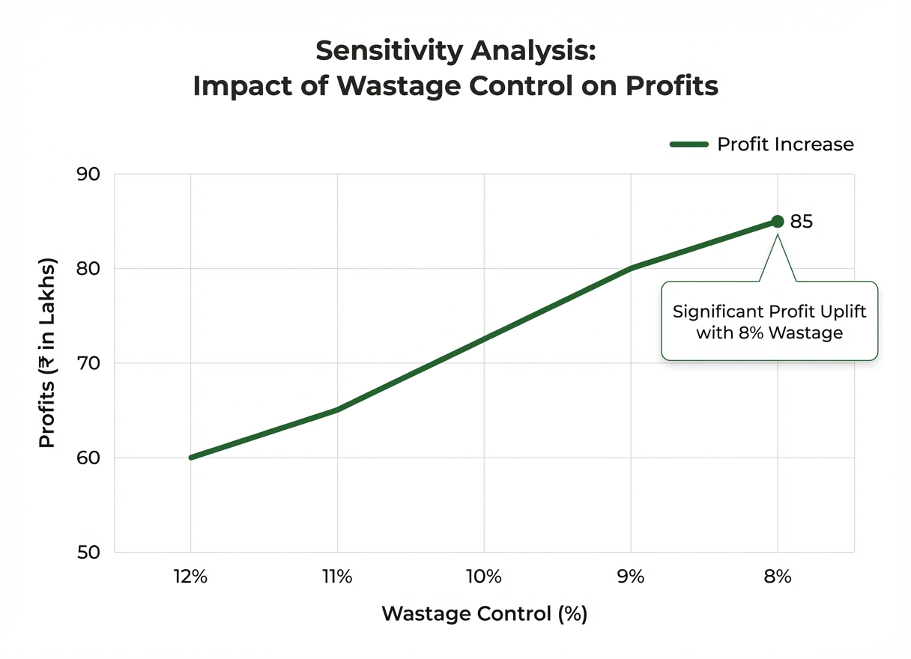 | **Wastage Sensitivity Graph** | Relationship between planning accuracy and wastage |
| 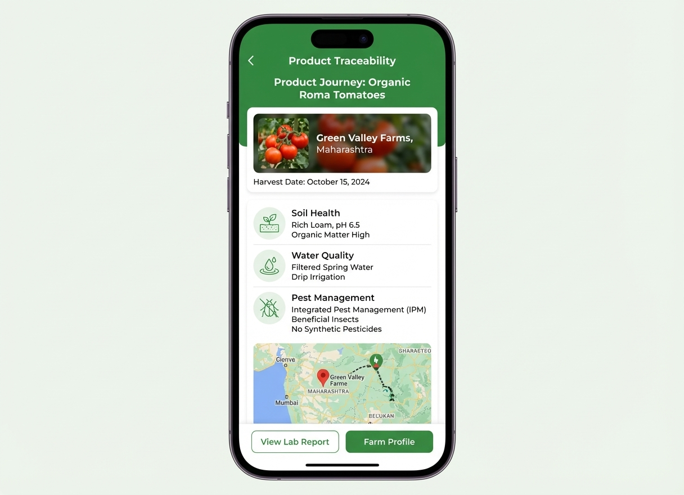 | **Traceability Mockup** | Product traceability and source visibility concept |
| 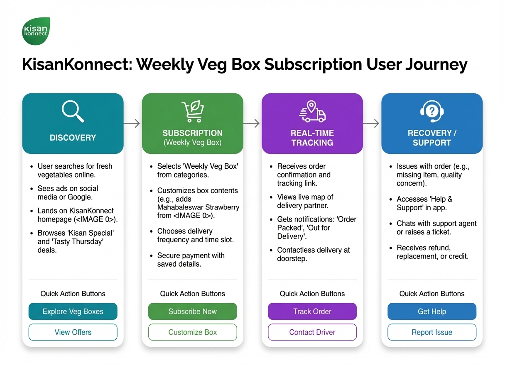 | **User Journey Map** | Stakeholder flow and user journey thinking |
| 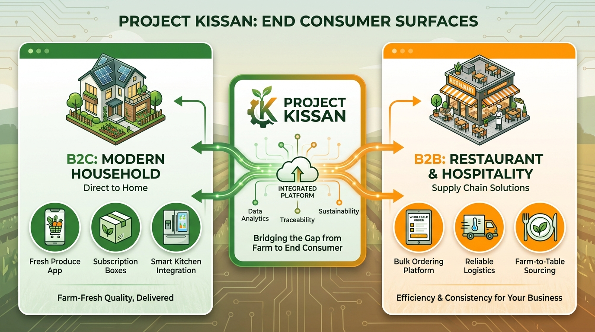 | **End Consumer Surfaces** | Consumer-facing touchpoints and interaction layers |
| 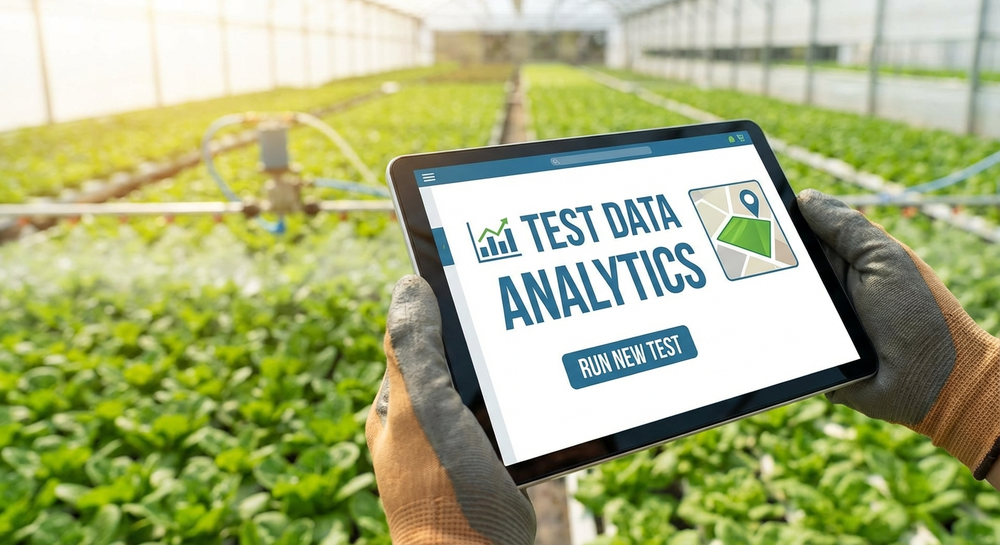 | **Testing / Experimental Asset** | Supporting visual asset for iteration/testing |

---

## 💬 WhatsApp & Pilot Tech Asset Gallery

These visuals show how Aapla Kisan could be tested through WhatsApp-first, lightweight, or pilot-friendly workflows before building a full app.

| Visual | Asset | What It Shows |
|---|---|---|
| 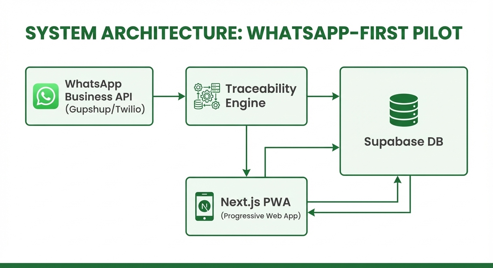 | **WhatsApp Pilot Architecture** | WhatsApp-first pilot system concept |
| 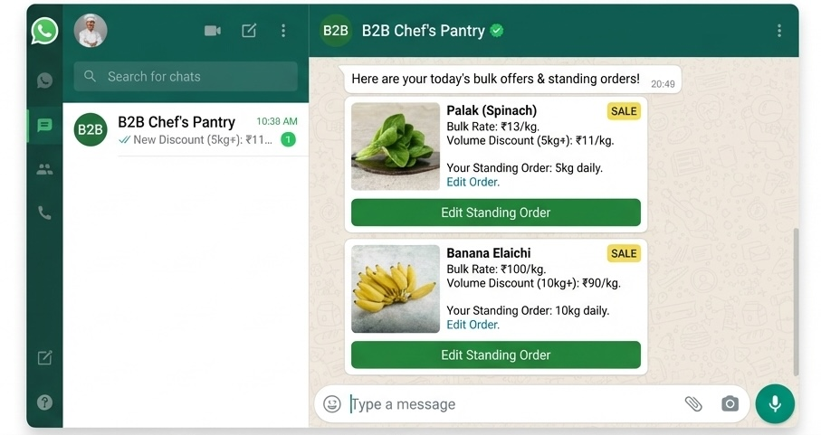 | **B2B WhatsApp Mockup** | B2B ordering and communication flow |
|  | **WhatsApp Commerce Wireframe** | WhatsApp commerce flow and screen concept |
| 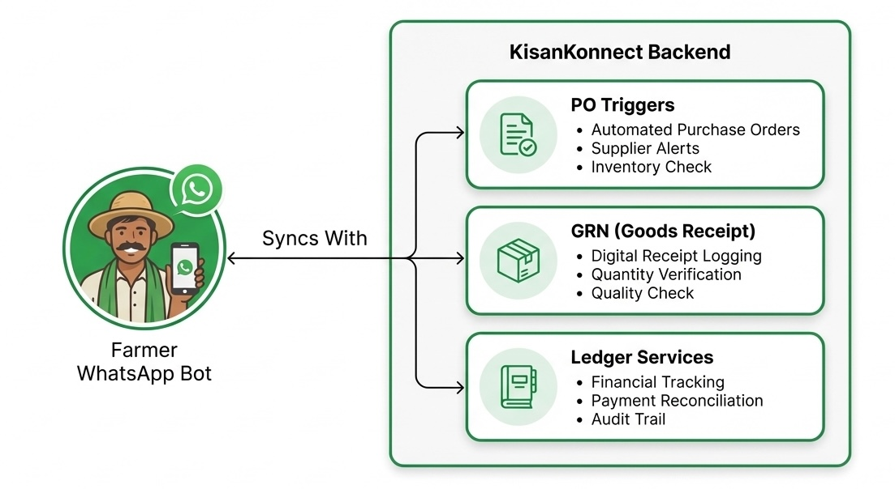 | **Farmer Bot Sync Diagram** | Farmer-side bot and data sync concept |

---

## 💼 Operating Model

The platform is built around a dual-demand model.

| Model | Explanation |
|---|---|
| **B2C Demand** | Household consumers order fresh produce through a mobile-first experience |
| **B2B Demand** | Restaurants, retailers, cafes, hostels, and institutions place recurring or scheduled orders |
| **Supply Side** | Farmers and vendors declare availability, stock, pricing, and delivery readiness |
| **Fulfilment Layer** | Collection points and dark stores manage grading, inventory, packing, and dispatch |
| **Governance Layer** | Admin team monitors approvals, pricing, inventory, orders, issues, and reports |

---

## 🔁 End-to-End Workflow

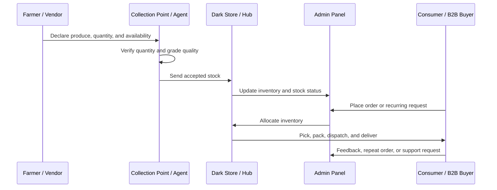
```mermaid
sequenceDiagram
    participant Farmer as Farmer / Vendor
    participant Agent as Collection Point / Agent
    participant Hub as Dark Store / Hub
    participant Admin as Admin Panel
    participant Buyer as Consumer / B2B Buyer

    Farmer->>Agent: Declare produce, quantity, and availability
    Agent->>Agent: Verify quantity and grade quality
    Agent->>Hub: Send accepted stock
    Hub->>Admin: Update inventory and stock status
    Buyer->>Admin: Place order or recurring request
    Admin->>Hub: Allocate inventory
    Hub->>Buyer: Pick, pack, dispatch, and deliver
    Buyer->>Admin: Feedback, repeat order, or support request
```

---

## 🧩 Key Platform Modules

### 📱 Consumer App

Designed for simple fresh produce ordering.

- Language selection
- Login and profile setup
- Location selection
- Fresh produce landing page
- Product categories
- Product listing
- Cart and checkout
- Delivery slot selection
- Live tracking
- Order history

---

### 👨‍🌾 Farmer / Vendor App

Designed for onboarding, stock updates, order handling, and payout transparency.

- Farmer / vendor / market role selection
- Basic details
- Business details
- KYC upload
- Bank details
- Product listing
- Price setting
- Stock update
- Order requests
- Delivery handover
- Payout summary
- Help and support
- Sales report

---

### 🧑‍💼 Admin Panel

Designed for control, monitoring, and governance.

- Admin dashboard
- Customer list
- Farmer list
- Onboarding approvals
- Category management
- Product management
- Pricing rules
- Order overview
- Dark store monitor
- Tickets and issues
- Broadcast notifications
- Sales and inventory reports
- Roles and permissions
- System settings

---

### 🏬 Dark Store Platform

Designed for fulfilment speed, accuracy, and inventory control.

- Operations login
- Order queue
- Order details
- Picklist
- Out-of-stock exception handling
- Package verification
- Dispatch queue
- Handover confirmation
- Inventory dashboard
- Stock inward
- Stock adjustment
- Returns and reports

---

## 🚀 Pilot Strategy

Aapla Kisan should be tested through a controlled pilot before scaling.

| Pilot Area | Recommended Scope |
|---|---|
| **Location** | One city or selected delivery zones |
| **Supply Side** | Selected farmers, vendors, and collection points |
| **Demand Side** | Selected B2C households and B2B buyers |
| **B2B Buyers** | Restaurants, hostels, cafes, retailers, and institutions |
| **Operations** | One hub or dark store |
| **Product Range** | Limited SKU catalog |
| **Timeline** | 3 to 6 months |

---

## 📊 Pilot Execution Flow


```mermaid
flowchart LR
    A[Scope Freeze] --> B[Ground Validation]
    B --> C[System Design]
    C --> D[SOP Planning]
    D --> E[Dry Run]
    E --> F[Live Pilot]
    F --> G[KPI Review]
    G --> H[Improve or Expand]
```

---

## 📈 Pilot Success Metrics

| KPI Category | Metrics |
|---|---|
| **Demand** | Orders, repeat orders, average order value, B2B order frequency |
| **Supply** | Active suppliers, declared vs actual supply, supplier reliability |
| **Quality** | Accepted stock, rejected stock, complaint rate |
| **Inventory** | Wastage %, shrinkage, stockouts, SKU availability |
| **Operations** | Fulfilment rate, picking time, packing time, dispatch time |
| **Delivery** | On-time delivery, delayed orders, failed deliveries |
| **Finance** | Procurement variance, gross margin, delivery cost per order |

---

## 🏆 Business Value

Aapla Kisan can create value by connecting supply, demand, fulfilment, and governance into one operating model.

| Value Driver | Business Impact |
|---|---|
| **Predictive Supply** | Better procurement planning through farmer/vendor declarations |
| **Predictive Demand** | Better planning through pre-booking and recurring B2B orders |
| **Digital Grading** | Better trust and quality consistency |
| **Dark Store Control** | Faster picking, packing, dispatch, and inventory tracking |
| **B2C + B2B Engine** | Reduced dependency on only one customer segment |
| **SOP Governance** | Repeatable operations across collection, QC, inventory, packing, dispatch, and issue handling |
| **KPI Governance** | Better control over wastage, stockouts, fulfilment, supplier reliability, and margins |

---

## 🧠 Skills Demonstrated

This case study demonstrates end-to-end product and operations thinking across 9 skill areas.

| Skill Area | Demonstrated Through | Proof Point |
|---|---|---|
| **Business Strategy** | Fresh supply chain model, B2C/B2B planning, value proposition | [Business Model](docs/01-business-model.md) |
| **Product Strategy** | User roles, product modules, MVP thinking, role-based flows | [MVP Feature List](docs/03-mvp-feature-list.md) |
| **UI/UX Thinking** | Bilingual design, mobile-first journeys, operational dashboards | [Design System](docs/00-design-system-and-ui-guidelines.md) + product previews |
| **Operations Planning** | Dark store workflow, inventory, dispatch, QC, SOP logic | [SOP & Operations Design](docs/05-sop-and-operations-design.md) |
| **Stakeholder Mapping** | Farmer, vendor, agent, consumer, B2B, admin, and dark-store journeys | [Stakeholder Journey Maps](docs/06-stakeholder-journey-maps.md) |
| **Go-To-Market Thinking** | Pilot-first rollout, demand validation, B2B buyer mapping | [Pilot Execution Plan](docs/02-pilot-execution-plan.md) |
| **Procurement Strategy** | 3-lane sourcing, pricing governance, pre-booking, inventory health | [Procurement & Pricing Model](docs/04-procurement-and-pricing-model.md) |
| **Analytics** | KPI framework, weekly review rhythm, performance metrics | Dashboard and analytics assets |
| **Documentation** | Public case study, structured project communication, implementation planning | Multi-doc repo structure |

---

## 📊 Project Completion Status

| Area | Item | Status |
|---|---|---|
| **Documentation** | Design system | ✅ Complete |
| **Documentation** | Business model | ✅ Complete |
| **Documentation** | Pilot execution plan | ✅ Complete |
| **Documentation** | MVP feature list | ✅ Complete |
| **Documentation** | Procurement and pricing model | ✅ Complete |
| **Documentation** | SOP and operations design | ✅ Complete |
| **Documentation** | Stakeholder journey maps | ✅ Complete |
| **Visual Assets** | Product previews | ✅ Complete |
| **Visual Assets** | UI components and dashboard visuals | ✅ Complete |
| **Visual Assets** | Supply chain and operations images | ✅ Complete |
| **Wireframes** | Consumer, farmer/vendor, admin, dark store PDFs | 🔄 To link/upload if not already added |
| **Diagrams** | System flow, supply chain flow, WhatsApp pilot flow | 🔄 To link/upload if not already added |
| **Portfolio Website** | GitHub Pages case study page | ⏳ Planned |
| **LinkedIn** | Project announcement post | ⏳ Planned |

---

## 📝 Professional Note

This repository is created as a public portfolio case study to demonstrate product strategy, business analysis, operations planning, UI/UX thinking, SOP design, stakeholder journey mapping, pilot execution design, and fresh supply chain systems thinking.

Sensitive client-specific names, private budgets, payment terms, internal proposal details, and confidential implementation terms have been removed or generalized.

---

<div align="center">

### Built as a proof-of-work case study for Digital Growth, Product Strategy, Business Analysis, Operations Planning, and Fresh Supply Chain Execution.

</div>
