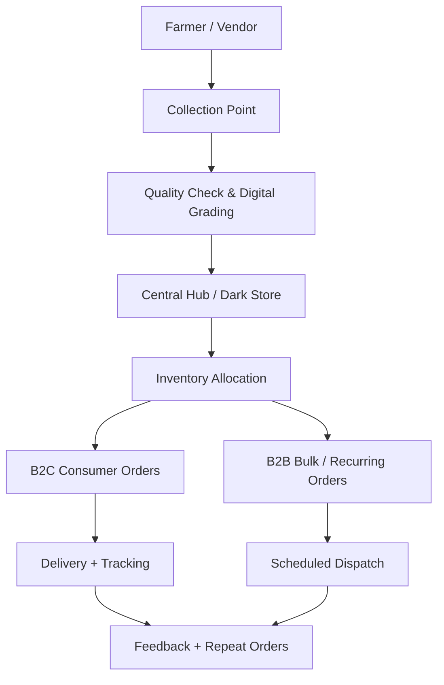
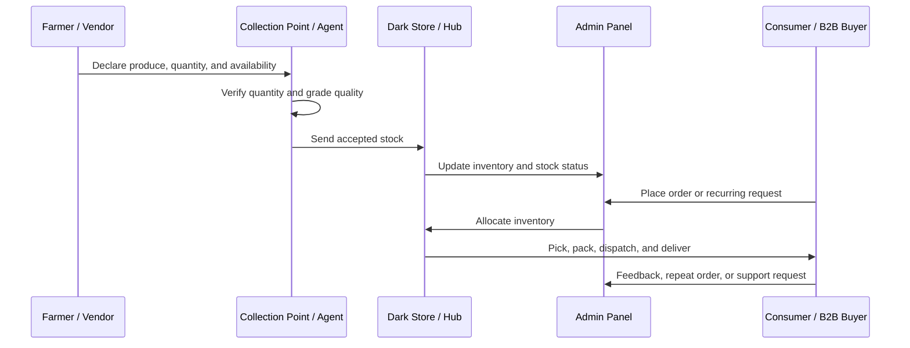

# 🌾 Aapla Kisan Growth System

### Product Strategy, Pilot Blueprint & Fresh Supply Chain Operating Model

A proof-of-work case study for designing a farm-to-consumer and farm-to-business fresh produce platform that connects farmers, vendors, collection points, dark stores, consumers, and B2B buyers.

 

---

## Executive Snapshot

| Area | Details |
|---|---|
| **Project Type** | Product Strategy + Business Model + Pilot Execution Case Study |
| **Industry** | Agri-commerce, Fresh Produce, Rural Commerce, Local Supply Chain |
| **Core Model** | B2C fresh produce ordering + B2B recurring supply |
| **Primary Users** | Farmers, Vendors, Consumers, B2B Buyers, Admin Team, Dark Store Operators |
| **Strategic Goal** | Predictable quality, predictable pricing, lower wastage, and reliable fulfilment |
| **Portfolio Focus** | Business analysis, product thinking, operations design, UI/UX planning, pilot strategy |

---

## Case Study Positioning

Aapla Kisan is designed as a **fresh produce operating system**, not only as an ordering app.

The case study explores how a structured platform can improve:

- Farmer and vendor onboarding
- Harvest and supply declaration
- Digital quality grading
- Collection and fulfilment operations
- Consumer ordering experience
- B2B recurring supply
- Dark store inventory control
- Admin governance and reporting
- KPI-based pilot execution

---

## Problem Landscape

Fresh produce supply chains are difficult to scale because they are affected by demand uncertainty, price volatility, quality inconsistency, weak inventory control, and high wastage.

| Stakeholder | Core Problem |
|---|---|
| **Farmers / Vendors** | Uncertain demand, price volatility, limited structured buyer access |
| **Consumers** | Inconsistent quality, fluctuating prices, limited freshness trust |
| **B2B Buyers** | Daily supply inconsistency, quality variation, procurement uncertainty |
| **Operations Team** | Stockouts, wastage, dispatch delays, weak inventory visibility |
| **Platform Team** | Need for governance, dashboards, SOPs, and role-based workflows |

---

## Proposed Solution

Aapla Kisan proposes a connected fresh supply chain model where produce moves through structured digital and operational checkpoints.

---

## Product Ecosystem

The platform is planned across four user-facing layers.

| Product Layer | Purpose | Key Capabilities |
|---|---|---|
| **Consumer App** | Fresh produce discovery and ordering | Language selection, location, product listing, cart, checkout, delivery slot, tracking |
| **Farmer / Vendor App** | Supplier onboarding and stock management | Role selection, KYC, bank details, product upload, stock update, order requests, payout |
| **Admin Panel** | Governance, monitoring, approvals, and controls | Dashboard, customers, farmers, approvals, products, pricing, orders, reports, roles |
| **Dark Store Platform** | Fulfilment, inventory, picking, packing, and dispatch | Order queue, picklist, exceptions, packing verification, dispatch, handover, inventory |

---

## UI/UX Design Direction

The product experience follows a **farmer-first, bilingual, clean, and operationally clear design language**.

| Design Principle | Direction |
|---|---|
| **Freshness** | Green-led visual system, produce imagery, clean backgrounds |
| **Trust** | Clear status labels, transparent payouts, visible order states |
| **Simplicity** | Large buttons, step-based forms, mobile-first actions |
| **Local Usability** | English + Marathi interface support |
| **Operational Clarity** | Dashboards, alerts, SLA timers, picklists, approval queues |
| **Scalability** | Reusable cards, tables, badges, modules, and role-based navigation |

---

## Visual Theme

| Usage | Color Name | Hex Code |
|---|---|---|
| **Primary Actions** | Seed Green | `#1E7A34` |
| **Success / Freshness** | Leaf Green | `#2E8B57` |
| **Soft Backgrounds** | Farm Mist | `#EAF7EF` |
| **Text / Headings** | Soil Black | `#1F2937` |
| **Secondary Text** | Market Gray | `#6B7280` |
| **Warnings** | Harvest Amber | `#F59E0B` |
| **Errors / Rejections** | Tomato Red | `#EF4444` |
| **Information / Tracking** | Sky Info | `#2563EB` |

---

## Operating Model

The platform is built around a dual-demand model.

| Model | Explanation |
|---|---|
| **B2C Demand** | Household consumers order fresh produce through a mobile-first experience |
| **B2B Demand** | Restaurants, retailers, cafes, hostels, and institutions place recurring or scheduled orders |
| **Supply Side** | Farmers and vendors declare availability, stock, pricing, and delivery readiness |
| **Fulfilment Layer** | Collection points and dark stores manage grading, inventory, packing, and dispatch |
| **Governance Layer** | Admin team monitors approvals, pricing, inventory, orders, issues, and reports |

---

## End-to-End Workflow

---

## Key Platform Modules

### Consumer App

Designed for simple fresh produce ordering.

- Language selection
- Login and profile setup
- Location selection
- Fresh produce landing page
- Product categories
- Product listing
- Cart and checkout
- Delivery slot selection
- Live tracking
- Order history

---

### Farmer / Vendor App

Designed for onboarding, stock updates, order handling, and payout transparency.

- Farmer / vendor / market role selection
- Basic details
- Business details
- KYC upload
- Bank details
- Product listing
- Price setting
- Stock update
- Order requests
- Delivery handover
- Payout summary
- Help and support
- Sales report

---

### Admin Panel

Designed for control, monitoring, and governance.

- Admin dashboard
- Customer list
- Farmer list
- Onboarding approvals
- Category management
- Product management
- Pricing rules
- Order overview
- Dark store monitor
- Tickets and issues
- Broadcast notifications
- Sales and inventory reports
- Roles and permissions
- System settings

---

### Dark Store Platform

Designed for fulfilment speed, accuracy, and inventory control.

- Operations login
- Order queue
- Order details
- Picklist
- Out-of-stock exception handling
- Package verification
- Dispatch queue
- Handover confirmation
- Inventory dashboard
- Stock inward
- Stock adjustment
- Returns and reports

---

## Pilot Strategy

Aapla Kisan should be tested through a controlled pilot before scaling.

| Pilot Area | Recommended Scope |
|---|---|
| **Location** | One city or selected delivery zones |
| **Supply Side** | Selected farmers, vendors, and collection points |
| **Demand Side** | Selected B2C households and B2B buyers |
| **B2B Buyers** | Restaurants, hostels, cafes, retailers, and institutions |
| **Operations** | One hub or dark store |
| **Product Range** | Limited SKU catalog |
| **Timeline** | 3 to 6 months |

---

## Pilot Execution Flow

---

## Pilot Success Metrics

| KPI Category | Metrics |
|---|---|
| **Demand** | Orders, repeat orders, average order value, B2B order frequency |
| **Supply** | Active suppliers, declared vs actual supply, supplier reliability |
| **Quality** | Accepted stock, rejected stock, complaint rate |
| **Inventory** | Wastage %, shrinkage, stockouts, SKU availability |
| **Operations** | Fulfilment rate, picking time, packing time, dispatch time |
| **Delivery** | On-time delivery, delayed orders, failed deliveries |
| **Finance** | Procurement variance, gross margin, delivery cost per order |

---

## Business Value

Aapla Kisan can create value by connecting supply, demand, fulfilment, and governance into one operating model.

| Value Driver | Business Impact |
|---|---|
| **Predictive Supply** | Better procurement planning through farmer/vendor declarations |
| **Predictive Demand** | Better planning through pre-booking and recurring B2B orders |
| **Digital Grading** | Better trust and quality consistency |
| **Dark Store Control** | Faster picking, packing, dispatch, and inventory tracking |
| **B2C + B2B Engine** | Reduced dependency on only one customer segment |
| **KPI Governance** | Better control over wastage, stockouts, fulfilment, and margins |

---

## Skills Demonstrated

| Skill Area | Demonstrated Through |
|---|---|
| **Business Strategy** | Fresh supply chain model, B2C/B2B planning, value proposition |
| **Product Strategy** | User roles, product modules, MVP thinking, role-based flows |
| **UI/UX Thinking** | Bilingual design, mobile-first journeys, operational dashboards |
| **Operations Planning** | Dark store workflow, inventory, dispatch, QC, SOP logic |
| **Go-To-Market Thinking** | Pilot-first rollout, demand validation, B2B buyer mapping |
| **Analytics** | KPI framework, weekly review rhythm, performance metrics |
| **Documentation** | Public case study, structured project communication, implementation planning |

---

## Repository Roadmap

This repository will be developed in stages.

| Stage | File / Folder | Purpose |
|---|---|---|
| **1** | `README.md` | Main case study overview |
| **2** | `docs/00-design-system-and-ui-guidelines.md` | UI/UX theme, colors, components, and role-based design |
| **3** | `docs/01-business-model.md` | Detailed business and operating model |
| **4** | `docs/02-pilot-execution-plan.md` | Pilot execution roadmap |
| **5** | `docs/03-mvp-feature-list.md` | MVP feature planning |
| **6** | `wireframes/` | Consumer, farmer/vendor, admin, and dark store PDFs |
| **7** | `diagrams/` | System architecture and operating flow |
| **8** | `marketing-assets/` | Public-safe posters and campaign creatives |

---

## Project Status

| Component | Status |
|---|---|
| Business model | ✅ Drafted |
| Consumer app screens | ✅ Prepared |
| Farmer/vendor app screens | ✅ Prepared |
| Admin panel screens | ✅ Prepared |
| Dark store screens | ✅ Prepared |
| System workflow diagram | ✅ Prepared |
| Public GitHub documentation | 🔄 In progress |
| Portfolio website integration | ⏳ Pending |

---

## Professional Note

This repository is created as a public portfolio case study to demonstrate product strategy, business analysis, operations planning, UI/UX thinking, and pilot execution design.

Sensitive client-specific names, private budgets, payment terms, internal proposal details, and confidential implementation terms have been removed or generalized.

---

### Built as a proof-of-work case study for Digital Growth, Product Strategy, Business Analysis, and Operations Planning.

