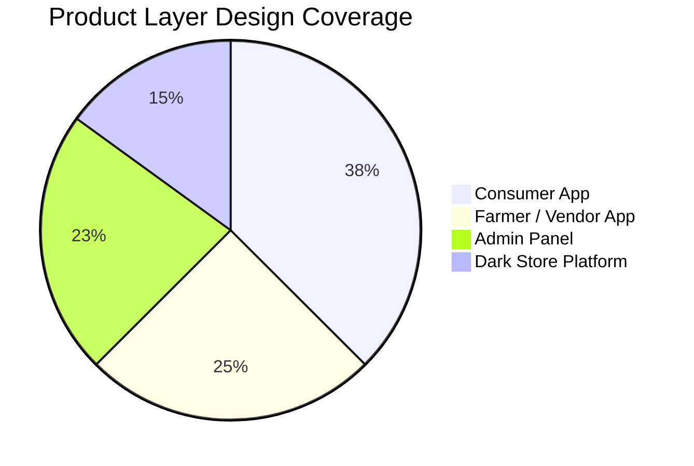
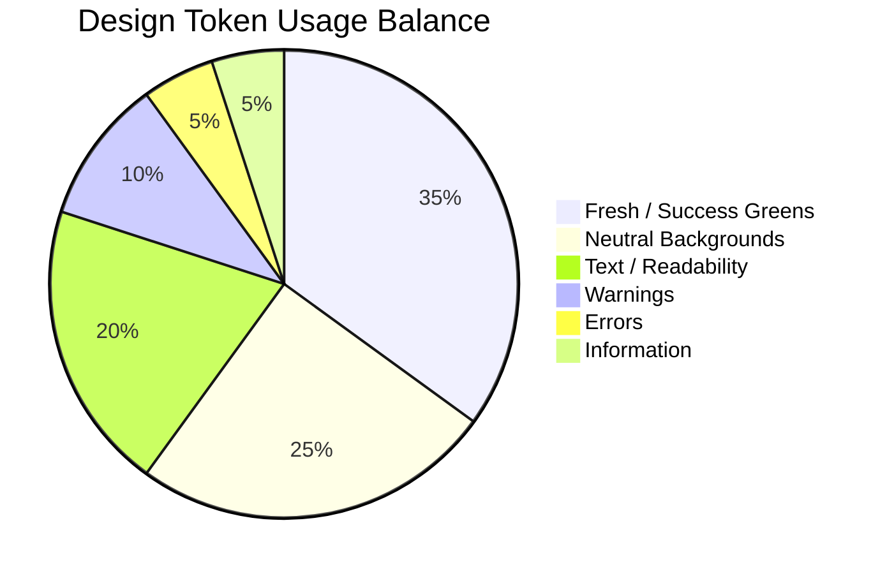
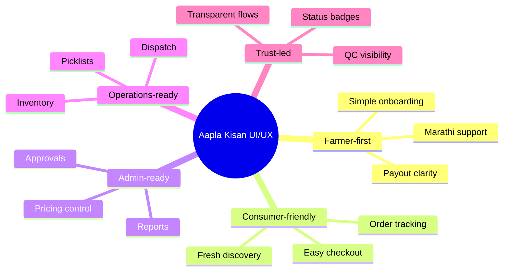

<div align="center">

# 🎨 Aapla Kisan Design System & UI/UX Guidelines

### Farmer-First, Bilingual, Fresh Commerce Interface

A visual design system for a fresh produce operating platform serving farmers, vendors, consumers, B2B buyers, admin teams, collection agents, and dark-store operators.

<br>


</div>

---

<p align="center">
  
</p>

---

## 🧭 Design Vision

Aapla Kisan should feel like a trusted local fresh produce platform that is simple enough for rural and semi-urban users, while structured enough for admin, operations, B2B, and fulfilment teams.

The design system is built around six experience goals.

| Attribute | Meaning |
|---|---|
| 🌿 **Fresh** | Reflects agriculture, produce, sustainability, and trust |
| ✅ **Simple** | Easy for farmers, vendors, consumers, and field teams to understand |
| 🌐 **Bilingual** | English + Marathi support for local usability |
| 🏬 **Operational** | Clear dashboards, status labels, alerts, picklists, and action flows |
| 🔐 **Trustworthy** | Transparent onboarding, payouts, quality checks, and order status |
| 📈 **Scalable** | Reusable cards, tables, dashboards, badges, modules, and components |

---

# 📊 Repository-Based UI Coverage Metrics

These are current project coverage metrics based on the uploaded wireframe previews and public portfolio files.

| Product Layer | Screen Coverage | UX Priority |
|---|---:|---|
| 📱 Consumer App | 15 | Ordering, checkout, tracking, repeat purchase |
| 👨‍🌾 Farmer / Vendor App | 10 | Onboarding, listing, stock, payout |
| 🧑‍💼 Admin Panel | 9 | Governance, approvals, products, pricing, reports |
| 🏬 Dark Store Platform | 6 | Picking, packing, dispatch, inventory |

```mermaid
xyChart-beta
    title "Current Wireframe Screen Coverage"
    x-axis ["Consumer", "Farmer/Vendor", "Admin", "Dark Store"]
    y-axis "Screens" 0 --> 16
    bar [15, 10, 9, 6]
```



---

# 🎨 Core Color Palette

The visual identity uses fresh greens, soft backgrounds, strong dark text, and operational status colors.

| Usage | Color Name | Hex Code | Purpose |
|---|---|---|---|
| **Primary Action** | Seed Green | `#1E7A34` | Primary CTAs, active navigation, approval actions |
| **Success / Freshness** | Leaf Green | `#2E8B57` | Verified, completed, accepted, fresh indicators |
| **Soft Background** | Farm Mist | `#EAF7EF` | Cards, product surfaces, calm section backgrounds |
| **Main Text** | Soil Black | `#1F2937` | Headings and main readable text |
| **Secondary Text** | Market Gray | `#6B7280` | Helper text, descriptions, inactive labels |
| **Warning** | Harvest Amber | `#F59E0B` | Pending, delayed, low stock, action needed |
| **Error / Critical** | Tomato Red | `#EF4444` | Rejected, cancelled, failed, out-of-stock |
| **Information** | Sky Info | `#2563EB` | Tracking, links, route states, information |



---

# 🧩 UI Components

<p align="center">
  
</p>

## Component Principles

| Component | Design Direction |
|---|---|
| **Buttons** | Large, rounded, clear action labels, strong contrast |
| **Cards** | Product, farmer, order, metric, inventory, and alert cards |
| **Badges** | Status-first scanability: verified, pending, rejected, packed, dispatched |
| **Forms** | Short labels, helper text, step progress, low-friction uploads |
| **Tables** | Admin and operations-focused rows with quick decision signals |
| **Dashboards** | Metric-first, alert-driven, weekly review friendly |

---

# 🧾 Forms & Data Capture

<p align="center">
  
</p>

Forms should be simple, guided, and mobile-friendly.

| Form Area | Data Captured | UX Rule |
|---|---|---|
| Farmer Basic Details | Name, mobile, address, city, pincode | Use short labels and Marathi helper text |
| Business Details | Farmer/vendor type, farm/shop name, category | Keep choices easy to select |
| KYC Upload | ID proof, bank proof, document image | Show upload progress and status |
| Bank Details | Account number, IFSC, confirmation | Add validation and double-confirmation |
| Product Upload | Name, category, image, unit, price | Use examples and clear units |
| Stock Update | Quantity, availability, expected supply | Keep fast repeat entry possible |

---

# 📱 Role-Based Product Preview

| Product Layer | Preview | UX Focus |
|---|---|---|
| **Consumer App** |  | Fresh discovery, order placement, tracking, repeat order |
| **Farmer / Vendor App** |  | Onboarding, product listing, stock update, payout clarity |
| **Admin Panel** |  | Approvals, pricing, categories, reports, issue control |
| **Dark Store Platform** |  | Order queue, picklist, packing, dispatch, inventory |

---

# 🧭 Role-Based Navigation

## Consumer Navigation

Home → Categories → Search → Cart → Orders → Profile

## Farmer / Vendor Navigation

Dashboard → Products → Orders → Stock → Payout → Support → Profile

## Admin Navigation

Dashboard → Customers → Farmers → Approvals → Categories → Products → Orders → Reports → Settings

## Dark Store Navigation

Ops Dashboard → Orders → Picking → Packing → Dispatch → Inventory → Returns → Reports

---

# 🏬 Operational Dashboard Direction

<p align="center">
  
</p>

Operational dashboards should reduce decision time.

| Dashboard Area | Required Signals |
|---|---|
| Order Queue | Pending, picking, packed, dispatched, delayed |
| Inventory | Low stock, out-of-stock, ageing stock, SKU availability |
| Quality | Accepted stock, rejected stock, complaint rate |
| Fulfilment | Picking time, packing time, dispatch status |
| Procurement | Declared vs actual supply, supplier reliability, price variance |
| Governance | Daily alerts, weekly KPIs, escalation owners |

---

# ♿ Accessibility & Local Usability

| Guideline | Rule |
|---|---|
| Readability | Use strong contrast and readable font sizes |
| Language | Support English + Marathi for local users |
| Touch Comfort | Use large buttons and enough spacing |
| Status Clarity | Use color + text, not color alone |
| Low Cognitive Load | One main task per mobile screen |
| Error Recovery | Use clear error messages and next action |
| Field Users | Keep upload, stock update, and support flows simple |

---

# 🧠 UX Principle Map



---

# 🏆 Skills Demonstrated

| Skill Area | Demonstrated Through |
|---|---|
| **UI/UX Strategy** | Farmer-first, bilingual, operationally clear design system |
| **Product Thinking** | Role-based navigation and multi-sided platform design |
| **Visual Systems** | Palette, components, badges, cards, dashboards, forms |
| **Accessibility** | Local language, contrast, mobile-first interaction design |
| **Operations UX** | Picklists, order queue, inventory signals, SLA states |
| **Analytics UX** | Dashboard-ready metric grouping and status hierarchy |

---

# 📝 Public Portfolio Note

This document is a public-safe design system created for portfolio presentation. It uses project-owned visual assets, wireframe previews, and repository-based planning metrics. It does not include confidential client implementation data.
