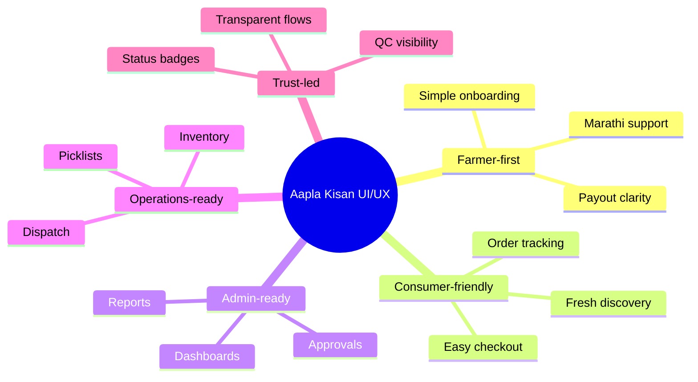

# Aapla Kisan Design System & UI/UX Guidelines

## Farmer-First, Bilingual, Fresh Commerce Interface

This document defines the visual design direction, UI/UX principles, color palette, typography, component system, and role-based interface strategy for the Aapla Kisan Growth System.

The design system is built for a fresh produce platform serving farmers, vendors, consumers, B2B buyers, admin teams, and dark store operations teams.

---

## 1. Design Vision

Aapla Kisan should feel like a trusted local fresh produce platform that is simple enough for rural and semi-urban users, while structured enough for operations teams, admin teams, and B2B buyers.

The product experience should feel:

| Attribute | Meaning |
|---|---|
| **Fresh** | Reflects agriculture, produce, sustainability, and trust |
| **Simple** | Easy for farmers, vendors, and consumers to understand |
| **Bilingual** | English + Marathi support for local usability |
| **Operational** | Clear dashboards, status labels, alerts, and action flows |
| **Trustworthy** | Transparent onboarding, payouts, order status, and quality checks |
| **Scalable** | Reusable cards, tables, dashboards, modules, and components |

---

## 2. Brand Personality

Aapla Kisan should not feel like a complex enterprise tool or a premium urban-only grocery app.

It should feel like a practical, local, and scalable fresh supply chain platform.

| Brand Trait | UI/UX Expression |
|---|---|
| **Farmer-first** | Simple onboarding, Marathi support, clear form labels |
| **Fresh and natural** | Green palette, produce imagery, light backgrounds |
| **Trust-led** | Verification, status badges, payout visibility, order tracking |
| **Action-oriented** | Large buttons, clear CTAs, minimal confusion |
| **Operations-ready** | Dashboards, queue views, inventory states, SLA alerts |
| **Community-driven** | Local language, regional identity, accessible interface |

---

## 3. Core Color Palette

The visual system is based on greens, light neutrals, and functional alert colors.

| Usage | Color Name | Hex Code | Purpose |
|---|---|---|---|
| **Primary Action** | Seed Green | `#1E7A34` | Main CTA buttons, active navigation, primary actions |
| **Freshness / Success** | Leaf Green | `#2E8B57` | Success states, verified badges, freshness indicators |
| **Soft Background** | Farm Mist | `#EAF7EF` | Cards, sections, gentle background panels |
| **Main Text** | Soil Black | `#1F2937` | Headings and main readable text |
| **Secondary Text** | Market Gray | `#6B7280` | Helper text, descriptions, inactive labels |
| **Page Background** | Clean White | `#F9FAFB` | App background and large empty spaces |
| **Warning** | Harvest Amber | `#F59E0B` | Pending, low stock, delayed, attention needed |
| **Error / Critical** | Tomato Red | `#EF4444` | Rejected, failed, cancelled, out of stock |
| **Information** | Sky Info | `#2563EB` | Tracking, links, informational status |

---

## 4. Color Usage Rules

### Primary Green

Use `Seed Green` for important user actions.

Examples:

- Continue
- Save & Continue
- Submit Documents
- Add to Cart
- Confirm Pick
- Complete Packing
- Confirm Handover
- Approve Farmer
- Save Changes

```text
Background: #1E7A34
Text: #FFFFFF
Hover: #16652B
Border Radius: 12px
```

---

### Success Green

Use `Leaf Green` for positive states.

Examples:

- Verified
- In Stock
- Completed
- Accepted
- Freshness Checked
- Payment Completed
- Order Delivered

```text
Background: #EAF7EF
Text: #2E8B57
Border: #2E8B57
```

---

### Warning Amber

Use `Harvest Amber` for pending or attention states.

Examples:

- Pending Review
- Low Stock
- Delivery Delay
- SLA Warning
- Action Required
- Exceptions Pending

```text
Background: #FFF7E6
Text: #B45309
Border: #F59E0B
```

---

### Error Red

Use `Tomato Red` for critical or negative states.

Examples:

- Out of Stock
- Failed KYC
- Rejected Batch
- Cancelled Order
- Critical Issue
- Payment Failed

```text
Background: #FEE2E2
Text: #B91C1C
Border: #EF4444
```

---

## 5. Typography System

The interface should be clean, readable, and suitable for both English and Marathi.

### Recommended Fonts

| Usage | Font Recommendation |
|---|---|
| English UI | Inter, Poppins, Noto Sans |
| Marathi UI | Noto Sans Devanagari |
| Dashboard UI | Inter or Noto Sans |
| Marketing Assets | Poppins + Noto Sans Devanagari |

---

### Typography Rules

| Element | Style Direction |
|---|---|
| **Main Heading** | Bold, large, clear |
| **Section Heading** | Semi-bold, medium-large |
| **Body Text** | Regular, readable |
| **Form Labels** | Medium weight |
| **Helper Text** | Smaller, gray, simple |
| **Button Text** | Semi-bold, short |
| **Status Labels** | Bold enough to scan quickly |

---

## 6. UI Component System

## 6.1 Buttons

### Primary Button

Used for main actions.

```text
Background: #1E7A34
Text: #FFFFFF
Border Radius: 12px
Font Weight: 600
Padding: 12px 20px
```

Examples:

- Continue
- Save & Continue
- Submit Documents
- Add to Cart
- Complete Packing

---

### Secondary Button

Used for supporting actions.

```text
Background: #EAF7EF
Text: #1E7A34
Border: 1px solid #1E7A34
Border Radius: 12px
```

Examples:

- View Details
- Edit
- Check Status
- Load More
- View Report

---

### Danger Button

Used for rejection or destructive actions.

```text
Background: #FEE2E2
Text: #B91C1C
Border: 1px solid #EF4444
Border Radius: 12px
```

Examples:

- Cancel Item
- Reject Batch
- Mark Out of Stock
- Remove Product

---

## 6.2 Cards

Cards should be used for product items, farmer profiles, customer profiles, dashboard metrics, order details, inventory items, and alerts.

```text
Background: #FFFFFF
Border: 1px solid #E5E7EB
Border Radius: 16px
Shadow: Soft
Padding: 16px to 24px
```

### Card Types

| Card Type | Use Case |
|---|---|
| **Product Card** | Product image, price, grade, add-to-cart |
| **Farmer Card** | Farmer name, status, location, product type |
| **Order Card** | Order ID, items, delivery slot, status |
| **Metric Card** | Dashboard KPIs and quick numbers |
| **Alert Card** | Low stock, pending approval, SLA risk |
| **Inventory Card** | SKU availability, target quantity, stock state |

---

## 6.3 Status Badges

Status badges should help users scan information quickly.

| Status | Color Direction |
|---|---|
| Verified | Green |
| Pending | Amber |
| Rejected | Red |
| In Stock | Green |
| Low Stock | Amber |
| Out of Stock | Red |
| Ready | Blue |
| Picking | Amber |
| Packed | Green |
| Dispatched | Blue |
| Delivered | Green |

---

## 6.4 Forms

Forms should be simple, guided, and mobile-friendly.

### Form Design Rules

- Use short labels
- Keep one main task per screen
- Use progress indicators for long onboarding
- Use helper text in Marathi where needed
- Keep input fields large enough for mobile users
- Avoid technical language
- Show clear success and error states
- Use examples inside placeholder text

### Form Examples

| Screen | Form Focus |
|---|---|
| Farmer Basic Details | Name, mobile number, address, city, pincode |
| Business Details | Farmer/vendor type, farm/shop name, category |
| KYC Upload | ID proof, bank proof, document upload |
| Bank Details | Account number, IFSC, confirmation |
| Product Upload | Name, category, image, unit, price |
| Stock Update | Quantity, availability, expected supply |

---

## 7. Role-Based Navigation

Navigation should change based on user role.

## 7.1 Consumer App Navigation

| Navigation Item | Purpose |
|---|---|
| Home | Fresh produce discovery |
| Categories | Fruits, vegetables, premium, bundles |
| Search | Find produce quickly |
| Cart | Review selected items |
| Orders | Track current and past orders |
| Profile | Address, preferences, support |

---

## 7.2 Farmer / Vendor App Navigation

| Navigation Item | Purpose |
|---|---|
| Dashboard | Business overview |
| Products | Add, edit, manage products |
| Orders | View and accept order requests |
| Stock | Update available supply |
| Payout | View payments and earnings |
| Support | Raise issues or ask for help |
| Profile | Documents, bank, business details |

---

## 7.3 Admin Panel Navigation

| Navigation Item | Purpose |
|---|---|
| Dashboard | Key metrics and alerts |
| Customers | B2C and B2B customer management |
| Farmers | Farmer/vendor list and status |
| Approvals | Onboarding verification |
| Categories | Product category control |
| Products | SKU and price management |
| Orders | Order overview and monitoring |
| Reports | Sales, inventory, and performance |
| Settings | Roles, permissions, system controls |

---

## 7.4 Dark Store Navigation

| Navigation Item | Purpose |
|---|---|
| Ops Dashboard | Order queue and SLA status |
| Orders | Order details and preparation |
| Picking | Picklist and item selection |
| Packing | Package verification |
| Dispatch | Rider assignment and handover |
| Inventory | Stock inward and adjustment |
| Returns | Returned or rejected stock |
| Reports | Daily fulfilment and inventory reports |

---

# 8. Role-Based UX Guidelines

## 8.1 Consumer App UX

The consumer app should focus on fresh produce discovery, trust, and fast ordering.

### Design Priorities

- Clear product images
- Simple category browsing
- Visible prices
- Easy add-to-cart
- Delivery slot clarity
- Freshness and quality trust badges
- Simple checkout
- Live tracking

### Key Screens

- Language selection
- Login
- Profile setup
- Location selection
- Landing page
- Product listing
- Cart
- Address selection
- Delivery slot
- Live tracking
- Order history

---

## 8.2 Farmer / Vendor App UX

The farmer/vendor app should focus on easy onboarding, clear business actions, and payout transparency.

### Design Priorities

- Large form fields
- Step-by-step onboarding
- Role selection
- KYC clarity
- Bank details guidance
- Product upload simplicity
- Stock update simplicity
- Order request clarity
- Payout transparency
- Marathi helper text

### Key Screens

- Language selection
- Login
- Role selection
- Basic details
- Business details
- KYC upload
- Bank details
- Seller dashboard
- My products
- Add product
- Set price
- Stock update
- Order requests
- Payout summary
- Help and support
- Sales report

---

## 8.3 Admin Panel UX

The admin panel should focus on control, visibility, and decision-making.

### Design Priorities

- High-level dashboard metrics
- Farmer/customer visibility
- Approval queues
- Stock and order alerts
- Pricing rule control
- Issue tracking
- Broadcast communication
- Reports and role permissions

### Key Screens

- Admin login
- Admin dashboard
- Customer list
- Farmer list
- Onboarding approvals
- Category management
- Product list
- Product details
- Pricing rules
- Orders overview
- Order detail
- Dark store monitor
- Tickets/issues
- Broadcast notifications
- Sales/inventory reports
- Roles and permissions
- System settings

---

## 8.4 Dark Store UX

The dark store platform should focus on speed, accuracy, and operational discipline.

### Design Priorities

- Clear order queue
- Visible SLA timers
- Easy picklist scanning
- Stock exception handling
- Package verification
- Dispatch queue clarity
- Handover confirmation
- Inventory visibility
- Low-stock alerts

### Key Screens

- Ops login
- Ops dashboard
- Order details
- Picklist
- Out-of-stock action
- Package verification
- Dispatch queue
- Handover confirmation
- Inventory dashboard
- Stock inward
- Stock adjustment
- Returns
- Reports

---

# 9. UX Principles

## 9.1 Bilingual First

The interface should support English and Marathi because the platform is expected to serve local farmers, vendors, consumers, and operations teams.

### Rule

Important actions should use bilingual labels where needed.

Example:

```text
Save & Continue / जतन करा आणि पुढे जा
```

---

## 9.2 Mobile-First

Consumer and farmer/vendor journeys should be designed mobile-first.

### Rule

Every screen should support fast actions:

- Tap
- Select
- Upload
- Confirm
- Track
- Call support
- Check status

---

## 9.3 Operational Clarity

Admin and dark store interfaces should reduce confusion.

### Rule

Each operational screen should clearly show:

- Order ID
- Status
- Quantity
- SKU
- Bin/location
- SLA timer
- Assigned person
- Exception status
- Next action

---

## 9.4 Trust and Transparency

The platform should build trust with both farmers and customers.

### Rule

Clearly show:

- Quality grade
- Payment status
- Order status
- Delivery status
- Rejection reason
- Payout summary
- Complaint status
- Support option

---

## 9.5 Reduce Cognitive Load

The product should not overload users with too much information at once.

### Rule

Use:

- Short labels
- Step indicators
- Cards
- Icons
- Status badges
- Clear primary buttons
- Progressive disclosure

---

# 10. Accessibility Guidelines

The interface should be accessible for users with different levels of digital comfort.

## Rules

- Maintain strong text contrast
- Use readable font sizes
- Do not rely only on color for status
- Use icons with labels
- Keep form labels visible
- Use clear error messages
- Avoid very small Marathi text
- Keep buttons touch-friendly
- Avoid long paragraphs on mobile screens
- Use simple words over complex technical terms

---

# 11. Design System Summary



---

# 12. Design Keywords

The Aapla Kisan design system should be described as:

```text
Fresh
Local
Clean
Trustworthy
Farmer-first
Bilingual
Mobile-first
Operational
Scalable
Accessible
```

---

## Public Portfolio Note

This design system is created as a public-safe UI/UX guideline document for the Aapla Kisan portfolio case study. It is based on the project’s product screens, role-based workflows, and fresh supply chain operating model.
