<div align="center">

# 🌾 Aapla Kisan Business Model

### Farm-to-Consumer + Farm-to-Business Fresh Supply Chain Operating Model

A strategic business model for connecting farmers, vendors, collection points, dark stores, B2C consumers, and B2B buyers through a structured fresh produce platform.

<br>


</div>

---

<p align="center">
  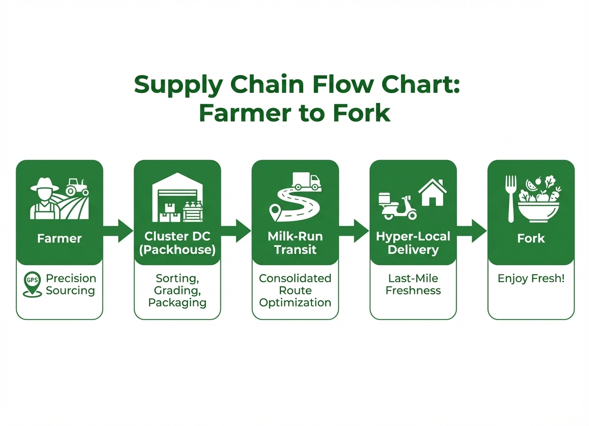
</p>

---

## 🚀 Executive Summary

Aapla Kisan is designed as a **fresh produce supply chain operating system**, not only as a grocery ordering app.

The model combines farmer/vendor supply, collection-center handling, quality grading, dark-store fulfilment, B2C ordering, B2B recurring demand, admin governance, and KPI-led decision-making.

---

# 🧩 Business Layer Architecture

| Business Layer | Strategic Purpose |
|---|---|
| 🌾 **Supply Layer** | Farmers, vendors, and collection points declare and supply produce |
| ✅ **Quality Layer** | Produce is checked, graded, accepted, rejected, or redirected |
| 🏬 **Fulfilment Layer** | Hub/dark store manages inventory, picking, packing, dispatch, returns |
| 🧺 **B2C Demand Layer** | Household consumers generate direct demand and repeat orders |
| 🏪 **B2B Demand Layer** | Restaurants, cafes, hostels, retailers, and institutions create recurring demand |
| 🧑‍💼 **Governance Layer** | Admin manages approvals, pricing, users, reports, roles, and exceptions |
| 📊 **Analytics Layer** | KPIs track wastage, stockouts, fill rate, supplier reliability, and order performance |

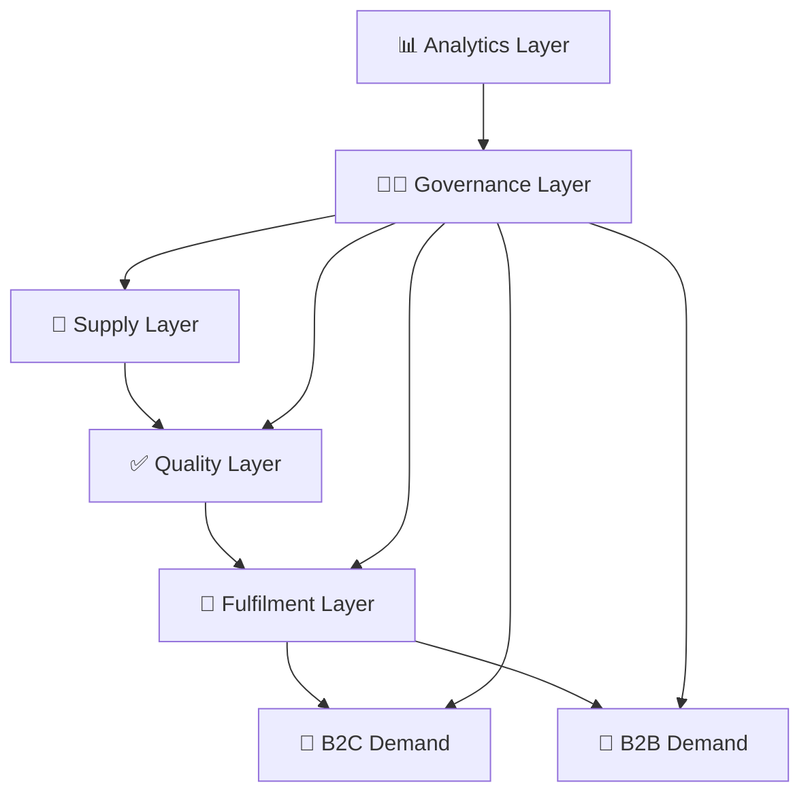

---

# 📊 Demand Engine Mix

The model should balance B2C and B2B demand so the platform does not depend only on instant consumer orders.

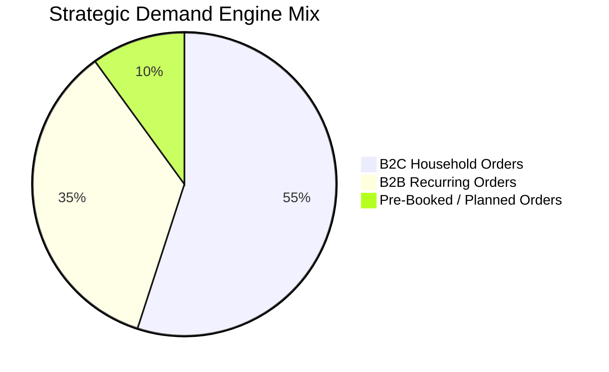

> These values are planning assumptions for portfolio visualization and should be replaced with real pilot data after execution.

---

# 🧭 Market Problem

Fresh produce supply chains face structural problems because demand, quality, pricing, and fulfilment are difficult to control together.

| Stakeholder | Current Problem | Business Impact | Aapla Kisan Response |
|---|---|---|---|
| **Farmers / Vendors** | Price volatility, uncertain demand, limited structured buyer access | Lower predictability and weak bargaining power | Registration, supply declaration, grade-linked payout, visibility |
| **Consumers** | Inconsistent quality, changing prices, weak freshness trust | Lower repeat orders and poor confidence | Product clarity, delivery slot, tracking, quality cues |
| **B2B Buyers** | Unreliable daily supply, quality variation, procurement uncertainty | Operational disruption | Standing orders, rate card, grade-based supply |
| **Operations Team** | Weak inventory visibility, over-buying, stockouts, wastage | Higher cost and lower service quality | Dark store dashboard, picklist, dispatch queue, SOPs |
| **Platform Team** | Lack of dashboards, governance, and role-based controls | Difficult to scale | Admin panel, KPI rhythm, approvals, issue control |

---

# 🏗️ Proposed Operating Flow

<p align="center">
  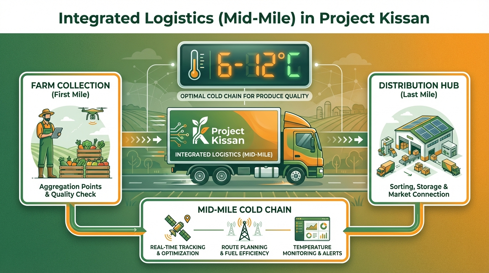
</p>

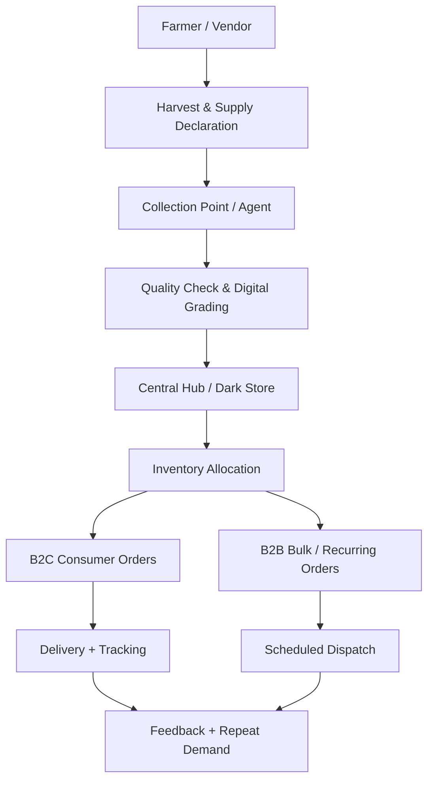

---

# 🔁 End-to-End Operating Model

## 1. Harvest and Supply Declaration

Farmers or vendors declare produce type, expected quantity, delivery date/time, expected grade, collection location, and price expectation before stock movement.

**Strategic value:** Early supply visibility improves procurement planning and reduces last-minute buying.

---

## 2. Collection and Digital Grading

<p align="center">
  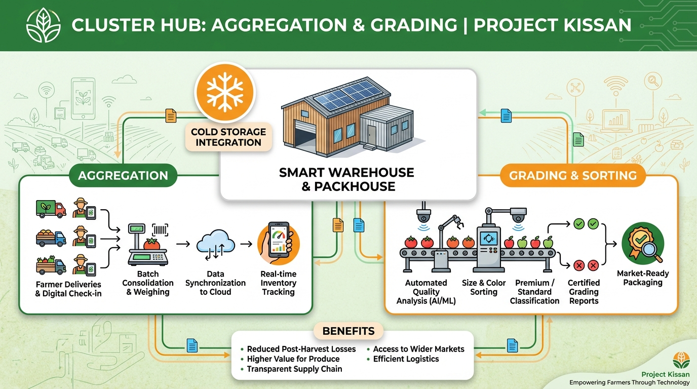
</p>

Produce is received through local collection points or trained field agents.

| Grading Step | Purpose |
|---|---|
| Quantity verification | Confirms declared vs actual supply |
| Grade assignment | Separates Grade A, B, C, and rejected stock |
| Photo proof | Reduces disputes |
| Batch tagging | Creates traceability |
| Supplier score update | Measures reliability over time |

---

## 3. Hub / Dark Store Operations

<p align="center">
  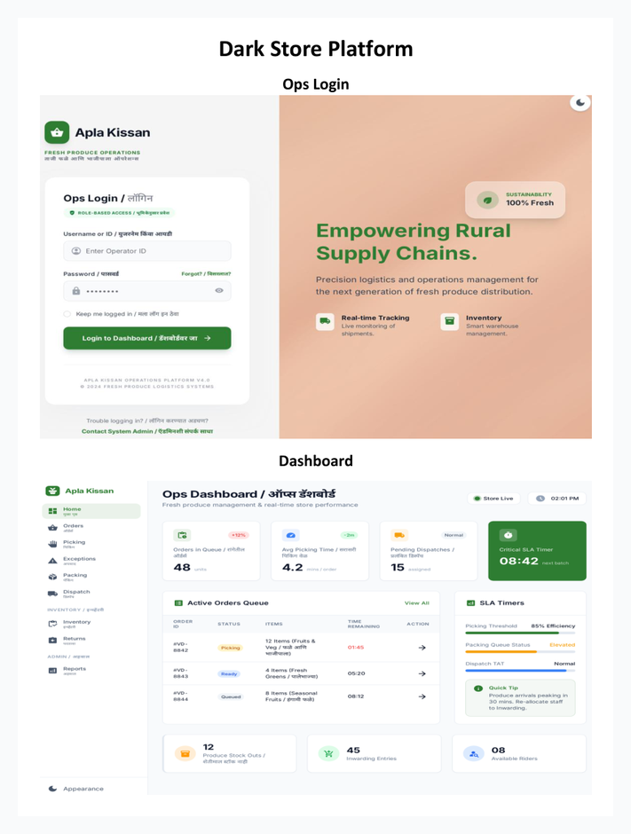
</p>

The dark store becomes the operational control center for stock inward, sorting, storage, picking, packing, dispatch preparation, returns, stock adjustment, and wastage tracking.

---

## 4. B2C and B2B Distribution

| Demand Engine | Use Case | Strategic Benefit |
|---|---|---|
| **B2C** | Household fresh produce ordering | Builds direct demand and brand trust |
| **B2B** | Restaurants, cafes, hostels, retailers, institutions | Creates predictable recurring volume and stabilizes procurement |

---

# 📱 Product Ecosystem

| Product Layer | Primary User | Main Purpose | Preview |
|---|---|---|---|
| **Consumer App** | B2C customers | Discovery, ordering, tracking, repeat purchase | 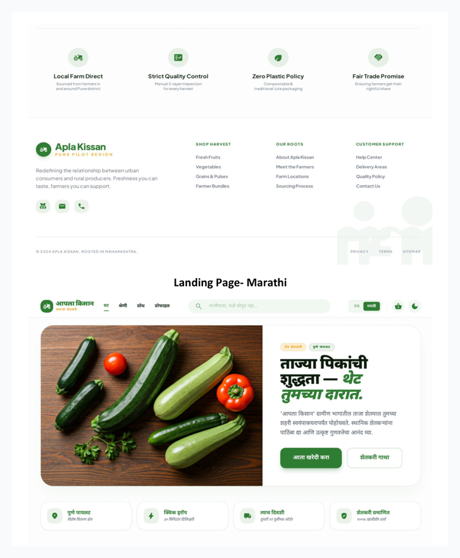 |
| **Farmer / Vendor App** | Farmers, vendors | Onboarding, listing, stock, pricing, payout | 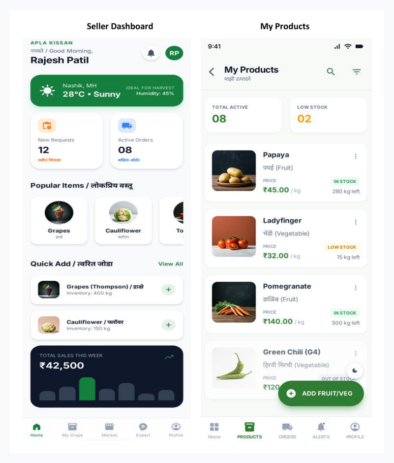 |
| **Admin Panel** | Admin team | Governance, approvals, pricing, orders, reports | 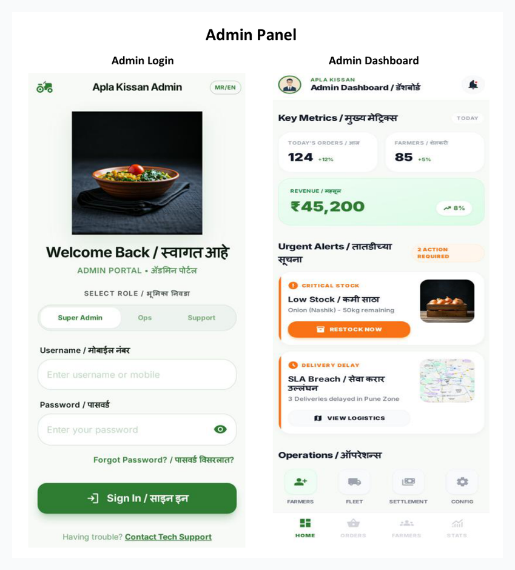 |
| **Dark Store Platform** | Ops team | Picklist, packing, dispatch, inventory, returns |  |

---

# 💼 Revenue and Value Streams

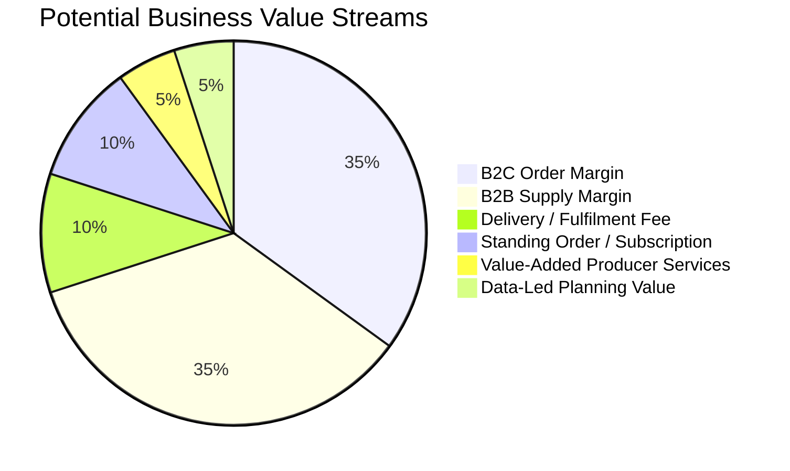

| Revenue / Value Stream | Description |
|---|---|
| **B2C Order Margin** | Margin on fresh produce sold to household customers |
| **B2B Supply Margin** | Margin on bulk/recurring supply to restaurants, cafes, retailers, hostels, institutions |
| **Delivery / Fulfilment Fee** | Fee based on delivery model, distance, or order size |
| **Subscription / Standing Order Model** | Recurring B2B supply arrangements for predictable demand |
| **Value-Added Producer Services** | Future scope: packaging, grading, digital listing, market access support |
| **Data-Led Planning Value** | Demand and supply insights for procurement planning and wastage control |

---

# 💰 Pricing Model Summary

Aapla Kisan uses a **fixed-price + market-linked pricing approach**.

| Pricing Element | Purpose |
|---|---|
| Assured floor price | Gives farmers/vendors minimum price confidence |
| Market reference benchmark | Keeps pricing realistic |
| Grade-based payout | Better quality earns better rates |
| Stable selling price band | Reduces customer price shock |
| Pre-booking advantage | Encourages predictable demand |
| B2B rate card | Supports recurring buyers with clear pricing |

---

# 🧪 Pilot Model

| Area | Recommended Scope |
|---|---|
| City / Zone | One city or selected delivery zones |
| Supply Side | Selected farmers, vendors, collection points |
| Demand Side | Selected B2C households and B2B buyers |
| B2B Segments | Restaurants, cafes, hostels, retailers, institutions |
| Operations | One central hub or dark store |
| SKU Range | Limited fresh produce catalog |
| Technology | MVP-level platform, dashboard, or manual-assisted workflow |
| Duration | 3 to 6 months |

---

# 📊 Pilot Success Metrics

```mermaid
xyChart-beta
    title "Pilot Success Metric Target Areas"
    x-axis ["Fulfilment", "On-Time", "Repeat B2C", "B2B Repeat", "Supplier Reliability", "Wastage Control"]
    y-axis "Target %" 0 --> 100
    bar [90, 85, 30, 60, 80, 90]
```

| KPI Category | Metrics |
|---|---|
| **Demand** | Total orders, repeat rate, B2B order frequency, average order value |
| **Supply** | Active suppliers, declared vs actual supply, supplier reliability |
| **Quality** | Accepted stock, rejected stock, complaint rate |
| **Inventory** | Wastage %, shrinkage, stockout frequency, SKU availability |
| **Operations** | Fulfilment rate, picking time, packing time, dispatch time |
| **Delivery** | On-time delivery, delayed orders, failed deliveries |
| **Finance** | Procurement variance, margin, delivery cost per order |

---

# ⚠️ Key Risks and Controls

| Risk | Business Impact | Control Mechanism |
|---|---|---|
| Supplier inconsistency | Stockouts and poor fulfilment | Multiple sourcing lanes and supplier reliability score |
| Poor quality produce | Complaints and returns | Digital grading and QC checkpoints |
| Over-buying | Wastage and margin loss | Pre-booking and demand forecasting |
| Delivery delays | Poor customer experience | Zone-wise batching and SLA tracking |
| B2B payment delays | Cash flow pressure | Clear buyer terms and credit checks |
| Weak SOP adoption | Operational inconsistency | Training, checklists, and weekly reviews |
| Low repeat demand | Weak unit economics | Feedback loop, retention offers, product mix optimization |

---

# 🧠 Strategic Differentiation

Aapla Kisan is stronger than a basic grocery delivery model because it combines:

- Predictive supply
- Predictive demand
- Farmer/vendor onboarding
- Local collection
- Digital grading
- Dark-store fulfilment
- B2C ordering
- B2B recurring supply
- KPI-based governance

---

# 🏆 Skills Demonstrated

| Skill Area | Demonstrated Through |
|---|---|
| **Business Strategy** | B2C + B2B model, stakeholder mapping, value proposition |
| **Product Strategy** | Multi-sided platform, role-based product layers, MVP thinking |
| **Operations Planning** | Collection, grading, dark store, inventory, dispatch |
| **Go-To-Market Thinking** | Pilot-first rollout, demand validation, buyer segmentation |
| **Supply Chain Thinking** | Procurement, pricing, wastage, fulfilment, supplier reliability |
| **Analytics** | KPI framework, weekly review model, performance tracking |
| **Data Visualization** | Business layer map, demand mix, value stream pie chart, KPI bar chart |

---

# 📝 Public Portfolio Note

This document is a public-safe business model version created for portfolio presentation. Sample chart values are planning assumptions for visualization and should be replaced with verified pilot data after execution.
