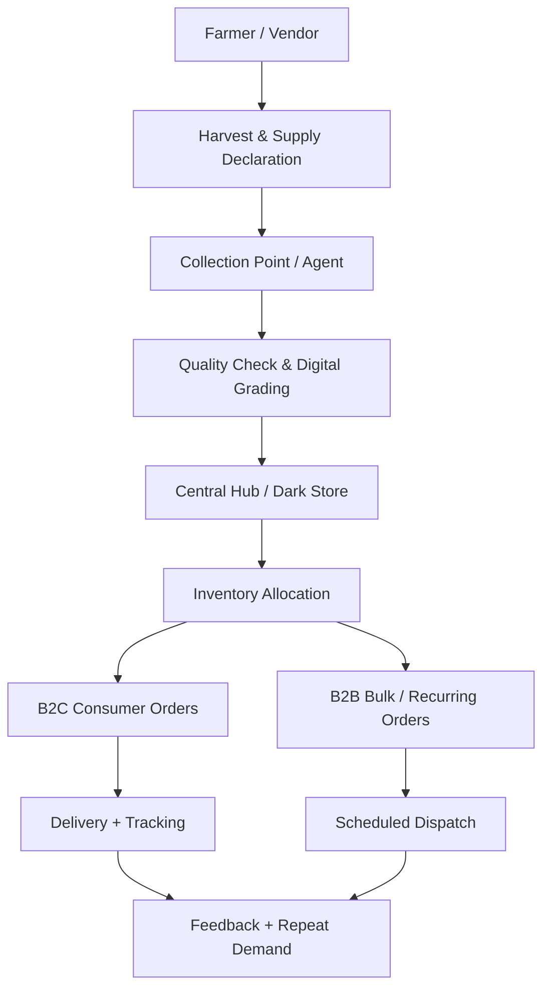
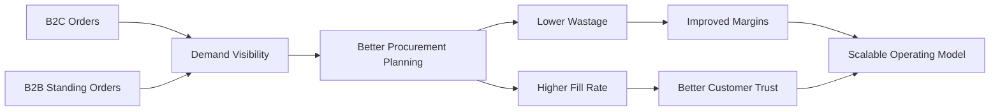

# 🌾 Aapla Kisan Business Model

## Farm-to-Consumer + Farm-to-Business Fresh Supply Chain Model

Aapla Kisan is a fresh produce operating model designed to connect farmers, vendors, collection points, dark stores, B2C consumers, and B2B buyers through a structured digital and operational ecosystem.

The model focuses on improving supply predictability, pricing stability, quality control, inventory movement, fulfilment reliability, and farmer/vendor participation.

---

# 🚀 Executive Summary

Aapla Kisan is not positioned as only a grocery ordering app. It is designed as a **fresh produce supply chain operating system**.

The platform combines:

| Business Layer | Strategic Purpose |
|---|---|
| **Supply Layer** | Farmers, vendors, producer groups, and collection points declare and supply produce |
| **Quality Layer** | Produce is checked, graded, accepted, or rejected through defined quality controls |
| **Fulfilment Layer** | Central hub/dark store manages inventory, picking, packing, dispatch, and returns |
| **Demand Layer** | B2C consumers and B2B buyers generate recurring demand |
| **Governance Layer** | Admin team manages approvals, pricing, reports, roles, and issue resolution |
| **Analytics Layer** | KPIs track wastage, fill rate, stockouts, supplier reliability, and order performance |

---

# 🧩 Market Problem

Fresh produce supply chains face structural problems because demand, quality, pricing, and fulfilment are difficult to control together.

## Stakeholder Pain Points

| Stakeholder | Current Problem | Business Impact |
|---|---|---|
| **Farmers / Vendors** | Price volatility, uncertain demand, limited structured buyer access | Lower predictability and weak bargaining power |
| **Consumers** | Inconsistent quality, changing prices, weak freshness trust | Lower repeat orders and poor customer confidence |
| **B2B Buyers** | Unreliable daily supply, quality variation, procurement uncertainty | Operational disruption for restaurants, hostels, cafes, and retailers |
| **Operations Team** | Weak inventory visibility, over-buying, stockouts, wastage | Higher fulfilment cost and lower service quality |
| **Platform Team** | Lack of SOPs, dashboards, governance, and role-based controls | Difficult to scale beyond pilot stage |

---

# 🎯 Strategic Objective

The objective of Aapla Kisan is to build a pilot-ready fresh supply chain model that can support:

- Predictable farmer/vendor supply
- Structured quality grading
- Stable pricing logic
- B2C fresh produce ordering
- B2B recurring supply
- Dark store fulfilment
- Admin governance
- Inventory control
- KPI-based decision-making
- Pilot-first expansion planning

---

# 🏗️ Proposed Solution

Aapla Kisan creates a structured flow from farm/vendor supply to consumer and B2B fulfilment.

This connected model improves visibility across supply, quality, inventory, demand, fulfilment, and customer experience.

---

# 🔁 End-to-End Operating Model

## 1. Harvest and Supply Declaration

Farmers or vendors declare supply before delivery.

They may provide:

- Produce type
- Expected quantity
- Expected delivery date
- Expected delivery time
- Expected grade or quality
- Collection location
- Selling expectation or price range

## Strategic Value

Supply declaration gives the platform early visibility, allowing better planning before procurement and dispatch decisions are made.

---

## 2. Collection and Digital Grading

Produce is received through local collection points or trained field agents.

The grading process may include:

- Quantity verification
- A/B/C quality grading
- Photo proof
- Acceptance or rejection status
- Defect identification
- Digital record creation
- Supplier reliability tracking

## Strategic Value

Digital grading helps create trust, reduces quality disputes, and supports grade-based pricing.

---

## 3. Hub / Dark Store Operations

Accepted produce moves to a central hub or dark store.

The dark store manages:

- Stock inward
- Sorting
- Storage
- Inventory update
- Picking
- Packing
- Dispatch preparation
- Returns
- Stock adjustment
- Wastage tracking

## Strategic Value

The dark store becomes the operational control center for fulfilment accuracy, inventory visibility, and delivery readiness.

---

## 4. B2C and B2B Distribution

Aapla Kisan supports two demand engines.

| Demand Engine | Use Case | Strategic Benefit |
|---|---|---|
| **B2C** | Household fresh produce ordering | Builds direct customer demand and brand trust |
| **B2B** | Restaurants, cafes, hostels, retailers, institutions | Creates predictable recurring volume and stabilizes procurement |

---

# 📱 Product Ecosystem

Aapla Kisan is planned as a multi-sided platform with four product layers.

## Product Layer Overview

| Product Layer | Primary User | Main Purpose |
|---|---|---|
| **Consumer App** | B2C customers | Fresh produce discovery, ordering, tracking, and repeat purchase |
| **Farmer / Vendor App** | Farmers, vendors, market sellers | Onboarding, product listing, stock update, pricing, order handling, payout |
| **Admin Panel** | Platform admin team | Governance, approvals, pricing, categories, orders, reports, and roles |
| **Dark Store Platform** | Operations team | Picklist, packing, dispatch, inventory, handover, stock inward, returns |

---

## 📱 Consumer App

The consumer app focuses on simple ordering and trust-building.

### Core Capabilities

- Language selection
- Login
- Profile setup
- Location selection
- Landing page
- Product categories
- Product listing
- Cart and checkout
- Delivery slot
- Live tracking
- Order history

### Business Role

The consumer app creates direct household demand and supports repeat purchase behaviour.

---

## 👨‍🌾 Farmer / Vendor App

The farmer/vendor app focuses on onboarding, supply visibility, and payout transparency.

### Core Capabilities

- Role selection
- Basic details
- Business details
- KYC upload
- Bank details
- Product listing
- Price setting
- Stock update
- Order requests
- Delivery handover
- Payout summary
- Help and support
- Sales report

### Business Role

The farmer/vendor app gives the platform structured supplier data and supply visibility.

---

## 🧑‍💼 Admin Panel

The admin panel focuses on governance and control.

### Core Capabilities

- Admin dashboard
- Customer list
- Farmer list
- Onboarding approvals
- Category management
- Product management
- Pricing rules
- Orders overview
- Dark store monitoring
- Tickets and issues
- Broadcast notifications
- Sales and inventory reports
- Roles and permissions

### Business Role

The admin panel gives the platform control over users, products, pricing, inventory, orders, and operational exceptions.

---

## 🏬 Dark Store Platform

The dark store platform focuses on fulfilment accuracy.

### Core Capabilities

- Operations login
- Ops dashboard
- Order details
- Picklist
- Out-of-stock action
- Package verification
- Dispatch queue
- Handover confirmation
- Inventory dashboard
- Stock inward
- Stock adjustment
- Returns
- Reports

### Business Role

The dark store platform helps the operations team execute picking, packing, dispatch, inventory movement, and handover with better control.

---

# 💼 Revenue and Operating Model

Aapla Kisan can operate through a combination of B2C, B2B, and platform-led fulfilment margins.

| Revenue / Value Stream | Description |
|---|---|
| **B2C Order Margin** | Margin on fresh produce sold to household customers |
| **B2B Supply Margin** | Margin on bulk or recurring supply to restaurants, cafes, retailers, hostels, and institutions |
| **Delivery / Fulfilment Fee** | Fee charged based on delivery model, distance, or order size |
| **Subscription / Standing Order Model** | Recurring B2B supply arrangements for predictable demand |
| **Value-Added Producer Services** | Future scope: packaging, grading, digital listing, and market access support |
| **Data-Led Planning Value** | Demand and supply insights used for procurement planning and wastage control |

---

# 💰 Pricing Model

Aapla Kisan uses a fixed-price plus market-linked pricing approach.

## Procurement Side

| Pricing Element | Purpose |
|---|---|
| **Assured Floor Price** | Gives farmers/vendors minimum price confidence |
| **Market Reference Benchmark** | Keeps pricing connected to local wholesale realities |
| **Grade-Based Payout** | Better quality produce earns better rates |
| **Weekly / Fortnightly Revision** | Reduces daily volatility while staying market-aware |
| **Supplier Reliability Tracking** | Rewards consistent suppliers over time |

---

## Selling Side

| Pricing Element | Purpose |
|---|---|
| **Stable Selling Price Band** | Reduces frequent price shock for customers |
| **Pre-Booking Advantage** | Encourages predictable demand and better planning |
| **B2B Rate Card** | Supports recurring buyers with clear pricing |
| **Volume-Based Pricing** | Supports bulk buyers and institutions |
| **Market-Linked Updates** | Keeps the model sustainable during market changes |

---

# 🔄 Dual Demand Engine

The model uses B2C and B2B together to reduce dependency on one demand source.

---

# 🧪 Pilot Model

Aapla Kisan should begin with a controlled pilot before expansion.

## Suggested Pilot Scope

| Area | Recommended Pilot Scope |
|---|---|
| **City / Zone** | One city or selected delivery zones |
| **Supply Side** | Selected farmers, vendors, and collection points |
| **Demand Side** | Selected B2C households and B2B buyers |
| **B2B Segments** | Restaurants, cafes, hostels, retailers, and institutions |
| **Operations** | One central hub or dark store |
| **SKU Range** | Limited fresh produce catalog |
| **Technology** | MVP-level platform, dashboard, or manual-assisted workflow |
| **Duration** | 3 to 6 months |

---

# 📊 Pilot Success Metrics

| KPI Category | Metrics |
|---|---|
| **Demand** | Total orders, repeat rate, B2B order frequency, average order value |
| **Supply** | Active suppliers, declared vs actual supply, supplier reliability |
| **Quality** | Accepted stock, rejected stock, complaint rate |
| **Inventory** | Wastage %, shrinkage, stockout frequency, SKU availability |
| **Operations** | Fulfilment rate, picking time, packing time, dispatch time |
| **Delivery** | On-time delivery, delayed orders, failed deliveries |
| **Finance** | Procurement variance, margin, delivery cost per order |
| **Customer Experience** | Repeat purchase, complaint resolution, feedback quality |

---

# ⚠️ Key Risks and Controls

| Risk | Business Impact | Control Mechanism |
|---|---|---|
| Supplier inconsistency | Stockouts and poor fulfilment | Multiple sourcing lanes and supplier reliability score |
| Poor quality produce | Customer complaints and returns | Digital grading and QC checkpoints |
| Over-buying | Wastage and margin loss | Pre-booking and demand forecasting |
| Delivery delays | Poor customer experience | Zone-wise batching and SLA tracking |
| B2B payment delays | Cash flow pressure | Clear buyer terms and credit checks |
| Weak SOP adoption | Operational inconsistency | Training, checklists, and weekly reviews |
| Low repeat demand | Weak unit economics | Customer feedback, retention offers, and product mix optimization |

---

# 🏆 Why This Model Can Work

Aapla Kisan can work because it connects five critical systems:

| System | Why It Matters |
|---|---|
| **Predictive Supply** | Supply declaration improves procurement planning |
| **Predictive Demand** | Pre-booking and B2B recurring orders reduce uncertainty |
| **Digital Quality Control** | Grading and acceptance rules improve trust |
| **Dark Store Fulfilment** | Structured operations improve picking, packing, and dispatch |
| **KPI Governance** | Weekly review rhythm helps control wastage, fill rate, stockouts, and margins |

---

# 🧠 Strategic Differentiation

Aapla Kisan is stronger than a basic grocery delivery model because it does not depend only on instant orders.

It combines:

- Supply planning
- Demand planning
- Farmer/vendor onboarding
- Local collection
- Digital grading
- Dark store fulfilment
- B2C ordering
- B2B recurring supply
- KPI-based governance

This makes the model more execution-ready and scalable.

---

# ✅ Skills Demonstrated

This business model demonstrates:

| Skill Area | Demonstrated Through |
|---|---|
| **Business Strategy** | B2C + B2B model, stakeholder mapping, value proposition |
| **Product Strategy** | Multi-sided platform, role-based product layers, MVP thinking |
| **Operations Planning** | Collection, grading, dark store, inventory, dispatch |
| **Go-To-Market Thinking** | Pilot-first rollout, demand validation, buyer segmentation |
| **Supply Chain Thinking** | Procurement, pricing, wastage, fulfilment, supplier reliability |
| **Analytics** | KPI framework, weekly review model, performance tracking |
| **Documentation** | Public-safe case study communication and structured project writing |

---

# 📝 Public Portfolio Note

This document is a public-safe business model version created for portfolio presentation.

Client-specific names, private budgets, payment terms, commercial proposal details, and confidential implementation terms have been removed or generalized.
