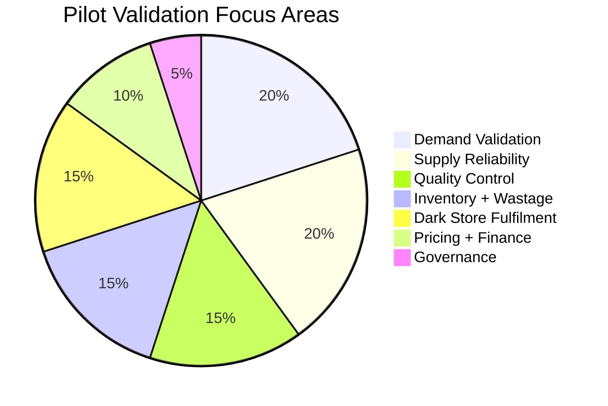
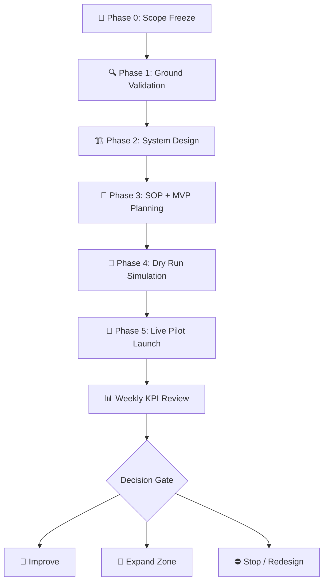
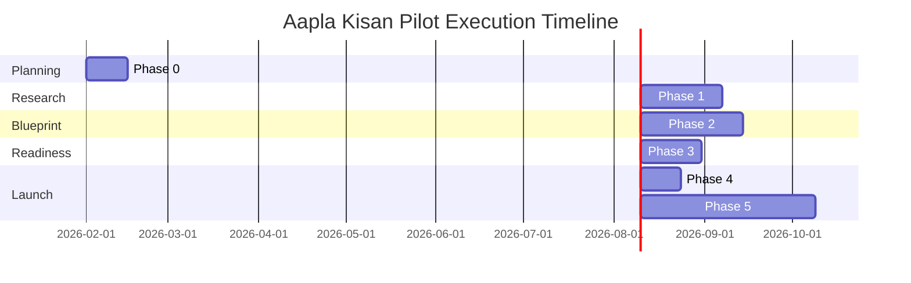
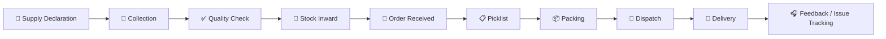

<div align="center">

# 🚀 Aapla Kisan Pilot Execution Plan

### Pilot-Ready Implementation Roadmap for a Fresh Produce Supply Chain Operating System

A stage-wise pilot blueprint to validate demand, supply reliability, quality control, dark-store fulfilment, B2C adoption, B2B recurring demand, pricing stability, SOP discipline, and KPI-led governance.

<br>


</div>

---

<p align="center">
  
</p>

---

## 🧭 Executive View

Aapla Kisan should not be scaled as a full platform before validating the operating model on the ground.

Fresh produce businesses are not only technology problems. They are execution-heavy systems where supply, quality, pricing, inventory, fulfilment, delivery, and customer trust must work together daily.

This pilot plan answers one strategic question:

> **Can Aapla Kisan create a repeatable fresh produce supply chain model that works for farmers, consumers, B2B buyers, and operations teams?**

---

# 🎯 Pilot Mission

| Mission Area | What the Pilot Must Prove |
|---|---|
| 🌾 **Supply Reliability** | Farmers/vendors can provide consistent quantity and quality |
| 🧺 **B2C Demand** | Households place repeat fresh produce orders |
| 🏪 **B2B Demand** | Restaurants, cafes, hostels, retailers, or institutions place recurring orders |
| ✅ **Quality Control** | Produce can be graded, accepted, rejected, and tracked |
| 🏬 **Dark Store Operations** | Picking, packing, dispatch, inventory, and handover can run smoothly |
| 💰 **Pricing Stability** | Fixed + market-linked pricing can work in real conditions |
| 📊 **KPI Governance** | Weekly metrics can guide decisions and reduce risk |
| 🔁 **Repeatability** | The model can be replicated in another zone after validation |

---

# 📊 Pilot Validation Weightage



---

# 🏁 Recommended Pilot Scope

| Pilot Area | Recommended Scope |
|---|---|
| 📍 **Geography** | One city or selected delivery zones |
| 🌾 **Supply Side** | Selected farmers, vendors, and collection points |
| 🧺 **B2C Demand Side** | Selected households and residential clusters |
| 🏪 **B2B Demand Side** | Restaurants, cafes, hostels, retailers, institutions |
| 🏬 **Operations** | One hub or dark store |
| 🥬 **SKU Range** | Limited fresh produce catalog |
| 📱 **Technology** | MVP-level app, dashboard, or manual-assisted workflow |
| ⏳ **Duration** | 3 to 6 months |

---

# 🗺️ Pilot Execution Map



---

# 📅 Stage-Wise Timeline



> Dates are indicative placeholders for roadmap visualization and should be adjusted once the pilot calendar is finalized.

---

# 🧭 Phase 0: Scope Freeze

## Purpose

Phase 0 creates clarity before execution begins and prevents shifting scope, unclear ownership, and uncontrolled decision-making.

| Activity | Strategic Purpose |
|---|---|
| 📍 Confirm pilot geography | Define city, zones, and operational boundaries |
| 👥 Define user segments | Identify target B2C and B2B users |
| 🌾 Identify supply sources | Shortlist farmers, vendors, collection points |
| 🥬 Select pilot SKUs | Start with controlled product categories |
| 📊 Define success metrics | Align team on what success means |
| 🧑‍💼 Assign decision owners | Avoid delays and unclear approvals |
| ⚠️ List assumptions and risks | Track early uncertainties |
| 🗓️ Set review rhythm | Create weekly governance discipline |

---

# 🔍 Phase 1: Ground Validation & Market Research

## Purpose

Phase 1 validates real demand, supply availability, B2B potential, pricing sensitivity, and competitor gaps before aggressive build-out.

<p align="center">
  
</p>

## Research Streams

| Stream | What to Validate | Output |
|---|---|---|
| 🧺 Consumer Demand | Buying frequency, trust triggers, price sensitivity, delivery preference | Demand reality report |
| 🏪 B2B Buyer Discovery | Daily/weekly requirement, quality needs, timing, records, recurrence | B2B opportunity notes |
| 🌾 Farmer/Vendor Mapping | Supply quantity, seasonality, registration willingness, price expectations | Supply feasibility map |
| 🕵️ Competitor Benchmarking | Price, packaging, freshness, delivery, replacement/refund | Market gap summary |

---

# 🏗️ Phase 2: System Design & Blueprint Build

## Purpose

Phase 2 converts validation into a practical operating model.

<p align="center">
  
</p>

## Blueprint Components

| Blueprint Area | Output |
|---|---|
| Procurement & Pricing | 3-lane sourcing, fixed + market-linked pricing, pre-booking rules |
| Operations SOP | Receiving, QC, storage, picking, packing, dispatch, returns |
| Collection Center | Registration, weighing, sorting, grading, batch movement |
| Tech Enablement | Role-based workflows, data fields, dashboard requirements |
| Governance | KPI scorecard, weekly review cadence, risk register |

---

# 🧾 Phase 3: SOP, MVP & Operations Planning

| Area | Required Before Pilot |
|---|---|
| 🧺 Customer Journey | Customer can browse, order, select delivery, and track |
| 🌾 Supplier Journey | Farmer/vendor can register, list produce, and update stock |
| 🧑‍💼 Admin Flow | Admin can approve, monitor, manage products and orders |
| 🏬 Dark Store Flow | Team can pick, pack, dispatch, and update inventory |
| 🎧 Support Flow | Complaints, replacements, and refunds have a clear process |
| 📊 KPI Flow | Weekly dashboard and issue tracking are ready |

---

# 🧪 Phase 4: Pilot Dry Run

<p align="center">
  
</p>

## Dry Run Flow



---

# 🚀 Phase 5: Live Pilot Launch

| Launch Period | Focus |
|---|---|
| **Day 1–2** | Test limited orders with controlled users |
| **Day 3–5** | Monitor quality, delivery delays, stockouts, complaints |
| **Day 6–7** | Review supplier reliability and inventory planning |
| **Week 2** | Increase volume slowly and track repeat orders |
| **Week 3–4** | Strengthen B2B recurring orders and reduce wastage |
| **Month 2–3** | Optimize SKU mix, pricing, delivery zones, and supplier reliability |

---

# 📊 KPI Command Center

```mermaid
xyChart-beta
    title "Pilot KPI Target Dashboard"
    x-axis ["Fulfilment", "On-Time", "Supplier", "B2B Repeat", "Stockout Control", "Wastage Control"]
    y-axis "Target %" 0 --> 100
    bar [90, 85, 80, 60, 93, 90]
```

| KPI Category | Metrics |
|---|---|
| 🧺 **Demand** | Total orders, repeat orders, average order value, B2B frequency |
| 🌾 **Supply** | Active suppliers, declared vs actual supply, supplier reliability |
| ✅ **Quality** | Accepted stock, rejected stock, complaint rate |
| 🏬 **Inventory** | Stockouts, wastage, shrinkage, days of cover |
| ⚙️ **Operations** | Picking time, packing time, dispatch time, fulfilment rate |
| 🚚 **Delivery** | On-time delivery, delayed orders, failed deliveries |
| 💰 **Finance** | Procurement variance, margin, delivery cost per order |

---

# ⚠️ Risk Register

| Risk | Possible Impact | Control Action |
|---|---|---|
| 🌾 Supplier inconsistency | Stockouts and poor fulfilment | Build multiple sourcing lanes |
| 🥬 Poor quality produce | Complaints and returns | Use grading and QC checkpoints |
| 📦 Over-buying | Wastage and margin loss | Use pre-booking and demand planning |
| 🔁 Low repeat orders | Weak retention | Improve product mix and customer feedback loop |
| 💸 B2B payment delays | Cash flow pressure | Define buyer terms and basic checks |
| 🚚 Delivery delays | Poor customer experience | Use zone-wise batching and SLA tracking |
| 🧾 Weak SOP adoption | Operational inconsistency | Train team and review weekly |
| 📉 Data quality issues | Poor decisions | Define required fields and validation rules |

---

# ✅ Pilot Success Criteria

The pilot can be considered successful if it proves repeat B2C ordering, recurring B2B demand, reliable farmer/vendor supply, controlled wastage, stable pricing logic, clear inventory visibility, acceptable fulfilment rate, manageable delivery cost, and SOPs that can be repeated in another zone.

---

# 🏆 Skills Demonstrated

| Skill Area | Demonstrated Through |
|---|---|
| **Business Analysis** | Market validation, stakeholder mapping, pilot planning |
| **Operations Strategy** | SOPs, dark store flow, fulfilment workflow, risk controls |
| **Product Strategy** | MVP scope, role-based product layers, workflow mapping |
| **Go-To-Market Thinking** | Controlled rollout, demand validation, B2B buyer testing |
| **Analytics** | KPI dashboard planning and weekly review model |
| **Supply Chain Thinking** | Procurement, grading, inventory, wastage, dispatch |
| **Data Visualization** | Gantt roadmap, KPI bar chart, validation pie chart, flow diagrams |

---

# 📝 Public Portfolio Note

This is a public-safe pilot execution plan created for portfolio presentation. Visual KPI values are planning targets and not actual pilot results.
