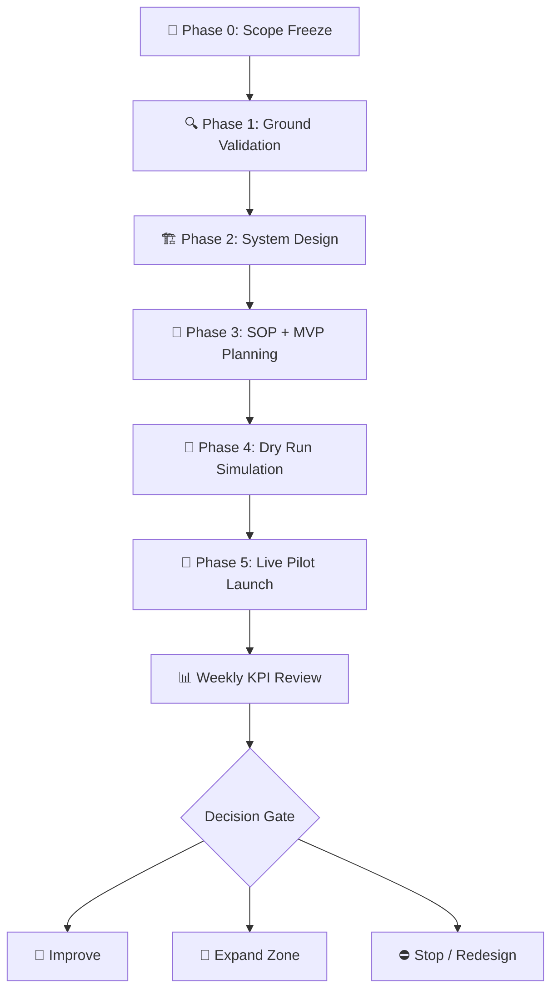
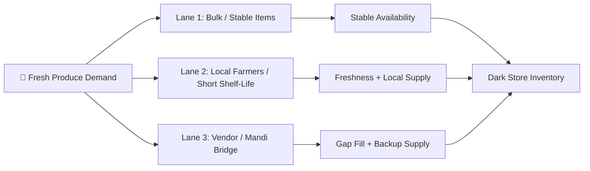
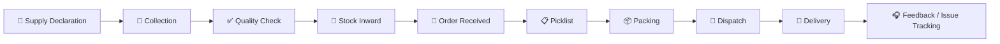

# 🚀 Aapla Kisan Pilot Execution Plan

### Pilot-Ready Implementation Roadmap for a Fresh Produce Supply Chain Operating System

A structured pilot blueprint to validate demand, supply reliability, quality control, dark store fulfilment, B2C adoption, B2B recurring orders, pricing stability, and KPI-led governance.

 

---

## 🧭 Executive View

Aapla Kisan should not be scaled as a full platform before validating the operating model on the ground.

Fresh produce businesses are not only technology problems. They are execution-heavy systems where supply, quality, pricing, inventory, fulfilment, delivery, and customer trust must work together daily.

This pilot plan is designed to answer one strategic question:

> **Can Aapla Kisan create a repeatable fresh produce supply chain model that works for farmers, consumers, B2B buyers, and operations teams?**

---

## 🎯 Pilot Mission

The pilot will validate whether Aapla Kisan can operate as a structured fresh produce platform with predictable supply, reliable demand, controlled wastage, and repeatable operations.

| Mission Area | What the Pilot Must Prove |
|---|---|
| 🌾 **Supply Reliability** | Farmers/vendors can provide consistent quantity and quality |
| 🧺 **B2C Demand** | Households place repeat fresh produce orders |
| 🏪 **B2B Demand** | Restaurants, cafes, hostels, retailers, or institutions place recurring orders |
| ✅ **Quality Control** | Produce can be graded, accepted, rejected, and tracked |
| 🏬 **Dark Store Operations** | Picking, packing, dispatch, inventory, and handover can run smoothly |
| 💰 **Pricing Stability** | Fixed + market-linked pricing can work in real conditions |
| 📊 **KPI Governance** | Weekly metrics can guide decisions and reduce risk |
| 🔁 **Repeatability** | The model can be replicated in another zone after validation |

---

## 🧩 Why a Pilot Is Required

Scaling a fresh produce platform without a pilot can lead to over-buying, wastage, stockouts, customer dissatisfaction, weak supplier discipline, and poor unit economics.

A controlled pilot helps validate the business model before major expansion.

| Without Pilot | With Pilot |
|---|---|
| Assumption-based decisions | Ground-data-backed decisions |
| High risk of wastage | Controlled buying and stock movement |
| Unclear customer repeat behaviour | Measured repeat orders |
| Unclear supplier reliability | Supplier performance tracking |
| Weak SOP discipline | Tested operational workflows |
| Overbuilt technology | MVP based on actual workflow needs |
| Poor expansion readiness | Repeatable operating playbook |

---

## 🏁 Recommended Pilot Scope

Start small. Measure deeply. Expand only after proof.

| Pilot Area | Recommended Scope |
|---|---|
| 📍 **Geography** | One city or selected delivery zones |
| 🌾 **Supply Side** | Selected farmers, vendors, and collection points |
| 🧺 **B2C Demand Side** | Selected households and residential clusters |
| 🏪 **B2B Demand Side** | Restaurants, cafes, hostels, retailers, institutions |
| 🏬 **Operations** | One hub or dark store |
| 🥬 **SKU Range** | Limited fresh produce catalog |
| 📱 **Technology** | MVP-level app, dashboard, or manual-assisted workflow |
| ⏳ **Duration** | 3 to 6 months |

---

## 🗺️ Pilot Execution Map

---

# 🧭 Phase 0: Scope Freeze

## Purpose

Phase 0 creates clarity before execution begins.

This phase prevents scope confusion, shifting priorities, unclear ownership, and uncontrolled decision-making during the pilot.

---

## Key Activities

| Activity | Strategic Purpose |
|---|---|
| 📍 Confirm pilot geography | Define city, zones, and operational boundaries |
| 👥 Define user segments | Identify target B2C and B2B users |
| 🌾 Identify supply sources | Shortlist farmers, vendors, collection points |
| 🥬 Select pilot SKUs | Start with controlled product categories |
| 📊 Define success metrics | Align team on what success means |
| 🧑‍💼 Assign decision owners | Avoid delays and unclear approvals |
| ⚠️ List assumptions and risks | Track early uncertainties |
| 🗓️ Set review rhythm | Create weekly governance discipline |

---

## Phase 0 Outputs

| Output | Purpose |
|---|---|
| ✅ **Pilot Scope Note** | Defines what is included and excluded |
| 📊 **Success Metrics Sheet** | Defines how success will be measured |
| ⚠️ **Initial Risk Register** | Tracks early operational and market risks |
| 🧑‍💼 **Role Ownership Sheet** | Defines who owns decisions and execution |
| 🗓️ **Review Calendar** | Sets weekly governance rhythm |

---

# 🔍 Phase 1: Ground Validation & Market Research

## Purpose

Phase 1 checks whether the model is realistic in the selected market.

The goal is to validate real demand, supply availability, B2B potential, pricing sensitivity, and competitor gaps before building aggressively.

---

## 1. Consumer Demand Validation

### What to Study

| Research Area | Questions to Answer |
|---|---|
| 🛒 Buying Behaviour | What do households buy regularly? |
| 🔁 Frequency | How often do they buy fresh produce? |
| 💰 Price Sensitivity | What price range feels acceptable? |
| ✅ Trust Triggers | What makes them trust freshness and quality? |
| 🚚 Delivery Preference | Do they prefer same-day, next-day, or pre-booking? |
| 📱 App Readiness | Are they comfortable ordering digitally? |
| 😟 Current Pain Points | What problems do they face with current options? |

### Expected Output

- Consumer demand reality report
- Buying frequency insights
- Trust trigger summary
- Early customer segment recommendation
- Pre-booking acceptance insight

---

## 2. B2B Buyer Validation

### Target Buyer Segments

| Segment | Potential Need |
|---|---|
| 🍽️ Restaurants | Daily vegetables, fruits, staples |
| ☕ Cafes | Consistent quality and scheduled supply |
| 🏫 Hostels | Bulk recurring fresh produce |
| 🛒 Retail Stores | Regular local stock replenishment |
| 🏢 Institutions | Scheduled supply with records/invoices |
| 🧑‍🍳 Local Food Businesses | Predictable input cost and quality |

### What to Study

- Daily or weekly fresh produce requirement
- Quality expectations
- Delivery timing needs
- Payment expectations
- Invoice or record requirements
- Recurring order potential
- Existing supplier pain points

### Expected Output

- B2B opportunity notes
- Recurring order potential
- Buyer requirement summary
- Early route feasibility observations

---

## 3. Farmer & Vendor Validation

### What to Study

| Validation Area | Why It Matters |
|---|---|
| 🌾 Farmer/vendor availability | Determines supply depth |
| 📦 Expected quantity | Supports procurement planning |
| 🗓️ Seasonality | Helps forecast supply variation |
| ✅ Willingness to register | Validates onboarding feasibility |
| 💰 Expected pricing | Supports pricing model design |
| 🧾 Payment expectations | Builds farmer/vendor trust |
| 🥬 Quality readiness | Supports grading and rejection rules |
| 📍 Collection feasibility | Supports logistics planning |

### Expected Output

- Farmer/vendor supply map
- Initial sourcing lane recommendation
- Supplier reliability assessment
- Collection point feasibility notes

---

## 4. Competitor Benchmarking

### What to Study

- Local vegetable vendors
- Grocery delivery players
- Mandi/vendor supply patterns
- Packaging quality
- Delivery speed
- Replacement/refund handling
- Price stability
- Product freshness
- Customer trust factors

### Expected Output

| Output | Purpose |
|---|---|
| 🕵️ Competitor Reality Report | Shows how the market currently operates |
| 📉 Market Gap Summary | Identifies where Aapla Kisan can differentiate |
| 💡 Differentiation Opportunities | Helps shape the value proposition |
| 📢 Go-To-Market Direction | Guides early pilot communication |

---

# 🏗️ Phase 2: System Design & Blueprint Build

## Purpose

Phase 2 converts validation into a practical operating model.

The output should not be a generic report. It should become an implementation-ready blueprint.

---

## 1. Procurement & Pricing Design

### Strategic Decisions

| Decision Area | What Must Be Defined |
|---|---|
| 🥬 SKU Selection | Which products are included in the pilot |
| 💰 Fixed-Price Logic | Which items can follow stable rate-card pricing |
| 📈 Market Linkage | How prices stay connected to real wholesale movement |
| 🏷️ Grade-Based Pricing | How better quality gets better payout |
| 📦 Sourcing Lanes | Bulk, local farmer, vendor/mandi bridge |
| 🔁 Pre-Booking Rules | How demand certainty reduces over-buying |
| 🧾 B2B Rate Card | How recurring buyers receive structured pricing |
| 💸 Payment Cycle | How farmer/vendor trust is maintained |

---

## 2. Three-Lane Sourcing Model

| Lane | Use Case | Strategic Benefit |
|---|---|---|
| **Lane 1: Bulk / Stable Items** | Higher-volume predictable items | Price stability and procurement control |
| **Lane 2: Local Farmers** | Short shelf-life produce | Freshness, local sourcing, farmer participation |
| **Lane 3: Vendor / Mandi Bridge** | Early-stage backup supply | Reliability while network is still building |

---

## 3. Operations & SOP Design

### SOP Library

| SOP Area | What It Covers |
|---|---|
| 📥 **Receiving SOP** | Stock inward, quantity check, acceptance |
| ✅ **Quality SOP** | Grading, rejection, photo proof, defect handling |
| 🏬 **Storage SOP** | Category-wise storage, FIFO/FEFO, rotation |
| 🧺 **Picking SOP** | Picklist, bin/location, item accuracy |
| 📦 **Packing SOP** | Package verification and freshness check |
| 🚚 **Dispatch SOP** | Rider handover, batching, SLA tracking |
| 🔁 **Returns SOP** | Replacement, refund, rejection, wastage logging |
| 🎧 **Support SOP** | Complaints, escalations, root-cause feedback |

---

## 4. Collection Center Design

### Collection Center Role

Collection centers reduce chaos at the supply side and create a structured inbound flow for the hub/dark store.

| Function | Description |
|---|---|
| 🌾 Farmer/vendor registration | Captures supplier information |
| ⚖️ Weighing and records | Tracks quantity and supply |
| 🥬 Basic sorting | Separates usable and unusable produce |
| ✅ Quality acceptance | Records accepted/rejected stock |
| 🧑‍🌾 Agent coordination | Handles local supplier communication |
| 💰 Payment support | Supports trust and dispute handling |

---

## 5. Tech Enablement Mapping

The technology should support the operating model without overengineering the pilot.

| Product Layer | Pilot Role |
|---|---|
| 📱 **Consumer App** | Ordering, delivery slot, tracking, order history |
| 👨‍🌾 **Farmer / Vendor App** | Onboarding, KYC, product listing, stock update, payout |
| 🧑‍💼 **Admin Panel** | Approvals, orders, pricing, categories, reports |
| 🏬 **Dark Store Platform** | Picklist, packing, dispatch, inventory, exceptions |

### Key Outputs

- MVP feature map
- Role-based workflows
- Data field requirements
- Dashboard requirements
- Integration assumptions

---

# 🧾 Phase 3: SOP, MVP & Operations Planning

## Purpose

Phase 3 prepares the pilot for execution.

This is where the operating model becomes a practical launch checklist.

---

## MVP Readiness Checklist

| Area | Required Before Pilot |
|---|---|
| 🧺 **Customer Journey** | Customer can browse, order, select delivery, and track |
| 🌾 **Supplier Journey** | Farmer/vendor can register, list produce, and update stock |
| 🧑‍💼 **Admin Flow** | Admin can approve, monitor, manage products and orders |
| 🏬 **Dark Store Flow** | Team can pick, pack, dispatch, and update inventory |
| 🎧 **Support Flow** | Complaints, replacements, and refunds have a clear process |
| 📊 **KPI Flow** | Weekly dashboard and issue tracking are ready |

---

## Operational Readiness Checklist

- [ ] Pilot geography finalized
- [ ] Initial farmers/vendors shortlisted
- [ ] B2B buyers shortlisted
- [ ] SKU catalog finalized
- [ ] Pricing logic defined
- [ ] Quality grading checklist ready
- [ ] Dark store process mapped
- [ ] Inventory tracking process ready
- [ ] Delivery zones and batching logic defined
- [ ] Customer support process ready
- [ ] Weekly review structure defined

---

# 🧪 Phase 4: Pilot Dry Run

## Purpose

The dry run tests the complete workflow before real launch.

It helps identify operational gaps before customers experience them.

---

## Dry Run Flow

---

## What to Test

| Workflow | What to Check |
|---|---|
| 🌾 **Supply** | Can produce quantity and timing be captured properly? |
| ✅ **Quality** | Can produce be graded and accepted/rejected clearly? |
| 🏬 **Inventory** | Can stock inward and stock adjustment be tracked? |
| 🧺 **Orders** | Can orders be allocated correctly? |
| 📋 **Picking** | Can the team follow picklists accurately? |
| 📦 **Packing** | Can items be verified before dispatch? |
| 🚚 **Dispatch** | Can handover and delivery tracking work? |
| 🎧 **Support** | Can issues be recorded and resolved? |
| 📊 **Reporting** | Can KPIs be reviewed weekly? |

---

## Dry Run Outputs

| Output | Purpose |
|---|---|
| ⚠️ Issue List | Captures gaps found during simulation |
| 🔧 Process Corrections | Fixes workflow errors |
| 🧾 SOP Improvements | Updates operating instructions |
| 👥 Training Needs | Identifies team readiness gaps |
| ✅ Final Launch Checklist | Confirms go-live readiness |

---

# 🚀 Phase 5: Live Pilot Launch

## Purpose

The live pilot tests the model with real users and real operating pressure.

Start with controlled volume. Increase only after the system proves reliability.

---

## Launch Playbook

| Launch Period | Focus |
|---|---|
| **Day 1–2** | Test limited orders with controlled users |
| **Day 3–5** | Monitor quality, delivery delays, stockouts, complaints |
| **Day 6–7** | Review supplier reliability and inventory planning |
| **Week 2** | Increase volume slowly and track repeat orders |
| **Week 3–4** | Strengthen B2B recurring orders and reduce wastage |
| **Month 2–3** | Optimize SKU mix, pricing, delivery zones, and supplier reliability |

---

# 📊 KPI Command Center

A weekly review rhythm is essential to keep the pilot under control.

## KPI Dashboard Areas

| KPI Category | Metrics |
|---|---|
| 🧺 **Demand** | Total orders, repeat orders, average order value, B2B frequency |
| 🌾 **Supply** | Active suppliers, declared vs actual supply, supplier reliability |
| ✅ **Quality** | Accepted stock, rejected stock, complaint rate |
| 🏬 **Inventory** | Stockouts, wastage, shrinkage, days of cover |
| ⚙️ **Operations** | Picking time, packing time, dispatch time, fulfilment rate |
| 🚚 **Delivery** | On-time delivery, delayed orders, failed deliveries |
| 💰 **Finance** | Procurement variance, margin, delivery cost per order |

---

## Governance Rhythm

| Frequency | Review Focus |
|---|---|
| **Daily** | Order issues, complaints, stockouts, delivery delays |
| **Weekly** | KPI review, supplier performance, fill rate, wastage |
| **Monthly** | Pilot health, customer retention, B2B consistency, expansion readiness |

---

# ⚠️ Risk Register

| Risk | Possible Impact | Control Action |
|---|---|---|
| 🌾 Supplier inconsistency | Stockouts and poor fulfilment | Build multiple sourcing lanes |
| 🥬 Poor quality produce | Complaints and returns | Use grading and QC checkpoints |
| 📦 Over-buying | Wastage and margin loss | Use pre-booking and demand planning |
| 🔁 Low repeat orders | Weak retention | Improve product mix and customer feedback loop |
| 💸 B2B payment delays | Cash flow pressure | Define buyer terms and basic checks |
| 🚚 Delivery delays | Poor customer experience | Use zone-wise batching and SLA tracking |
| 🧾 Weak SOP adoption | Operational inconsistency | Train team and review weekly |
| 📉 Data quality issues | Poor decisions | Define required fields and validation rules |

---

# ✅ Pilot Success Criteria

The pilot can be considered successful if it proves:

- Repeat B2C customer ordering
- Recurring B2B demand
- Reliable farmer/vendor supply
- Controlled wastage
- Stable pricing logic
- Clear inventory visibility
- Acceptable fulfilment rate
- Manageable delivery cost
- Positive customer feedback
- SOPs that can be repeated in another zone

---

# 📈 Expansion Readiness Gate

Aapla Kisan should expand only after the pilot proves the following:

| Readiness Area | Expansion Condition |
|---|---|
| 🧺 **Demand** | Repeat orders are visible |
| 🌾 **Supply** | Farmer/vendor reliability is stable |
| ✅ **Quality** | Rejection and complaint rates are controlled |
| 🏬 **Inventory** | Wastage and stockouts are measurable and manageable |
| ⚙️ **Operations** | SOPs are followed consistently |
| 🏪 **B2B** | Recurring buyers show stable order behaviour |
| 📱 **Technology** | MVP requirements are validated by real usage |
| 📊 **Governance** | Weekly KPI system supports decision-making |

---

# 🧠 Consultant View

The Aapla Kisan pilot should be treated as an operating model validation project.

The goal is not only to test whether users can order vegetables online. The real goal is to prove whether supply, demand, quality, pricing, inventory, fulfilment, and governance can function together as a repeatable business system.

---

# 🏆 Skills Demonstrated

| Skill Area | Demonstrated Through |
|---|---|
| **Business Analysis** | Market validation, stakeholder mapping, pilot planning |
| **Operations Strategy** | SOPs, dark store flow, fulfilment workflow, risk controls |
| **Product Strategy** | MVP scope, role-based product layers, workflow mapping |
| **Go-To-Market Thinking** | Controlled rollout, demand validation, B2B buyer testing |
| **Analytics** | KPI dashboard planning and weekly review model |
| **Supply Chain Thinking** | Procurement, grading, inventory, wastage, dispatch |
| **Consulting Documentation** | Public-safe, structured, implementation-ready planning |

---

# 📝 Public Portfolio Note

This is a public-safe pilot execution plan created for portfolio presentation.

Client-specific names, private budgets, payment terms, commercial proposal details, and confidential implementation terms have been removed or generalized.

---

### Built as a proof-of-work consulting case study for Product Strategy, Business Analysis, Operations Planning, and Fresh Supply Chain Execution.

