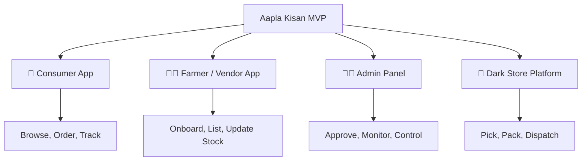
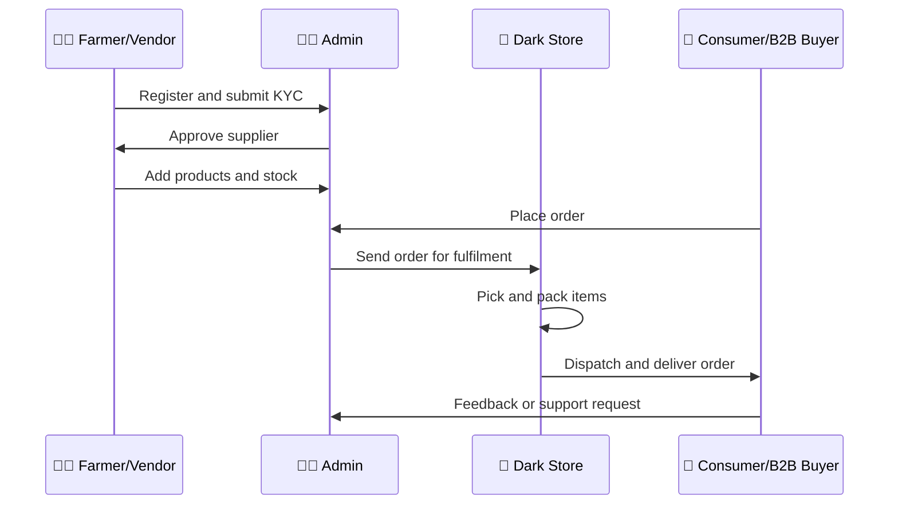

# 🧩 Aapla Kisan MVP Feature List

### Minimum Viable Product Scope for Fresh Supply Chain Pilot Execution

A practical MVP feature map for launching Aapla Kisan as a controlled pilot across consumers, farmers/vendors, admin teams, and dark store operations.

 

---

## 🧭 MVP Philosophy

The Aapla Kisan MVP should not try to build every feature from day one.

The goal of the MVP is to validate the fresh produce operating model with the minimum set of features required to manage:

- Supply declaration
- Farmer/vendor onboarding
- Product listing
- Consumer ordering
- B2B ordering
- Inventory visibility
- Dark store fulfilment
- Admin approvals
- Quality control
- Pilot KPI tracking

The MVP should help answer one core question:

> **Can Aapla Kisan run a controlled fresh produce supply chain pilot with real users, real suppliers, real orders, and measurable operational performance?**

---

## 🎯 MVP Objective

The MVP should support a pilot where the team can:

| Objective | Why It Matters |
|---|---|
| 🌾 Onboard farmers/vendors | Build the supply base |
| 🥬 List and manage products | Create sellable fresh produce catalog |
| 🧺 Accept consumer orders | Validate B2C demand |
| 🏪 Handle B2B requirements | Validate recurring bulk demand |
| 🏬 Manage dark store fulfilment | Execute picking, packing, dispatch |
| 🧑‍💼 Give admin control | Manage approvals, products, orders, and reports |
| 📊 Track KPIs | Measure fulfilment, wastage, quality, and repeat demand |

---

# 🏗️ Product Architecture

Aapla Kisan MVP is divided into four core product layers.

---

# 📱 1. Consumer App MVP

## Purpose

The consumer app should allow users to discover fresh produce, place orders, select delivery details, and track order status.

The consumer MVP should be simple, mobile-first, and trust-building.

---

## Day 1 MVP Features

| Feature | Priority | Purpose |
|---|---|---|
| 🌐 Language Selection | Must Have | Supports English and Marathi users |
| 🔐 Login with Mobile Number | Must Have | Basic user authentication |
| 👤 Profile Setup | Must Have | Captures name, area, pincode |
| 📍 Location Selection | Must Have | Confirms delivery area |
| 🏠 Home / Landing Page | Must Have | Shows fresh produce categories and offers |
| 🥬 Product Categories | Must Have | Helps users browse fruits, vegetables, premium items |
| 🛒 Product Listing | Must Have | Shows product name, image, price, unit |
| ➕ Add to Cart | Must Have | Enables order building |
| 🧾 Cart Review | Must Have | Lets users confirm quantity and items |
| 📦 Delivery Slot Selection | Must Have | Supports planned fulfilment |
| ✅ Order Confirmation | Must Have | Confirms order successfully |
| 📍 Order Tracking Status | Must Have | Builds trust through visibility |
| 📜 Order History | Should Have | Supports repeat behaviour |

---

## Phase 2 Consumer Features

| Feature | Priority | Purpose |
|---|---|---|
| 🔁 Repeat Order | Should Have | Improves customer retention |
| ❤️ Wishlist / Favourite Products | Could Have | Helps repeat buyers |
| 🎟️ Promo Code | Could Have | Supports growth campaigns |
| ⭐ Product Ratings | Could Have | Builds trust |
| 🧑‍🌾 Farmer Story / Source Info | Could Have | Strengthens local farm connection |
| 🧺 Subscription Basket | Should Have | Supports recurring demand |
| 🗓️ Pre-Booking Essentials | Should Have | Improves demand forecasting |

---

## Consumer MVP Success Metrics

| Metric | Why It Matters |
|---|---|
| Total consumer orders | Measures demand |
| Repeat order rate | Measures retention |
| Average order value | Measures commercial potential |
| Cart abandonment | Measures UX friction |
| Delivery slot selection rate | Measures planning adoption |
| Complaint rate | Measures quality and service experience |

---

# 👨‍🌾 2. Farmer / Vendor App MVP

## Purpose

The farmer/vendor app should help suppliers register, share business details, upload products, update stock, manage order requests, and view payout information.

The MVP should be simple enough for non-technical users and clear enough to support operational planning.

---

## Day 1 MVP Features

| Feature | Priority | Purpose |
|---|---|---|
| 🌐 Language Selection | Must Have | Supports local usability |
| 🔐 Login with Mobile Number | Must Have | Basic authentication |
| 👨‍🌾 Role Selection | Must Have | Identifies farmer, vendor, or market user |
| 🧾 Basic Details | Must Have | Captures name, mobile, address, city, pincode |
| 🏪 Business Details | Must Have | Captures farm/shop name, produce category |
| 📄 KYC Upload | Must Have | Supports verification |
| 🏦 Bank Details | Must Have | Supports payout process |
| ⏳ Submission Status | Must Have | Shows approval progress |
| 📊 Seller Dashboard | Must Have | Gives supplier overview |
| 🥬 Product Listing | Must Have | Allows supplier to list produce |
| ➕ Add Product | Must Have | Creates fresh produce catalog |
| 💰 Set Price | Must Have | Captures expected selling price |
| 📦 Stock Update | Must Have | Captures available quantity |
| 📥 Order Requests | Must Have | Allows supplier to accept/manage requests |
| 💸 Payout Summary | Should Have | Builds payment transparency |
| 🎧 Help / Support | Should Have | Allows issue resolution |

---

## Phase 2 Farmer / Vendor Features

| Feature | Priority | Purpose |
|---|---|---|
| 📈 Sales Report | Should Have | Helps supplier understand performance |
| 🔔 Stock Reminder Alerts | Could Have | Improves stock update discipline |
| 🏷️ Grade-Based Pricing | Should Have | Rewards better quality |
| 📆 Harvest Declaration Calendar | Should Have | Improves predictive supply |
| 🚚 Delivery / Handover Plan | Should Have | Improves logistics coordination |
| 🏆 Supplier Reliability Score | Could Have | Supports long-term supplier ranking |
| 💬 In-App Communication | Could Have | Improves coordination with ops/admin |

---

## Farmer / Vendor MVP Success Metrics

| Metric | Why It Matters |
|---|---|
| Number of registered suppliers | Measures supply network growth |
| Approval completion rate | Measures onboarding quality |
| Active supplier count | Measures actual participation |
| Stock update frequency | Measures supply visibility |
| Declared vs actual supply | Measures reliability |
| Supplier payout issues | Measures trust and process quality |

---

# 🧑‍💼 3. Admin Panel MVP

## Purpose

The admin panel is the control center of the platform.

It should help the team approve users, manage products, monitor orders, control pricing, view reports, and handle operational issues.

---

## Day 1 MVP Features

| Feature | Priority | Purpose |
|---|---|---|
| 🔐 Admin Login | Must Have | Secure platform access |
| 📊 Admin Dashboard | Must Have | Shows key metrics and alerts |
| 👥 Customer List | Must Have | View and manage customers |
| 👨‍🌾 Farmer / Vendor List | Must Have | View and manage suppliers |
| ✅ Onboarding Approvals | Must Have | Approve or reject suppliers |
| 🧺 Category Management | Must Have | Manage fruits, vegetables, premium categories |
| 🥬 Product Management | Must Have | Add, edit, and manage SKUs |
| 💰 Pricing Rules | Must Have | Manage fixed/market-linked pricing |
| 📦 Orders Overview | Must Have | Monitor all orders |
| 🏬 Dark Store Monitor | Must Have | View fulfilment status |
| 🎧 Tickets / Issues | Should Have | Manage complaints and operational problems |
| 📊 Sales / Inventory Reports | Should Have | Track business and operations performance |
| 🔐 Roles and Permissions | Should Have | Control user access |

---

## Phase 2 Admin Features

| Feature | Priority | Purpose |
|---|---|---|
| 📢 Broadcast Notifications | Could Have | Send updates to users/suppliers |
| 🎟️ Promo / Banner Management | Could Have | Support marketing campaigns |
| 📈 Advanced Analytics | Should Have | Improve decision-making |
| 🏆 Supplier Scorecards | Should Have | Track reliable suppliers |
| 🚚 Route / Delivery Planning | Should Have | Improve dispatch efficiency |
| 🧾 Invoice / B2B Billing | Should Have | Support business buyers |
| ⚠️ Risk Dashboard | Could Have | Track stock, SLA, supplier, and finance risks |

---

## Admin MVP Success Metrics

| Metric | Why It Matters |
|---|---|
| Approval turnaround time | Measures admin efficiency |
| Product update accuracy | Measures catalog quality |
| Order monitoring accuracy | Measures operational control |
| Issue resolution time | Measures support quality |
| Pricing update accuracy | Measures commercial control |
| Report availability | Measures decision readiness |

---

# 🏬 4. Dark Store Platform MVP

## Purpose

The dark store platform should help the operations team manage order queues, picking, packing, stock exceptions, dispatch, handover, inventory, and returns.

This layer is critical because fresh produce success depends heavily on fulfilment accuracy.

---

## Day 1 MVP Features

| Feature | Priority | Purpose |
|---|---|---|
| 🔐 Operations Login | Must Have | Secure access for ops team |
| 📊 Ops Dashboard | Must Have | View order queue and SLA status |
| 📦 Order Details | Must Have | Shows customer/order/item details |
| 📋 Picklist | Must Have | Guides picker item-by-item |
| ⚠️ Out-of-Stock Action | Must Have | Handles unavailable items |
| ✅ Package Verification | Must Have | Confirms items before dispatch |
| 🚚 Dispatch Queue | Must Have | Tracks ready orders |
| 🤝 Handover Confirmation | Must Have | Confirms rider/order handoff |
| 🏬 Inventory Dashboard | Must Have | Tracks stock levels |
| 📥 Stock Inward | Must Have | Records received stock |
| 🔄 Stock Adjustment | Should Have | Handles corrections |
| ↩️ Returns | Should Have | Handles rejected/returned items |
| 📊 Reports | Should Have | Tracks fulfilment performance |

---

## Phase 2 Dark Store Features

| Feature | Priority | Purpose |
|---|---|---|
| 📍 Bin Location Mapping | Should Have | Improves picking speed |
| ⏱️ SLA Timer Alerts | Should Have | Prevents fulfilment delays |
| 📷 Packing Photo Proof | Could Have | Improves dispute resolution |
| 🧾 Batch Dispatch Planning | Should Have | Improves delivery efficiency |
| 🧊 Storage Condition Logs | Could Have | Supports quality control |
| 📉 Wastage Reason Tracking | Should Have | Reduces spoilage over time |
| 📦 SKU Ageing Report | Should Have | Supports FIFO/FEFO discipline |

---

## Dark Store MVP Success Metrics

| Metric | Why It Matters |
|---|---|
| Picking time | Measures operational speed |
| Packing accuracy | Measures order quality |
| Dispatch time | Measures fulfilment readiness |
| Stockout incidents | Measures inventory accuracy |
| Returns rate | Measures quality and fulfilment issues |
| Wastage percentage | Measures fresh supply chain control |

---

# 🔗 Cross-Platform Data Requirements

The MVP should capture the minimum data required to run the pilot.

| Data Area | Required Fields |
|---|---|
| 👤 Customer Data | Name, mobile, address, pincode, order history |
| 🌾 Supplier Data | Name, mobile, role, location, KYC, bank, product category |
| 🥬 Product Data | Product name, category, image, unit, price, stock, grade |
| 📦 Order Data | Order ID, customer, items, quantity, delivery slot, status |
| 🏬 Inventory Data | SKU, available quantity, inward quantity, stockout, wastage |
| ✅ Quality Data | Grade, accepted quantity, rejected quantity, reason |
| 🚚 Dispatch Data | Rider, order ID, handover time, delivery status |
| 📊 KPI Data | Orders, repeat rate, wastage, fill rate, stockouts, complaints |

---

# 🧪 MVP Pilot Workflow

---

# 📊 MVP Priority Matrix

| Priority Level | Meaning | Examples |
|---|---|---|
| ✅ **Must Have** | Required for Day 1 pilot | Login, onboarding, product listing, order placement, picklist, dispatch |
| 🟡 **Should Have** | Important but can be improved after launch | Reports, payout summary, returns, supplier score |
| 🔵 **Could Have** | Useful for later experience improvement | Promo codes, wishlist, advanced analytics, photo proof |
| ⚪ **Later** | Not needed for pilot validation | Loyalty system, advanced AI forecasting, marketplace expansion |

---

# 🚦 Build vs Manual Decision

Not everything should be built immediately.

Some processes can start manually during the pilot to avoid overbuilding.

| Process | MVP Approach |
|---|---|
| Customer ordering | Build basic digital flow |
| Farmer onboarding | Build form-based flow |
| Product listing | Build simple catalog |
| Inventory tracking | Basic dashboard or structured sheet initially |
| B2B order management | Manual-assisted or admin-managed initially |
| KPI dashboard | Google Sheet / Looker Studio first, product dashboard later |
| Route planning | Manual initially, automation later |
| Forecasting | Manual analysis first, predictive model later |

---

# 🏁 MVP Launch Readiness Checklist

Before launch, the MVP should have:

- [ ] Consumer can register and place an order
- [ ] Farmer/vendor can register and add products
- [ ] Admin can approve users and manage products
- [ ] Orders can be viewed and processed
- [ ] Dark store team can pick, pack, and dispatch
- [ ] Stock can be updated
- [ ] Out-of-stock cases can be handled
- [ ] Delivery status can be tracked
- [ ] Basic complaints/support can be handled
- [ ] Weekly KPI sheet is ready
- [ ] Pilot success metrics are defined

---

# 🧠 Consultant View

The Aapla Kisan MVP should be treated as an operating model validation tool, not a complete product from day one.

The first version should prove:

- Can suppliers onboard?
- Can stock be declared?
- Can products be listed?
- Can customers order?
- Can B2B demand be captured?
- Can the dark store fulfil orders?
- Can admins control the system?
- Can the team track KPIs?
- Can the model reduce wastage and improve reliability?

Once these are proven, advanced features can be added with confidence.

---

# 🏆 Skills Demonstrated

| Skill Area | Demonstrated Through |
|---|---|
| **Product Strategy** | MVP planning, feature prioritization, phased roadmap |
| **Business Analysis** | User role mapping, data requirements, workflow planning |
| **UI/UX Thinking** | Role-based journeys, mobile-first screens, bilingual interface |
| **Operations Planning** | Dark store workflow, order processing, stock handling |
| **Supply Chain Thinking** | Supplier onboarding, quality, inventory, fulfilment |
| **Go-To-Market Thinking** | Pilot-first feature selection and phased rollout |
| **Analytics Thinking** | MVP KPIs, success metrics, dashboard readiness |

---

# 📝 Public Portfolio Note

This document is a public-safe MVP feature plan created for portfolio presentation.

Client-specific names, private budgets, payment terms, commercial proposal details, and confidential implementation terms have been removed or generalized.

---

### Built as a proof-of-work product strategy document for MVP planning, business analysis, and fresh supply chain execution.

