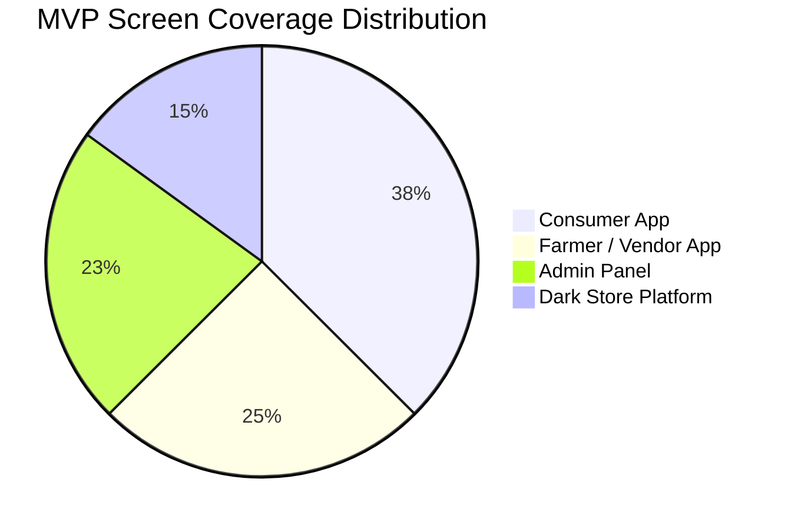
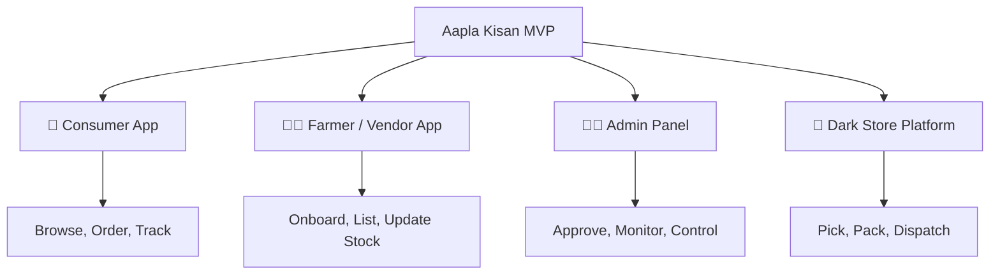
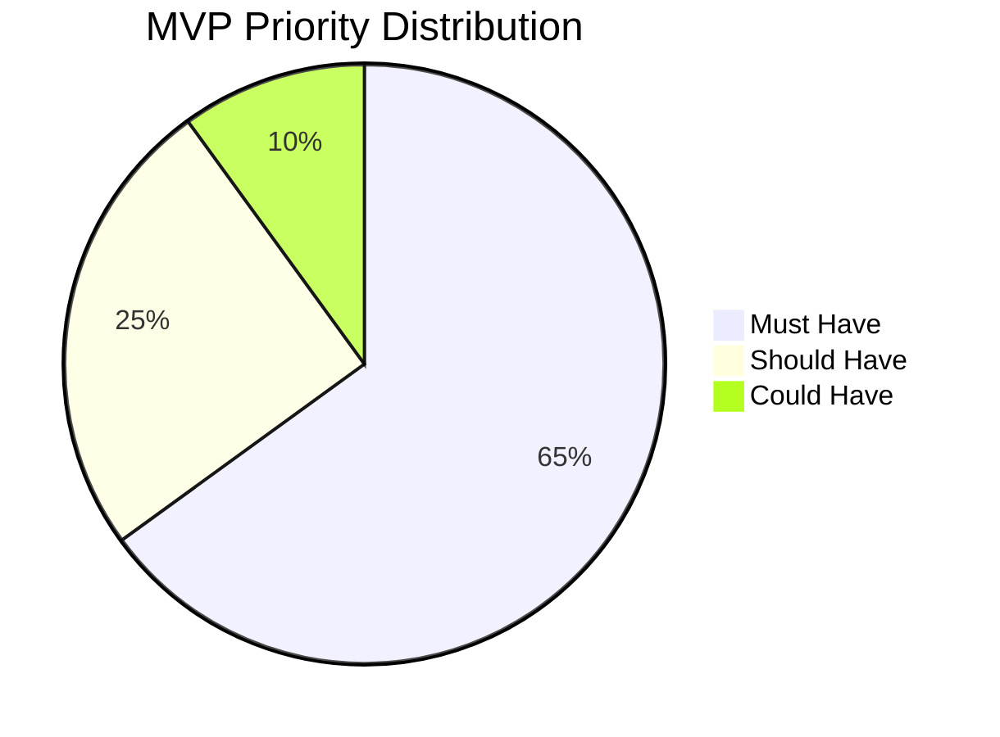
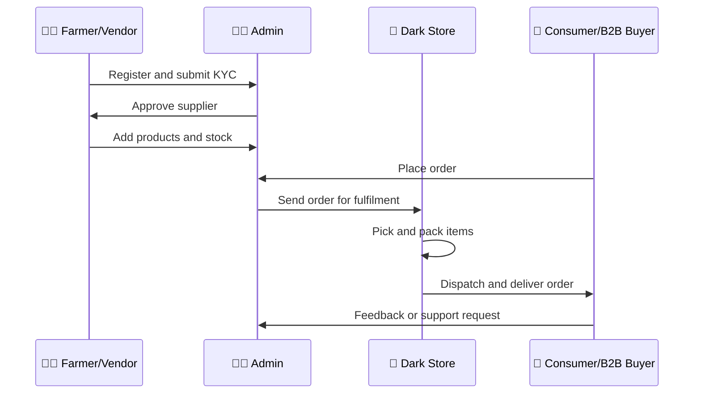

<div align="center">

# 🧩 Aapla Kisan MVP Feature List

### Minimum Viable Product Scope for Fresh Supply Chain Pilot Execution

A visual MVP planning document for launching Aapla Kisan as a controlled pilot across consumers, farmers/vendors, admin teams, and dark-store operations.

<br>


</div>

---

<p align="center">
  
</p>

---

## 🧭 MVP Philosophy

The Aapla Kisan MVP should not try to build every possible feature from day one.

The goal is to validate the fresh produce operating model with the minimum feature set required to manage:

- 🌾 Supplier onboarding and supply declaration
- 🥬 Product listing and stock visibility
- 🧺 Consumer ordering and delivery tracking
- 🏪 B2B recurring order capture
- 🏬 Dark-store fulfilment
- 🧑‍💼 Admin approvals and governance
- ✅ Quality control and exception handling
- 📊 Pilot KPI tracking

The MVP should answer one core question:

> **Can Aapla Kisan run a controlled fresh produce pilot with real users, real suppliers, real orders, and measurable operational performance?**

---

# 📊 Product Layer Screen Coverage

These are repository-based planning metrics derived from the uploaded wireframe previews.

| Product Layer | Screen Coverage | MVP Role |
|---|---:|---|
| 📱 Consumer App | 15 | Browse, order, checkout, track, repeat |
| 👨‍🌾 Farmer / Vendor App | 10 | Register, list, update stock, payout |
| 🧑‍💼 Admin Panel | 9 | Approve, monitor, control pricing, manage reports |
| 🏬 Dark Store Platform | 6 | Pick, pack, dispatch, update inventory |

```mermaid
xyChart-beta
    title "MVP Wireframe Coverage by Product Layer"
    x-axis ["Consumer", "Farmer/Vendor", "Admin", "Dark Store"]
    y-axis "Screens" 0 --> 16
    bar [15, 10, 9, 6]
```



---

# 🏗️ Product Architecture



---

# 📱 1. Consumer App MVP

<p align="center">
  
</p>

## Purpose

The consumer app should allow users to discover fresh produce, place orders, select delivery details, and track order status.

## Day 1 Features

| Feature | Priority | Purpose |
|---|---|---|
| 🌐 Language Selection | Must Have | Supports English and Marathi users |
| 🔐 Login with Mobile Number | Must Have | Basic user authentication |
| 👤 Profile Setup | Must Have | Captures name, area, pincode |
| 📍 Location Selection | Must Have | Confirms delivery area |
| 🏠 Home / Landing Page | Must Have | Shows fresh produce categories and offers |
| 🥬 Product Categories | Must Have | Helps users browse fruits and vegetables |
| 🛒 Product Listing | Must Have | Shows product name, image, price, unit |
| ➕ Add to Cart | Must Have | Enables order building |
| 🧾 Cart Review | Must Have | Lets users confirm quantity and items |
| 📦 Delivery Slot Selection | Must Have | Supports planned fulfilment |
| ✅ Order Confirmation | Must Have | Confirms order successfully |
| 📍 Order Tracking Status | Must Have | Builds trust through visibility |
| 📜 Order History | Should Have | Supports repeat behaviour |

## Phase 2 Consumer Features

| Feature | Priority | Purpose |
|---|---|---|
| 🔁 Repeat Order | Should Have | Improves customer retention |
| ❤️ Wishlist / Favourite Products | Could Have | Helps repeat buyers |
| 🎟️ Promo Code | Could Have | Supports growth campaigns |
| ⭐ Product Ratings | Could Have | Builds trust |
| 🧑‍🌾 Farmer Story / Source Info | Could Have | Strengthens local farm connection |
| 🧺 Subscription Basket | Should Have | Supports recurring demand |
| 🗓️ Pre-Booking Essentials | Should Have | Improves demand forecasting |

---

# 👨‍🌾 2. Farmer / Vendor App MVP

<p align="center">
  
</p>

## Purpose

The farmer/vendor app should help suppliers register, share business details, upload products, update stock, manage order requests, and view payout information.

## Day 1 Features

| Feature | Priority | Purpose |
|---|---|---|
| 🌐 Language Selection | Must Have | Supports local usability |
| 🔐 Login with Mobile Number | Must Have | Basic authentication |
| 👨‍🌾 Role Selection | Must Have | Identifies farmer, vendor, or market user |
| 🧾 Basic Details | Must Have | Captures name, mobile, address, city, pincode |
| 🏪 Business Details | Must Have | Captures farm/shop name, produce category |
| 📄 KYC Upload | Must Have | Supports verification |
| 🏦 Bank Details | Must Have | Supports payout process |
| ⏳ Submission Status | Must Have | Shows approval progress |
| 📊 Seller Dashboard | Must Have | Gives supplier overview |
| 🥬 Product Listing | Must Have | Allows supplier to list produce |
| ➕ Add Product | Must Have | Creates fresh produce catalog |
| 💰 Set Price | Must Have | Captures expected selling price |
| 📦 Stock Update | Must Have | Captures available quantity |
| 📥 Order Requests | Must Have | Allows supplier to accept/manage requests |
| 💸 Payout Summary | Should Have | Builds payment transparency |
| 🎧 Help / Support | Should Have | Allows issue resolution |

---

# 🧑‍💼 3. Admin Panel MVP

<p align="center">
  
</p>

## Purpose

The admin panel is the control center of the platform. It should help the team approve users, manage products, monitor orders, control pricing, view reports, and handle operational issues.

## Day 1 Features

| Feature | Priority | Purpose |
|---|---|---|
| 🔐 Admin Login | Must Have | Secure platform access |
| 📊 Admin Dashboard | Must Have | Shows key metrics and alerts |
| 👥 Customer List | Must Have | View and manage customers |
| 👨‍🌾 Farmer / Vendor List | Must Have | View and manage suppliers |
| ✅ Onboarding Approvals | Must Have | Approve or reject suppliers |
| 🧺 Category Management | Must Have | Manage fruits, vegetables, premium categories |
| 🥬 Product Management | Must Have | Add, edit, and manage SKUs |
| 💰 Pricing Rules | Must Have | Manage fixed/market-linked pricing |
| 📦 Orders Overview | Must Have | Monitor all orders |
| 🏬 Dark Store Monitor | Must Have | View fulfilment status |
| 🎧 Tickets / Issues | Should Have | Manage complaints and operational problems |
| 📊 Sales / Inventory Reports | Should Have | Track business and operations performance |
| 🔐 Roles and Permissions | Should Have | Control user access |

---

# 🏬 4. Dark Store Platform MVP

<p align="center">
  
</p>

## Purpose

The dark store platform should help the operations team manage order queues, picking, packing, stock exceptions, dispatch, handover, inventory, and returns.

## Day 1 Features

| Feature | Priority | Purpose |
|---|---|---|
| 🔐 Operations Login | Must Have | Secure access for ops team |
| 📊 Ops Dashboard | Must Have | View order queue and SLA status |
| 📦 Order Details | Must Have | Shows customer/order/item details |
| 📋 Picklist | Must Have | Guides picker item-by-item |
| ⚠️ Out-of-Stock Action | Must Have | Handles unavailable items |
| ✅ Package Verification | Must Have | Confirms items before dispatch |
| 🚚 Dispatch Queue | Must Have | Tracks ready orders |
| 🤝 Handover Confirmation | Must Have | Confirms rider/order handoff |
| 🏬 Inventory Dashboard | Must Have | Tracks stock levels |
| 📥 Stock Inward | Must Have | Records received stock |
| 🔄 Stock Adjustment | Should Have | Handles corrections |
| ↩️ Returns | Should Have | Handles rejected/returned items |
| 📊 Reports | Should Have | Tracks fulfilment performance |

---

# 📊 Feature Priority Distribution



> Priority values are planning weights for MVP communication and should be revised during final sprint planning.

---

# 🔗 Cross-Platform Data Requirements

| Data Area | Required Fields |
|---|---|
| 👤 Customer Data | Name, mobile, address, pincode, order history |
| 🌾 Supplier Data | Name, mobile, role, location, KYC, bank, product category |
| 🥬 Product Data | Product name, category, image, unit, price, stock, grade |
| 📦 Order Data | Order ID, customer, items, quantity, delivery slot, status |
| 🏬 Inventory Data | SKU, available quantity, inward quantity, stockout, wastage |
| ✅ Quality Data | Grade, accepted quantity, rejected quantity, reason |
| 🚚 Dispatch Data | Rider, order ID, handover time, delivery status |
| 📊 KPI Data | Orders, repeat rate, wastage, fill rate, stockouts, complaints |

---

# 🧪 MVP Pilot Workflow



---

# 🚦 Build vs Manual Decision

| Process | MVP Approach |
|---|---|
| Customer ordering | Build basic digital flow |
| Farmer onboarding | Build form-based flow |
| Product listing | Build simple catalog |
| Inventory tracking | Basic dashboard or structured sheet initially |
| B2B order management | Manual-assisted or admin-managed initially |
| KPI dashboard | Google Sheet / Looker Studio first, product dashboard later |
| Route planning | Manual initially, automation later |
| Forecasting | Manual analysis first, predictive model later |

---

# 🏁 MVP Launch Readiness Checklist

- [ ] Consumer can register and place an order
- [ ] Farmer/vendor can register and add products
- [ ] Admin can approve users and manage products
- [ ] Orders can be viewed and processed
- [ ] Dark store team can pick, pack, and dispatch
- [ ] Stock can be updated
- [ ] Out-of-stock cases can be handled
- [ ] Delivery status can be tracked
- [ ] Basic complaints/support can be handled
- [ ] Weekly KPI sheet is ready
- [ ] Pilot success metrics are defined

---

# 🏆 Skills Demonstrated

| Skill Area | Demonstrated Through |
|---|---|
| **Product Strategy** | MVP planning, feature prioritization, phased roadmap |
| **Business Analysis** | User role mapping, data requirements, workflow planning |
| **UI/UX Thinking** | Role-based journeys, mobile-first screens, bilingual interface |
| **Operations Planning** | Dark store workflow, order processing, stock handling |
| **Supply Chain Thinking** | Supplier onboarding, quality, inventory, fulfilment |
| **Analytics Thinking** | MVP KPIs, success metrics, dashboard readiness |
| **Data Visualization** | Screen coverage bar chart, priority pie chart, product architecture map |

---

# 📝 Public Portfolio Note

This document is a public-safe MVP feature plan created for portfolio presentation. Feature priorities and chart values are planning assumptions and should be revised during final product sprint planning.
