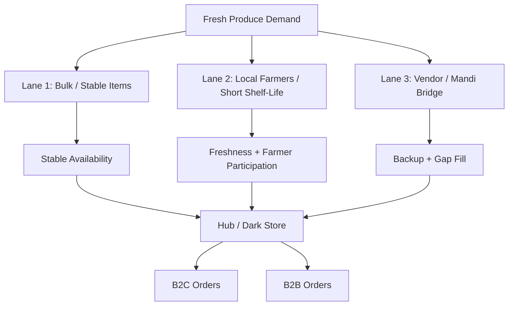
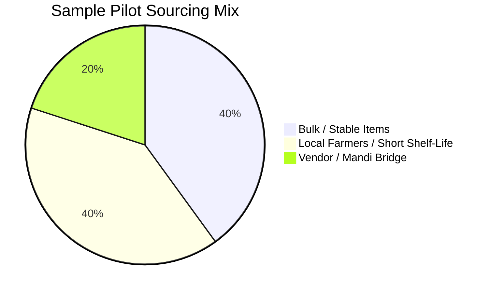
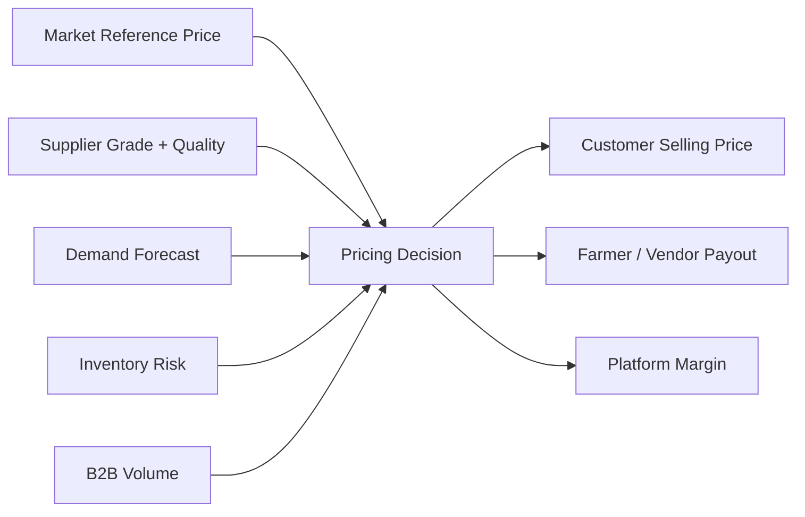
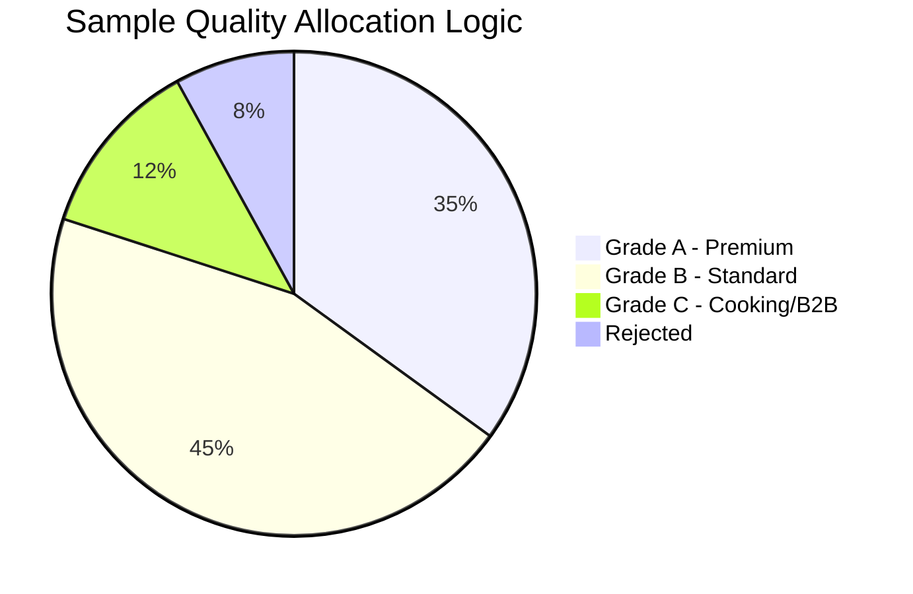
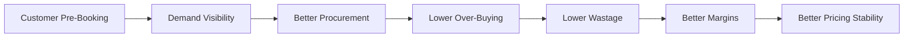
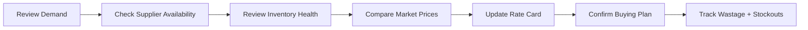

<div align="center">

# 💰 Aapla Kisan Procurement & Pricing Model

### Fixed-Price + Market-Linked Fresh Produce Sourcing Framework

A strategic sourcing and pricing framework for balancing farmer/vendor trust, customer affordability, B2B consistency, wastage control, inventory health, and sustainable platform margins.

<br>


</div>

---

<p align="center">
  
</p>

---

## 🧭 Executive View

Fresh produce pricing is complex because market prices change frequently, while customers and B2B buyers prefer stable pricing, predictable quality, and reliable supply.

Aapla Kisan uses a **fixed-price + market-linked pricing model** to balance:

- Fair farmer/vendor payout
- Customer price stability
- B2B procurement consistency
- Inventory control
- Wastage reduction
- Sustainable platform margins

The goal is not to compete only on the cheapest price. The stronger goal is to build a reliable fresh supply chain where price, quality, quantity, and delivery are predictable.

---

# 🎯 Strategic Objective

| Objective | Business Reason |
|---|---|
| 🌾 Fair supplier participation | Farmers/vendors need trust, clarity, and predictable payment |
| 🥬 Better quality control | Grade-based sourcing improves customer experience |
| 🧺 Customer price stability | Reduces daily price shocks for B2C buyers |
| 🏪 B2B consistency | Helps restaurants, hostels, cafes, and retailers plan procurement |
| 🏬 Dark store control | Improves inventory planning and dispatch readiness |
| 📉 Lower wastage | Reduces over-buying and unsold perishable stock |
| 📊 Better margin visibility | Helps track procurement variance and profitability |

---

# 🏗️ Procurement Model Overview

Aapla Kisan should not depend on only one supply source. The model uses a **3-lane sourcing framework**.



---

# 📊 Sourcing Mix Visualization

> The chart below is a sample pilot planning split, not actual operating data. It shows how the sourcing model can be balanced during the pilot.



---

# 🛣️ Three-Lane Sourcing Model

<p align="center">
  
</p>

| Lane | Best For | Pricing Logic | Main Benefit | Control Needed |
|---|---|---|---|---|
| **Lane 1: Bulk / Stable Items** | Staples, high-demand predictable SKUs | Fixed rate-card for defined cycle | Price stability and availability | Days-of-cover, wastage %, stock ageing |
| **Lane 2: Local Farmers** | Leafy, seasonal, fragile, short shelf-life produce | Grade-based + market reference | Freshness and farmer participation | Supplier reliability, accepted vs rejected stock |
| **Lane 3: Vendor / Mandi Bridge** | Gap-fill, emergency stock, early pilot stage | Market-linked | Protects fulfilment reliability | Vendor comparison, price variance, quality rejection rate |

---

# 💰 Pricing Model

Aapla Kisan should use a pricing model that is stable enough for customers but flexible enough to remain connected to real market conditions.



---

## Pricing Layers

| Layer | Purpose |
|---|---|
| 🌾 **Farmer / Vendor Payout** | Ensures supplier trust and participation |
| 🥬 **Grade-Based Price** | Rewards better quality produce |
| 📈 **Market Reference** | Keeps pricing realistic and sustainable |
| 🧺 **B2C Selling Price** | Creates stable customer-facing price bands |
| 🏪 **B2B Rate Card** | Supports recurring buyers with predictable pricing |
| 🏬 **Platform Margin** | Supports operations, fulfilment, and sustainability |

---

# 📈 Pricing Decision Weightage

```mermaid
xyChart-beta
    title "Sample Pricing Decision Weightage"
    x-axis ["Market Price", "Quality Grade", "Demand Forecast", "Inventory Risk", "B2B Volume", "Platform Margin"]
    y-axis "Weightage %" 0 --> 40
    bar [30, 20, 15, 15, 10, 10]
```

> These values are planning weights for visualization, not actual market values.

---

# 🌾 Farmer / Vendor Pricing Logic

Farmer/vendor pricing should be transparent and linked to quality.

| Pricing Element | Purpose |
|---|---|
| **Assured Floor Price** | Gives supplier minimum price confidence |
| **Market Reference Benchmark** | Keeps payout connected to wholesale reality |
| **Grade-Based Payout** | Better quality earns better rate |
| **Supply Commitment** | Reliable suppliers can be prioritized |
| **Payment Cycle Clarity** | Builds trust and reduces disputes |
| **Supplier Reliability Score** | Rewards consistency over time |

---

# ✅ Grade-Based Payout Model

<p align="center">
  
</p>

| Grade | Meaning | Pricing Treatment |
|---|---|---|
| ✅ **Grade A** | Premium quality, fresh, clean, low defects | Highest payout |
| 🟢 **Grade B** | Standard saleable quality | Normal payout |
| 🟡 **Grade C** | Usable but lower quality | Discounted payout or B2B/processing use |
| 🔴 **Rejected** | Damaged, spoiled, or below acceptance | Not accepted / returned / documented |



---

# 🧺 B2C Pricing Logic

B2C customers need trust, clarity, and price stability.

| Option | Use Case | Strategic Benefit |
|---|---|---|
| 🛒 **Instant Order** | Limited same-day availability | Convenience |
| 🗓️ **Next-Day Order** | Default planned fulfilment | Better inventory planning |
| 🔁 **Pre-Book Essentials** | Regular basket or scheduled order | Demand predictability |
| 🧺 **Curated Basket** | Fixed produce bundles | Higher average order value |
| 🎯 **Local Seasonal Offers** | Seasonal produce promotion | Stock movement and freshness appeal |

---

# 🏪 B2B Pricing Logic

| Pricing Model | Use Case |
|---|---|
| **Rate Card Pricing** | Fixed price for a defined cycle |
| **Volume Slabs** | Better pricing for higher quantity |
| **Standing Orders** | Recurring daily/weekly supply |
| **Grade-Based Pricing** | Premium grade vs cooking grade |
| **Scheduled Dispatch Pricing** | Lower chaos through planned delivery |
| **Credit-Controlled Supply** | Controlled payment terms for reliable buyers |

---

# 🔁 Pre-Booking Model

Pre-booking creates demand visibility before procurement decisions are made.



---

# 📊 Sample Impact of Pre-Booking

```mermaid
xyChart-beta
    title "Sample Relationship: Pre-Booking Adoption vs Wastage Control"
    x-axis ["0%", "10%", "20%", "30%", "40%", "50%"]
    y-axis "Estimated Wastage %" 0 --> 18
    line [16, 14, 12, 10, 8, 6]
```

> Planning assumption: as pre-booking adoption increases, wastage can reduce because procurement becomes more predictable.

---

# 🏬 Inventory Health Connection

<p align="center">
  
</p>

| Inventory Metric | Pricing / Procurement Impact |
|---|---|
| **Days of Cover** | Indicates how many days current stock can support |
| **Wastage %** | Shows over-buying or poor storage handling |
| **Stockout Frequency** | Shows under-buying or supplier inconsistency |
| **SKU Ageing** | Helps identify slow-moving products |
| **Fill Rate** | Measures how often orders are fulfilled completely |
| **Supplier Reliability** | Helps rank sourcing partners |
| **Price Variance** | Measures difference between expected and actual procurement price |

```mermaid
xyChart-beta
    title "Sample Inventory Health Targets"
    x-axis ["Fill Rate", "Supplier Reliability", "On-Time Supply", "Stockout Control", "Wastage Control"]
    y-axis "Target %" 0 --> 100
    bar [90, 80, 85, 93, 90]
```

---

# ⚠️ Risk Heatmap

| Risk | Probability | Impact | Risk Level | Control |
|---|---|---|---|---|
| 🌾 Supplier fails to deliver | Medium | High | 🔴 High | Multiple sourcing lanes |
| 📈 Market price spike | Medium | High | 🔴 High | Market-linked review cycle |
| 📦 Over-buying | High | High | 🔴 High | Pre-booking and demand planning |
| 🥬 Poor quality produce | Medium | High | 🔴 High | Digital grading and rejection rules |
| 🏪 B2B demand fluctuation | Medium | Medium | 🟡 Medium | Standing orders and confirmed schedules |
| 💸 Payment disputes | Low | High | 🟡 Medium | Transparent payout and acceptance records |
| 📊 Poor data quality | Medium | Medium | 🟡 Medium | Mandatory fields and weekly review |

---

# 🔁 Weekly Procurement Review Rhythm



---

# 🧠 Consultant View

The Aapla Kisan pricing model should not compete only on discounts. Its stronger advantage is **predictability**.

A strong fresh produce model wins when it can create predictable supply, predictable demand, predictable quality, predictable fulfilment, predictable pricing, and predictable margins.

---

# 🏆 Skills Demonstrated

| Skill Area | Demonstrated Through |
|---|---|
| **Business Strategy** | Fixed + market-linked pricing logic |
| **Supply Chain Thinking** | 3-lane sourcing model and procurement controls |
| **Operations Planning** | Inventory health and dark store alignment |
| **Product Strategy** | Pricing logic connected to product workflows |
| **B2B Thinking** | Rate cards, standing orders, volume-based pricing |
| **Analytics Thinking** | Price variance, fill rate, wastage, supplier reliability |
| **Data Visualization** | Pie chart, bar chart, line chart, decision matrix, risk heatmap |
| **Consulting Documentation** | Public-safe strategy framework and decision matrix |

---

# 📝 Public Portfolio Note

This is a public-safe procurement and pricing model created for portfolio presentation. The sample chart values are planning assumptions for visualization purposes and are not actual pilot results.
