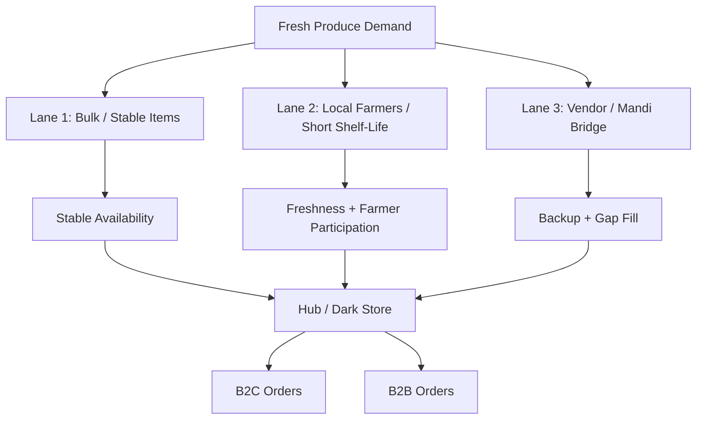
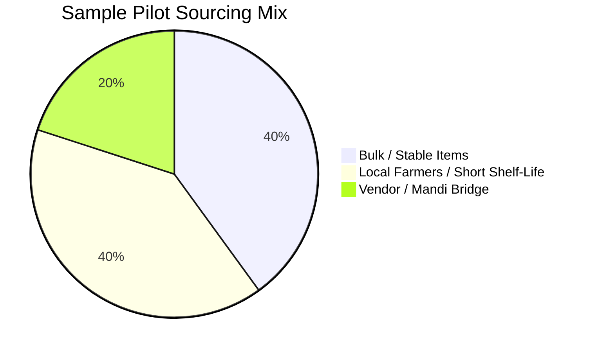
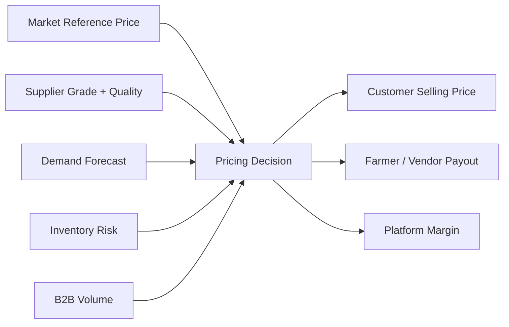
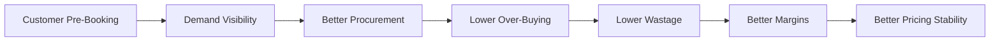
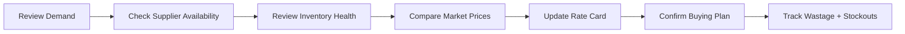

<div align="center">

# 💰 Aapla Kisan Procurement & Pricing Model

### Fixed-Price + Market-Linked Fresh Produce Sourcing Framework

A strategic sourcing and pricing framework for balancing farmer/vendor trust, customer affordability, B2B consistency, wastage control, inventory health, and sustainable platform margins.

<br>


</div>

---

## 🧭 Executive View

Fresh produce pricing is complex because market prices change frequently, while customers and B2B buyers prefer stable pricing, predictable quality, and reliable supply.

Aapla Kisan uses a **fixed-price + market-linked pricing model** to balance:

- Fair farmer/vendor payout
- Customer price stability
- B2B procurement consistency
- Inventory control
- Wastage reduction
- Sustainable platform margins

The goal is not to compete only on the cheapest price. The stronger goal is to build a reliable fresh supply chain where price, quality, quantity, and delivery are predictable.

---

## 🎯 Strategic Objective

The procurement and pricing model should help Aapla Kisan achieve:

| Objective | Business Reason |
|---|---|
| 🌾 Fair supplier participation | Farmers/vendors need trust, clarity, and predictable payment |
| 🥬 Better quality control | Grade-based sourcing improves customer experience |
| 🧺 Customer price stability | Reduces daily price shocks for B2C buyers |
| 🏪 B2B consistency | Helps restaurants, hostels, cafes, and retailers plan procurement |
| 🏬 Dark store control | Improves inventory planning and dispatch readiness |
| 📉 Lower wastage | Reduces over-buying and unsold perishable stock |
| 📊 Better margin visibility | Helps track procurement variance and profitability |

---

# 🏗️ Procurement Model Overview

Aapla Kisan should not depend on only one supply source.

The model uses a **3-lane sourcing framework**.



---

# 📊 Sourcing Mix Visualization

> The chart below is a **sample pilot planning split**, not actual operating data. It shows how the sourcing model can be balanced during the pilot.



---

# 🛣️ Three-Lane Sourcing Model

## Lane 1: Bulk / Stable Items

Used for products with predictable demand and relatively stable consumption.

| Area | Details |
|---|---|
| **Best For** | Staples, high-demand vegetables, predictable SKUs |
| **Procurement Style** | Bulk buying or planned sourcing |
| **Pricing Logic** | Fixed rate-card for a defined cycle |
| **Main Benefit** | Improves price stability and availability |
| **Main Risk** | Over-buying if demand is wrongly estimated |
| **Control Needed** | Days-of-cover, wastage %, stock ageing |

---

## Lane 2: Local Farmers / Short Shelf-Life Produce

Used for fresh, seasonal, and fast-moving produce.

| Area | Details |
|---|---|
| **Best For** | Leafy vegetables, seasonal fruits, fragile produce |
| **Procurement Style** | Local farmer/vendor supply declaration |
| **Pricing Logic** | Grade-based + market reference |
| **Main Benefit** | Freshness, local sourcing, farmer participation |
| **Main Risk** | Inconsistent quantity or quality |
| **Control Needed** | Supplier reliability score, accepted vs rejected stock |

---

## Lane 3: Vendor / Mandi Bridge

Used as a backup supply source during early months or when local supply is insufficient.

| Area | Details |
|---|---|
| **Best For** | Gap-fill supply, emergency stock, early pilot stage |
| **Procurement Style** | Vendor or mandi bridge sourcing |
| **Pricing Logic** | Market-linked |
| **Main Benefit** | Protects fulfilment reliability |
| **Main Risk** | Price volatility and variable quality |
| **Control Needed** | Vendor comparison, price variance, quality rejection rate |

---

# 💰 Pricing Model

Aapla Kisan should use a pricing model that is stable enough for customers but flexible enough to remain connected to real market conditions.



---

## Pricing Layers

| Layer | Purpose |
|---|---|
| 🌾 **Farmer / Vendor Payout** | Ensures supplier trust and participation |
| 🥬 **Grade-Based Price** | Rewards better quality produce |
| 📈 **Market Reference** | Keeps pricing realistic and sustainable |
| 🧺 **B2C Selling Price** | Creates stable customer-facing price bands |
| 🏪 **B2B Rate Card** | Supports recurring buyers with predictable pricing |
| 🏬 **Platform Margin** | Supports operations, fulfilment, and sustainability |

---

# 📈 Pricing Decision Weightage

> The values below are sample planning weights to show how pricing decisions can be evaluated. These are not actual market values.

```mermaid
xyChart-beta
    title "Sample Pricing Decision Weightage"
    x-axis ["Market Price", "Quality Grade", "Demand Forecast", "Inventory Risk", "B2B Volume", "Platform Margin"]
    y-axis "Weightage %" 0 --> 40
    bar [30, 20, 15, 15, 10, 10]
```

---

# 🌾 Farmer / Vendor Pricing Logic

Farmer/vendor pricing should be transparent and linked to quality.

| Pricing Element | Purpose |
|---|---|
| **Assured Floor Price** | Gives supplier minimum price confidence |
| **Market Reference Benchmark** | Keeps payout connected to wholesale reality |
| **Grade-Based Payout** | Better quality earns better rate |
| **Supply Commitment** | Reliable suppliers can be prioritized |
| **Payment Cycle Clarity** | Builds trust and reduces disputes |
| **Supplier Reliability Score** | Rewards consistency over time |

---

## Grade-Based Payout Model

| Grade | Meaning | Pricing Treatment |
|---|---|---|
| ✅ **Grade A** | Premium quality, fresh, clean, low defects | Highest payout |
| 🟢 **Grade B** | Standard saleable quality | Normal payout |
| 🟡 **Grade C** | Usable but lower quality | Discounted payout or B2B/processing use |
| 🔴 **Rejected** | Damaged, spoiled, or below acceptance | Not accepted / returned / documented |

---

# 🧺 B2C Pricing Logic

B2C customers need trust, clarity, and price stability.

## B2C Pricing Principles

| Principle | Explanation |
|---|---|
| **Stable Price Band** | Avoid frequent daily price shocks |
| **Clear Unit Pricing** | Show kg, bunch, dozen, pack, or basket clearly |
| **Pre-Booking Benefit** | Reward customers who help predict demand |
| **Freshness Trust** | Link price with quality and reliability |
| **Transparent Checkout** | Avoid hidden charges or confusing delivery fees |

---

## B2C Pricing Options

| Option | Use Case | Strategic Benefit |
|---|---|---|
| 🛒 **Instant Order** | Limited same-day availability | Convenience |
| 🗓️ **Next-Day Order** | Default planned fulfilment | Better inventory planning |
| 🔁 **Pre-Book Essentials** | Regular basket or scheduled order | Demand predictability |
| 🧺 **Curated Basket** | Fixed produce bundles | Higher average order value |
| 🎯 **Local Seasonal Offers** | Seasonal produce promotion | Stock movement and freshness appeal |

---

# 🏪 B2B Pricing Logic

B2B pricing should focus on consistency, reliability, and volume planning.

## B2B Buyer Needs

| Buyer Type | Main Need |
|---|---|
| 🍽️ Restaurants | Daily supply and cooking-grade options |
| ☕ Cafes | Predictable quality and scheduled delivery |
| 🏫 Hostels | Bulk quantity and stable pricing |
| 🛒 Retailers | Regular replenishment |
| 🏢 Institutions | Invoice-based records and reliable fulfilment |

---

## B2B Pricing Options

| Pricing Model | Use Case |
|---|---|
| **Rate Card Pricing** | Fixed price for a defined cycle |
| **Volume Slabs** | Better pricing for higher quantity |
| **Standing Orders** | Recurring daily/weekly supply |
| **Grade-Based Pricing** | Premium grade vs cooking grade |
| **Scheduled Dispatch Pricing** | Lower chaos through planned delivery |
| **Credit-Controlled Supply** | Controlled payment terms for reliable buyers |

---

# 🔁 Pre-Booking Model

Pre-booking is one of the strongest levers in the Aapla Kisan model.

It creates demand visibility before procurement decisions are made.



---

## Why Pre-Booking Matters

| Benefit | Impact |
|---|---|
| Predictable demand | Reduces blind procurement |
| Better stock planning | Helps dark store prepare inventory |
| Lower wastage | Reduces unsold perishable stock |
| Better fulfilment | Improves availability and delivery planning |
| Pricing advantage | Enables better rate planning for customers |
| Supplier confidence | Helps farmers/vendors plan supply |

---

# 📊 Sample Impact of Pre-Booking

> The chart below shows a planning assumption: as pre-booking adoption increases, wastage can reduce because procurement becomes more predictable.

```mermaid
xyChart-beta
    title "Sample Relationship: Pre-Booking Adoption vs Wastage Control"
    x-axis ["0%", "10%", "20%", "30%", "40%", "50%"]
    y-axis "Estimated Wastage %" 0 --> 18
    line [16, 14, 12, 10, 8, 6]
```

---

# 📊 Pricing Governance

Pricing should not be changed randomly.

It should follow a defined review rhythm.

| Pricing Control | Recommendation |
|---|---|
| **Price Review Cycle** | Weekly or fortnightly depending on product category |
| **Market Benchmark** | Track local wholesale/mandi reference |
| **Grade Consideration** | Adjust payout based on accepted quality |
| **Inventory Risk** | Adjust based on stock ageing and wastage |
| **B2B Commitments** | Protect rate cards for agreed cycle |
| **Margin Check** | Review platform margin after procurement and delivery cost |
| **Exception Approval** | High price movement should require admin approval |

---

# 🧠 Pricing Decision Matrix

| Situation | Recommended Action |
|---|---|
| High demand + low supply | Increase procurement priority, monitor price |
| Low demand + high stock | Promote bundles, reduce future buying |
| High wastage | Reduce procurement quantity, review SKU mix |
| Frequent stockouts | Increase supplier base or buffer stock |
| Quality complaints | Tighten grading and supplier review |
| B2B recurring demand grows | Create rate card and scheduled supply |
| Price variance increases | Review market benchmark and margins |

---

# 🏬 Inventory Health Connection

Procurement and pricing must be connected to inventory health.

| Inventory Metric | Pricing / Procurement Impact |
|---|---|
| **Days of Cover** | Indicates how many days current stock can support |
| **Wastage %** | Shows over-buying or poor storage handling |
| **Stockout Frequency** | Shows under-buying or supplier inconsistency |
| **SKU Ageing** | Helps identify slow-moving products |
| **Fill Rate** | Measures how often orders are fulfilled completely |
| **Supplier Reliability** | Helps rank sourcing partners |
| **Price Variance** | Measures difference between expected and actual procurement price |

---

# 📉 Inventory Health Visualization

> Sample planning targets for pilot monitoring.

```mermaid
xyChart-beta
    title "Sample Inventory Health Targets"
    x-axis ["Fill Rate", "Supplier Reliability", "On-Time Supply", "Low Stockout Control", "Wastage Control"]
    y-axis "Target %" 0 --> 100
    bar [90, 80, 85, 93, 90]
```

---

# ⚠️ Risk Heatmap

| Risk | Probability | Impact | Risk Level | Control |
|---|---|---|---|---|
| 🌾 Supplier fails to deliver | Medium | High | 🔴 High | Multiple sourcing lanes |
| 📈 Market price spike | Medium | High | 🔴 High | Market-linked review cycle |
| 📦 Over-buying | High | High | 🔴 High | Pre-booking and demand planning |
| 🥬 Poor quality produce | Medium | High | 🔴 High | Digital grading and rejection rules |
| 🏪 B2B demand fluctuation | Medium | Medium | 🟡 Medium | Standing orders and confirmed schedules |
| 💸 Payment disputes | Low | High | 🟡 Medium | Transparent payout and acceptance records |
| 📊 Poor data quality | Medium | Medium | 🟡 Medium | Mandatory fields and weekly review |

---

# 🔁 Weekly Procurement Review Rhythm



---

# 🧠 Consultant View

The Aapla Kisan pricing model should not compete only on discounts.

Its stronger advantage is **predictability**.

A strong fresh produce model wins when it can create:

- Predictable supply
- Predictable demand
- Predictable quality
- Predictable fulfilment
- Predictable pricing
- Predictable margins

This makes the platform more scalable than a discount-heavy grocery model.

---

# 🏆 Skills Demonstrated

| Skill Area | Demonstrated Through |
|---|---|
| **Business Strategy** | Fixed + market-linked pricing logic |
| **Supply Chain Thinking** | 3-lane sourcing model and procurement controls |
| **Operations Planning** | Inventory health and dark store alignment |
| **Product Strategy** | Pricing logic connected to product workflows |
| **B2B Thinking** | Rate cards, standing orders, volume-based pricing |
| **Analytics Thinking** | Price variance, fill rate, wastage, supplier reliability |
| **Data Visualization** | Pie chart, bar chart, line chart, decision matrix, risk heatmap |
| **Consulting Documentation** | Public-safe strategy framework and decision matrix |

---

# 📝 Public Portfolio Note

This is a public-safe procurement and pricing model created for portfolio presentation.

The sample chart values are planning assumptions for visualization purposes. They are not actual pilot results. Actual values should be added only after real field execution or verified pilot data collection.

Client-specific names, private budgets, payment terms, commercial proposal details, and confidential implementation terms have been removed or generalized.

---

<div align="center">

### Built as a proof-of-work strategy document for procurement design, pricing logic, data visualization, B2B planning, and fresh supply chain execution.

</div>
