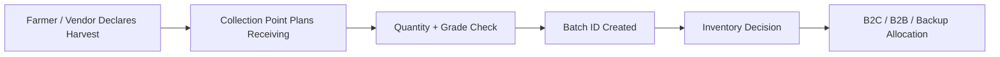
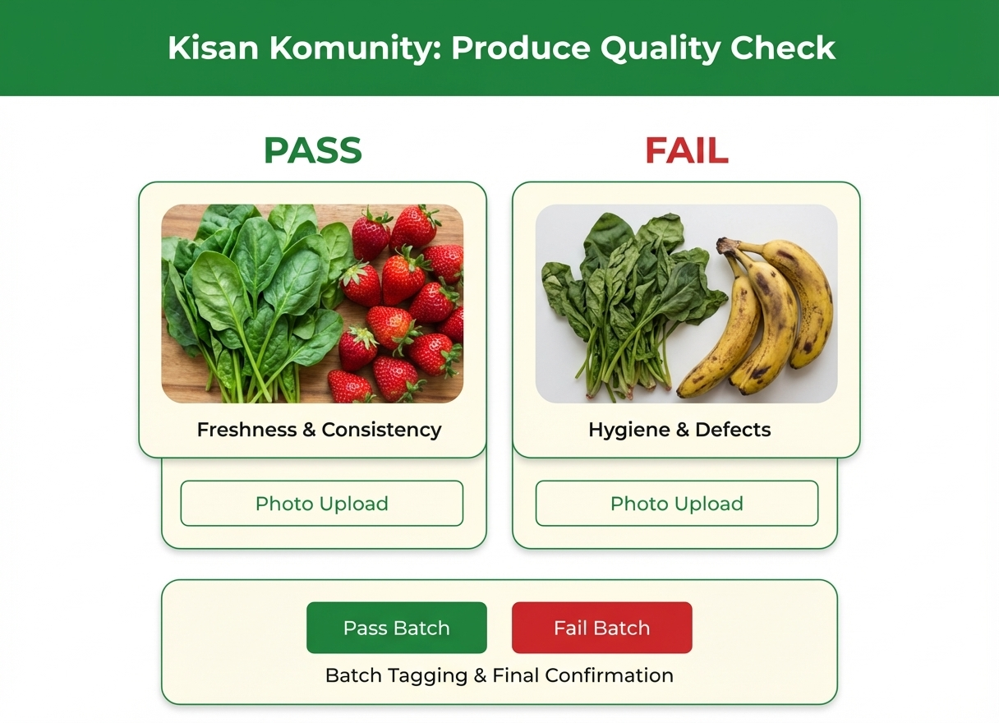
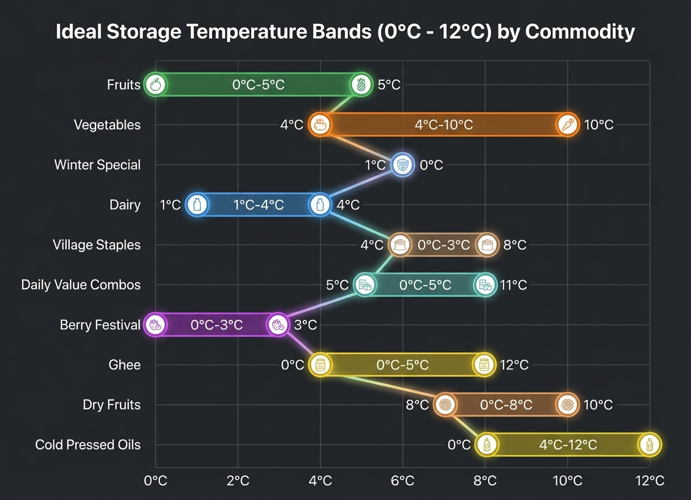
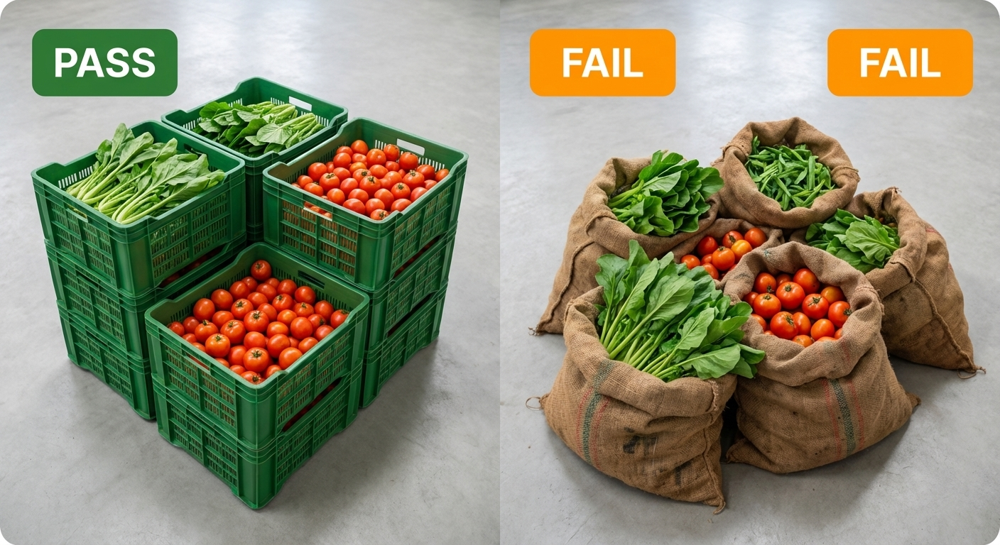
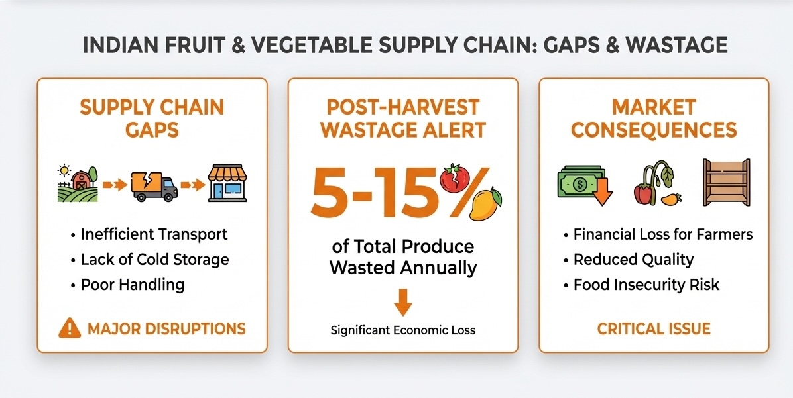
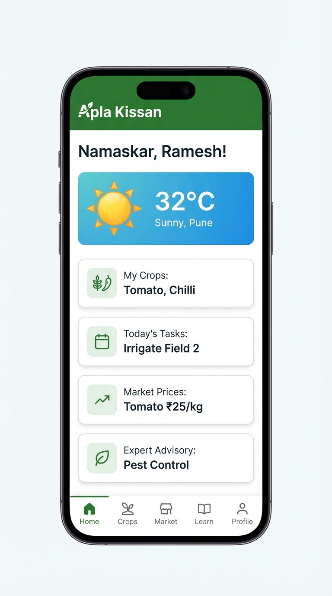

# 🧾 Aapla Kisan SOP & Operations Design

### Fresh Produce Standard Operating Procedure Framework

A public-safe operations design document for managing sourcing, harvest declaration, quality checks, collection-center handling, dark-store operations, cold-chain discipline, dispatch control, wastage reduction, and KPI-led governance.

 

---

  

---

## 🧭 Executive View

Fresh produce operations fail when quality, storage, dispatch, and procurement decisions depend only on individual judgment.

Aapla Kisan uses SOP-led operations so that the pilot can run with repeatable workflows, measurable controls, and clear decision ownership.

The operating model connects:

- 🌾 Farmers / vendors
- 🧺 Collection points
- ✅ Quality gates
- 🏬 Hub / dark store
- 📦 Inventory and packing
- 🚚 B2C and B2B dispatch
- 📊 KPI dashboard and weekly review rhythm

The goal is not only to move produce faster. The stronger goal is to build an operating system that protects **freshness, trust, price stability, fulfilment accuracy, and wastage control**.

---

# 1. 🧠 SOP Philosophy

SOPs matter because fresh produce has a short decision window. A delay in sourcing, grading, storage, or dispatch can quickly create quality loss, customer complaints, and margin leakage.

| SOP Principle | Meaning for Aapla Kisan |
|---|---|
| **Freshness First** | Every process should protect quality and shelf life |
| **Grade Before Movement** | Produce should be accepted, rejected, or redirected early |
| **Record Every Batch** | Batch-level visibility improves traceability and accountability |
| **Plan Before Buying** | Procurement should be linked to demand, not guesswork |
| **Move Fast, Review Daily** | Fresh categories need daily operational review |
| **Escalate Exceptions** | Stockouts, quality issues, and delays should trigger action quickly |
| **Measure Weekly** | KPI rhythm should drive continuous improvement |

---

## SOP Design Objectives

| Objective | Operating Outcome |
|---|---|
| Reduce wastage | Better procurement, FEFO/FIFO discipline, and markdown rules |
| Improve quality | Grade-based acceptance and rejection at quality gates |
| Improve fulfilment | Clear picking, packing, dispatch, and handover routines |
| Improve supplier reliability | Harvest declaration and supplier score tracking |
| Improve B2B consistency | Scheduled dispatch and recurring-order fulfilment |
| Improve governance | Daily checks, weekly reviews, and ownership clarity |

---

# 2. 🌾 Sourcing & Harvest Protocols

Aapla Kisan should avoid dependency on a single sourcing channel. The SOP model uses a blended sourcing structure.

| Sourcing Lane | Use Case | Operating Control |
|---|---|---|
| **Direct / Registered Farmers** | Short shelf-life, local, seasonal, high-freshness produce | Harvest declaration, quality grade, supplier reliability score |
| **Bulk / Stable Source** | Predictable high-demand staples | Rate-card, buying calendar, days-of-cover tracking |
| **Mandi / Vendor Bridge** | Early-stage backup and demand gap-fill | Market reference, quality comparison, price variance tracking |

> Pilot assumption: Direct/registered sourcing should be prioritized wherever reliability is available. Mandi/vendor bridge should remain a controlled backup, not the long-term dependency.

---

## Harvest Declaration SOP

Before produce reaches the collection point, farmers/vendors should declare supply visibility.

| Field | Purpose |
|---|---|
| Produce type | Identifies category and storage requirement |
| Expected quantity | Helps procurement and demand allocation |
| Harvest date/time | Supports freshness and dispatch planning |
| Expected arrival time | Helps collection center staffing |
| Grade expectation | Helps plan B2C/B2B allocation |
| Supplier ID | Links batch to farmer/vendor record |
| Location / pickup point | Supports logistics planning |

---

# 3. 🧺 Collection Center SOP

Collection centers act as the first operational checkpoint between supplier and hub.

  

## Collection Center Daily Flow

| Step | Activity | Output |
|---|---|---|
| 1 | Supplier arrival check | Supplier verified |
| 2 | Produce weighing | Actual quantity recorded |
| 3 | Visual inspection | Obvious defects identified |
| 4 | Grade assignment | Grade A / B / C / Reject |
| 5 | Photo proof | Acceptance/rejection evidence |
| 6 | Batch tagging | Batch ID generated |
| 7 | Dispatch to hub | Hub receives structured inbound data |

---

## Collection Center Checklist

- [ ] Supplier ID verified
- [ ] Harvest declaration matched with actual quantity
- [ ] Produce weighed and recorded
- [ ] Visual QC completed
- [ ] Grade assigned
- [ ] Rejected items documented
- [ ] Batch ID tagged
- [ ] Crates labelled
- [ ] Dispatch note created
- [ ] Hub informed of inbound movement

---

# 4. ✅ Quality Gate Operations

Quality checks should happen at three points:

| Quality Gate | Location | Purpose |
|---|---|---|
| **QC Gate 1** | Collection point | Prevent poor produce from entering the system |
| **QC Gate 2** | Hub / dark store receiving | Confirm quantity and freshness after movement |
| **QC Gate 3** | Packing / dispatch | Prevent customer-facing quality failures |

---

  

## Grade-Based Acceptance Model

| Grade | Meaning | Recommended Use |
|---|---|---|
| ✅ **Grade A** | Premium fresh produce, clean, low defects | B2C premium / high-trust orders |
| 🟢 **Grade B** | Standard saleable quality | Regular B2C and B2B supply |
| 🟡 **Grade C** | Usable but lower visual quality | Cooking-grade B2B, bundles, markdown |
| 🔴 **Rejected** | Spoiled, damaged, unsafe, or below standard | Reject / return / document |

---

## QC Evidence Requirements

| Evidence Type | Why It Matters |
|---|---|
| Photos | Supports dispute handling and supplier feedback |
| Batch ID | Connects supplier, quality, inventory, and order data |
| Quantity record | Tracks declared vs actual supply |
| Rejection reason | Helps supplier training and future sourcing decisions |
| QC timestamp | Helps freshness and SLA review |

---

# 5. ❄️ Cold Chain & Freshness Management

Fresh produce handling should follow category-wise storage discipline. Not every product needs the same temperature, but the process should define clear handling expectations.

  

## Cold Chain SOP Reference

| Control Area | Recommended Operating Rule |
|---|---|
| Temperature discipline | Maintain category-appropriate range; pilot reference: 0–12°C where applicable |
| Humidity discipline | Maintain suitable humidity for leafy/fresh categories; reference: 80–95% where applicable |
| Transit exposure | Reduce open-air exposure during loading/unloading |
| Crate handling | Avoid over-stacking and compression damage |
| Category segregation | Keep leafy, wet, dry, fragile, and bulk items separated |
| Time sensitivity | Prioritize short shelf-life items in picking and dispatch |

---

## Crate Handling SOP

  

| Rule | Reason |
|---|---|
| Do not overload crates | Prevents bruising and compression |
| Keep fragile items separate | Reduces physical damage |
| Label crates by batch | Improves traceability |
| Keep rejected stock separate | Prevents mixing and disputes |
| Follow FEFO movement | Prevents older stock from remaining unsold |

---

# 6. 🏬 Dark Store Daily Rhythm

Dark store operations should follow a predictable daily rhythm from inbound receiving to end-of-day review.

  

## Daily Operating Flow

---

## Dark Store Operating Checklist

| Time / Stage | Activity | Owner |
|---|---|---|
| Opening | Review pending orders, low stock, ageing stock | Hub Manager |
| Inbound | Receive stock and confirm batch quantity | Receiving Staff |
| QC | Confirm grade and rejection status | QC Staff |
| Inventory | Update available stock and location bins | Inventory Staff |
| Picking | Pick according to picklist and FEFO/FIFO | Picker |
| Packing | Verify SKU, quantity, grade, and packaging | Packing Staff |
| Dispatch | Assign rider / route / B2B schedule | Dispatch Coordinator |
| EOD | Review wastage, stockouts, delays, complaints | Hub Manager + Ops Lead |

---

# 7. 📦 Picking, Packing & Dispatch SOP

## Picking SOP

| Step | Action |
|---|---|
| 1 | Open active order queue |
| 2 | Generate picklist by priority and delivery slot |
| 3 | Pick by SKU location/bin |
| 4 | Follow FEFO/FIFO for perishable items |
| 5 | Mark item picked or exception |
| 6 | Escalate shortage or quality issue |

---

## Packing SOP

| Step | Action |
|---|---|
| 1 | Verify picked items against order |
| 2 | Recheck freshness and physical condition |
| 3 | Pack fragile and leafy products separately |
| 4 | Add batch/order label |
| 5 | Seal package |
| 6 | Move to dispatch queue |

---

## Dispatch SOP

| Dispatch Type | Control Rule |
|---|---|
| B2C same-day | Prioritize by delivery slot and SLA |
| B2C next-day | Batch by zone and route |
| B2B standing order | Confirm quantity, invoice/record, and scheduled handover |
| Urgent exception | Require admin/ops approval if stock or SLA is affected |

---

# 8. 📉 Wastage Control Discipline

Wastage should be treated as a measurable operating metric, not as an unavoidable cost.

  

## Wastage Control Rules

| Rule | Operating Meaning |
|---|---|
| **FEFO** | First Expiry / Freshness Out for short shelf-life items |
| **FIFO** | First In First Out for regular stock rotation |
| **Daily ageing review** | Identify slow-moving stock early |
| **Markdown policy** | Discount or bundle near-expiry usable stock |
| **B2B redirection** | Move Grade B/C usable stock to cooking-grade B2B demand |
| **Shrinkage tracking** | Track spoilage, handling loss, missing stock, and rejection |
| **Root-cause tagging** | Mark wastage reason: over-buying, delay, quality, storage, demand gap |

---

## Wastage Decision Matrix

| Situation | Recommended Action |
|---|---|
| High stock + low demand | Bundle, markdown, reduce next procurement |
| High rejection at hub | Review collection QC and supplier handling |
| High wastage in leafy items | Reduce buying window, increase pre-booking |
| Frequent stockouts | Increase buffer or add supplier lane |
| B2B grade mismatch | Define cooking-grade vs premium-grade SKU logic |

---

# 9. 🚨 Exception Handling SOP

Fresh produce operations need quick exception handling because delays can reduce value.

| Exception | Trigger | Action |
|---|---|---|
| Stockout | Ordered SKU unavailable | Substitute, cancel item, or escalate |
| Quality failure | Item below dispatch quality | Replace from stock or reject |
| Supplier short supply | Declared quantity not delivered | Update supplier score and sourcing plan |
| Delivery delay | SLA breach risk | Route escalation and customer update |
| B2B order mismatch | Quantity/grade issue | Confirm replacement or revised fulfilment |
| Payment/payout dispute | Supplier raises mismatch | Use batch record, photos, quantity log |

---

# 10. 📊 KPI Review Rhythm

Operations should be reviewed daily, weekly, and monthly.

  

## Daily Ops Check

| Metric | Why It Matters |
|---|---|
| Pending orders | Tracks fulfilment load |
| Stockouts | Shows procurement/inventory gaps |
| Rejections | Shows quality issue volume |
| Delayed orders | Tracks SLA risk |
| Complaints | Shows customer experience issues |
| Wastage today | Captures avoidable loss quickly |

---

## Weekly KPI Review

| KPI Category | Metrics |
|---|---|
| Demand | Total orders, repeat orders, B2B order frequency |
| Supply | Declared vs actual supply, supplier reliability |
| Quality | Accepted stock %, rejected stock %, complaint rate |
| Inventory | Days of cover, stockouts, wastage %, shrinkage |
| Operations | Picking time, packing time, fulfilment rate |
| Delivery | On-time delivery, delayed delivery, failed delivery |
| Finance | Procurement variance, delivery cost/order, margin view |

---

## Escalation Triggers

| Trigger | Escalation Owner |
|---|---|
| Wastage crosses target range | Ops Lead + Procurement Owner |
| Stockout repeats for same SKU | Inventory Owner + Supplier Manager |
| Supplier reliability drops | Procurement Owner |
| Complaint rate increases | Customer Support + QC Owner |
| B2B fulfilment failure | Ops Lead + Account Owner |
| Price variance increases | Procurement + Finance Owner |

---

# 11. 🧑‍💼 Role Ownership Matrix

| Role | Core Responsibility |
|---|---|
| Farmer / Vendor | Declare harvest, quantity, quality expectation, delivery readiness |
| Collection Agent | Verify, grade, record, tag, and dispatch accepted stock |
| QC Staff | Accept/reject stock based on quality rules |
| Inventory Staff | Update stock, bin location, ageing, and stock adjustments |
| Picker | Pick products as per order and FEFO/FIFO |
| Packing Staff | Verify, pack, label, and move to dispatch |
| Dispatch Coordinator | Assign route, rider, B2B schedule, and handover |
| Admin / Ops Lead | Monitor dashboard, approve exceptions, review KPIs |

---

# 12. 🧪 Pilot Readiness Checklist

Before live pilot, the following should be ready:

- [ ] Supplier onboarding fields finalized
- [ ] Harvest declaration format finalized
- [ ] Collection point SOP documented
- [ ] Grade A/B/C/reject criteria finalized
- [ ] Batch ID and proof capture process defined
- [ ] Crate handling rules shared
- [ ] Dark store receiving SOP ready
- [ ] Picking and packing checklist ready
- [ ] Dispatch and handover process ready
- [ ] Stockout exception workflow ready
- [ ] Replacement/refund support workflow ready
- [ ] Daily ops dashboard format ready
- [ ] Weekly KPI review format ready
- [ ] Risk register and escalation owners assigned

---

# 13. 🧠 Consultant View

Aapla Kisan’s operational advantage should come from **discipline**, not just technology.

The strongest pilot will be the one that can prove:

- Supply can be declared before movement
- Produce can be graded before allocation
- Inventory can be controlled before wastage happens
- Orders can be fulfilled through a predictable dark-store routine
- B2B and B2C demand can be served together
- Weekly KPIs can improve decisions over time

The product should therefore be built around operating discipline first, and technology should support that discipline.

---

# 14. 🏆 Skills Demonstrated

| Skill Area | Demonstrated Through |
|---|---|
| **Operations Planning** | Collection center, QC, dark store, dispatch, and EOD review design |
| **SOP Design** | Step-by-step processes, checklists, exception rules, and escalation triggers |
| **Supply Chain Thinking** | Sourcing lanes, harvest declaration, grading, hub movement, and delivery flow |
| **Quality Governance** | Grade A/B/C/reject logic, batch records, and QC gates |
| **Inventory Management** | FEFO/FIFO, stock ageing, stockouts, shrinkage, and wastage control |
| **Pilot Execution** | Readiness checklist, review cadence, and role ownership matrix |
| **Analytics Thinking** | KPI rhythm, dashboard metrics, and performance-based decision-making |

---

# 📝 Public Portfolio Note

This document is a public-safe SOP and operations design framework created for portfolio presentation.

Client-specific names, private budgets, payment terms, commercial proposal details, and confidential implementation terms have been removed or generalized.

---

### Built as a proof-of-work operations design document for fresh supply chain execution, SOP planning, pilot readiness, and KPI-led governance.

