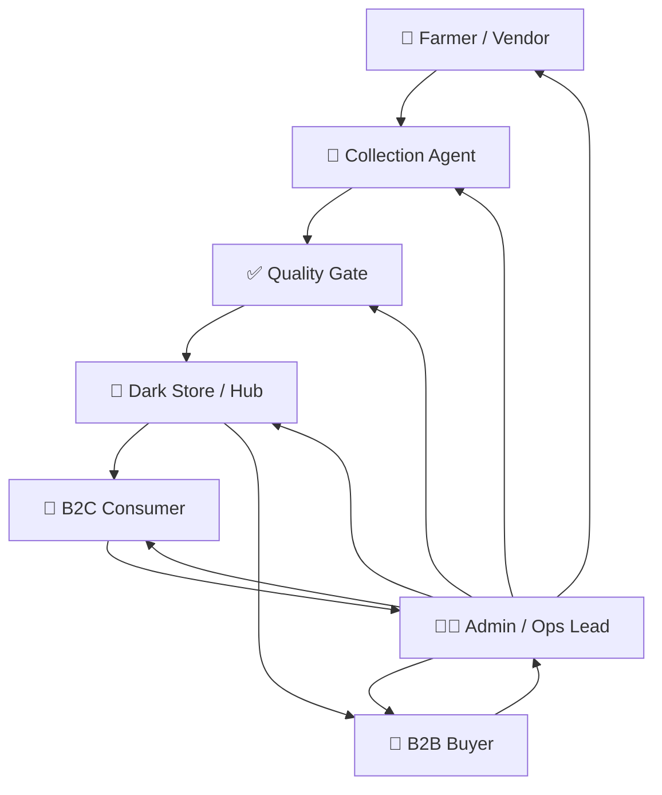
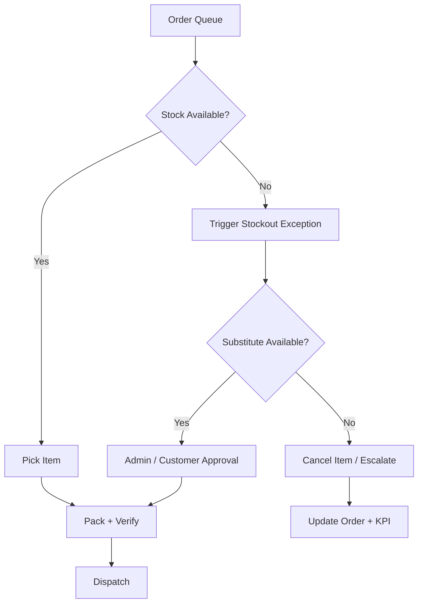
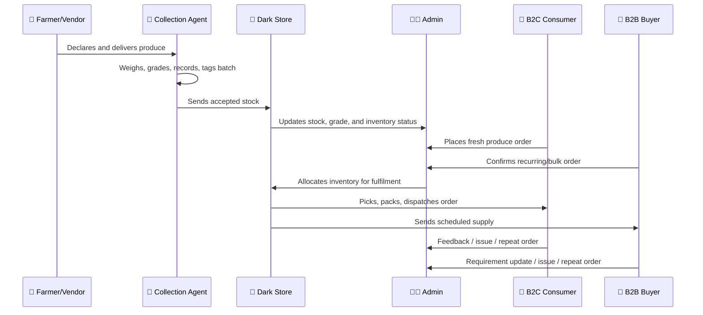
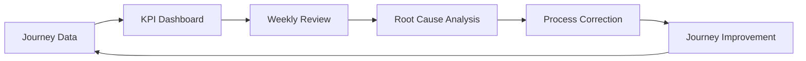

# 🗺️ Aapla Kisan Stakeholder Journey Maps

### Role-Based Journey Design for a Fresh Produce Operating System

A public-safe journey mapping document that explains how farmers, vendors, consumers, B2B buyers, collection agents, dark-store teams, and admin teams interact across the Aapla Kisan fresh supply chain model.

 

---

  

---

## 🧭 Executive View

Aapla Kisan is not a single-user app. It is a multi-stakeholder operating system where every role affects the next role in the supply chain.

A poor farmer onboarding flow can reduce supply visibility. A weak collection process can reduce quality. A delayed dark-store operation can damage customer trust. A weak admin dashboard can delay decisions.

This document maps the journeys of the core stakeholders so the product and operations model can be designed around real workflows, not only screens.

---

# 1. 👥 Stakeholder Ecosystem

Aapla Kisan has seven major stakeholder groups.

| Stakeholder | Primary Goal | Platform Role |
|---|---|---|
| 🌾 **Farmer / Producer** | Get stable demand, fair price, and transparent payment | Declares harvest, supplies produce, receives payout |
| 🧺 **Vendor / Merchant** | Sell available stock through a structured channel | Lists products, updates stock, fulfils supply requests |
| 📍 **Collection Agent** | Verify, grade, record, and move produce | First operational checkpoint |
| 🏬 **Dark Store / Hub Team** | Receive, store, pick, pack, dispatch, and control inventory | Fulfilment and inventory execution layer |
| 🧺 **B2C Consumer** | Buy fresh produce with trust and convenience | Orders fresh produce and tracks delivery |
| 🏪 **B2B Buyer** | Get reliable recurring supply at stable quality and pricing | Places scheduled or bulk orders |
| 🧑‍💼 **Admin / Operations Lead** | Monitor users, pricing, inventory, orders, issues, and KPIs | Governance and decision-control layer |

---

## Stakeholder Relationship Map

---

# 2. 🌾 Farmer / Producer Journey

  

## Journey Objective

The farmer journey should build trust, reduce uncertainty, and make participation simple.

The farmer should understand:

- How to register
- What information is required
- How produce is accepted or rejected
- How price is calculated
- When payment will happen
- How future supply can be declared

---

## Farmer Journey Map

| Stage | Farmer Action | Platform / Ops Response | Success Signal |
|---|---|---|---|
| Awareness | Learns about Aapla Kisan through agent/community/channel | Explains benefits, payment, quality, and process | Farmer shows interest |
| Registration | Shares basic details, location, produce type, KYC, bank details | Admin verifies and approves | Farmer profile approved |
| Supply Declaration | Declares crop, quantity, harvest date, delivery timing | System records expected supply | Supply visibility created |
| Collection | Delivers produce to collection point | Agent weighs, grades, records, tags batch | Quantity and grade confirmed |
| Acceptance / Rejection | Receives grade and acceptance status | System stores QC proof and reason | Dispute risk reduced |
| Payout | Receives payment as per cycle | Admin/payment record updated | Farmer trust improves |
| Repeat Supply | Declares next harvest cycle | Reliability score improves over time | Supplier retention improves |

---

## Farmer Pain Points and Product Responses

| Pain Point | Product / Ops Response |
|---|---|
| Unclear pricing | Show rate-card, grade logic, and payment cycle |
| Fear of delayed payment | Payout summary and transparent status |
| Rejection disputes | Photo proof, QC reason, batch record |
| Low digital comfort | Simple mobile-first flow and local language support |
| Uncertain demand | Harvest declaration and pre-booking demand visibility |

---

# 3. 🧺 Vendor / Merchant Journey

## Journey Objective

Vendors or merchants help stabilize supply during early pilot months and fill stock gaps when direct farmer supply is inconsistent.

| Stage | Vendor Action | Platform / Ops Response | Success Signal |
|---|---|---|---|
| Onboarding | Registers business and product category | Admin verifies and approves | Vendor activated |
| Product Listing | Adds available produce and expected price | Platform creates sellable SKU record | Stock becomes visible |
| Stock Update | Updates available quantity | Admin/dark store sees supply availability | Procurement planning improves |
| Order Request | Receives supply request | Vendor confirms quantity and timing | Fulfilment risk reduced |
| Handover | Sends/delivers stock to collection/hub | QC and quantity check completed | Stock accepted |
| Payment | Receives payout as per agreed cycle | Payout record updated | Vendor trust improves |

---

# 4. 📍 Collection Agent Journey

  

## Journey Objective

The collection agent is the first execution checkpoint. This role protects quality, accuracy, and trust before produce reaches the hub.

---

## Collection Agent Journey Map

| Stage | Agent Action | System / Process Support | Output |
|---|---|---|---|
| Start of Day | Reviews expected supplier arrivals | Harvest declaration list | Collection readiness |
| Supplier Arrival | Verifies farmer/vendor identity | Supplier profile and ID | Supplier matched |
| Quantity Check | Weighs actual produce | Quantity entry field | Declared vs actual record |
| Quality Check | Grades produce A/B/C/reject | QC checklist and photo proof | Grade assigned |
| Batch Creation | Tags accepted produce | Batch ID and crate label | Traceability created |
| Dispatch to Hub | Sends accepted batch to hub | Dispatch note and timestamp | Hub inbound visibility |
| End of Day | Reviews pending, rejected, and dispatched stock | Collection summary | Daily control |

---

## Collection Agent Critical Controls

- Supplier ID verification
- Weight and quantity capture
- Grade assignment
- Rejection reason capture
- Photo proof
- Batch ID tagging
- Crate labelling
- Dispatch note generation
- Escalation for mismatch or quality dispute

---

# 5. 🏬 Dark Store / Hub Team Journey

  

## Journey Objective

The dark store team converts accepted stock into fulfilled orders. This is the operational layer where inventory discipline, picking accuracy, packing quality, and dispatch speed are tested.

---

## Dark Store Journey Map

| Stage | Ops Team Action | System Support | KPI Impact |
|---|---|---|---|
| Inbound Receiving | Receives batch from collection/vendor | Inbound stock dashboard | Inventory accuracy |
| QC Confirmation | Confirms grade and condition | QC checklist and exception flag | Complaint reduction |
| Storage | Stores by category, grade, and shelf life | Inventory location/bin | Wastage control |
| Order Queue Review | Reviews B2C and B2B orders | Order dashboard | Fulfilment planning |
| Picking | Picks items from inventory | Picklist | Picking time / accuracy |
| Packing | Verifies SKU, quantity, and freshness | Packing checklist | Customer satisfaction |
| Dispatch | Assigns rider or B2B schedule | Dispatch queue | SLA performance |
| EOD Review | Reviews wastage, stockouts, delays | KPI dashboard | Continuous improvement |

---

## Dark Store Exception Journey

---

# 6. 🧺 B2C Consumer Journey

  

## Journey Objective

The consumer journey should make fresh produce ordering simple, trustworthy, and repeatable.

Customers should feel that Aapla Kisan provides:

- Freshness
- Clear pricing
- Easy ordering
- Delivery visibility
- Quality confidence
- Local farmer connection

---

## Consumer Journey Map

| Stage | Consumer Action | Platform Response | Trust Signal |
|---|---|---|---|
| Discovery | Opens app / landing page | Shows fresh categories, offers, location | Clear first impression |
| Language & Location | Selects language and area | Shows available delivery zone | Local relevance |
| Browse | Views product categories and SKUs | Shows price, unit, image, freshness cues | Product clarity |
| Cart | Adds products and reviews quantity | Shows total and delivery option | Price transparency |
| Checkout | Selects delivery slot and confirms order | Order confirmation generated | Confidence |
| Tracking | Tracks order status | Live status / dispatch update | Reliability |
| Delivery | Receives order | Quality and quantity expected | Satisfaction |
| Feedback / Repeat | Rates, complains, or reorders | Support or repeat-order option | Retention |

---

## Consumer Experience Surfaces

  

| Surface | Purpose |
|---|---|
| Landing Page | Builds trust and communicates freshness |
| Product Listing | Shows item, unit, grade/quality cue, and price |
| Cart | Helps confirm quantity and cost |
| Delivery Slot | Supports planned fulfilment |
| Tracking | Reduces anxiety and support load |
| Order History | Supports repeat purchase |
| Support | Handles replacement/refund/complaint flow |

---

# 7. 🏪 B2B Buyer Journey

## Journey Objective

B2B buyers need reliability more than app experience. Their journey should focus on recurring supply, quality grade, delivery schedule, and predictable pricing.

---

## B2B Buyer Journey Map

| Stage | B2B Buyer Action | Platform / Ops Response | Business Value |
|---|---|---|---|
| Discovery | Learns about recurring supply model | Sales/admin explains rate-card and quality grades | Buyer interest |
| Requirement Capture | Shares daily/weekly produce needs | Admin captures SKU, quantity, timing, grade | Demand visibility |
| Rate Card Agreement | Reviews pricing and terms | Platform maps rate cycle and volume slabs | Price predictability |
| Standing Order | Places recurring order | Admin/dark store schedules fulfilment | Demand stability |
| Dispatch | Receives scheduled supply | Hub batches and dispatches order | Operational consistency |
| Issue Handling | Reports quality/quantity mismatch | Support/QC resolves with batch record | Trust retention |
| Review | Adjusts volume or SKU list | Rate-card and supply plan updated | Long-term relationship |

---

  

## B2B Journey Design Notes

| Requirement | Design Direction |
|---|---|
| Recurring orders | Standing order templates |
| Quality preference | Grade-based catalogue |
| Bulk quantity | Volume slabs and scheduled supply |
| Fast communication | WhatsApp-first or admin-assisted flow in pilot |
| Invoice/records | B2B order logs and downloadable records |
| Reliability | SLA and issue-resolution tracking |

---

# 8. 🧑‍💼 Admin / Operations Lead Journey

  

## Journey Objective

The admin journey is the governance layer of Aapla Kisan. Admin users need visibility, approvals, exception handling, pricing control, and KPI tracking.

---

## Admin Journey Map

| Stage | Admin Action | System Support | Outcome |
|---|---|---|---|
| Start of Day | Reviews dashboard | Orders, stockouts, low stock, supplier updates | Daily control |
| Approvals | Reviews farmer/vendor/customer records | Approval queue | Clean user base |
| Product Control | Updates SKUs, categories, prices | Product/pricing module | Catalogue accuracy |
| Order Monitoring | Tracks B2C and B2B orders | Orders overview | SLA monitoring |
| Exception Handling | Resolves stockout, refund, complaint, supplier issue | Tickets / issue dashboard | Faster resolution |
| KPI Review | Reviews demand, supply, quality, inventory, finance | Reports dashboard | Decision support |
| Weekly Governance | Runs review with owners | KPI scorecard and risk register | Continuous improvement |

---

## Admin Decision Areas

| Decision Area | Examples |
|---|---|
| Supplier approval | Verify KYC, location, produce category, bank details |
| Product activation | Add/edit categories, SKUs, units, images, selling status |
| Pricing control | Rate-card, market reference, B2B slabs, pre-booking benefit |
| Inventory escalation | Stockouts, ageing stock, wastage, shrinkage |
| Customer issue resolution | Complaint, replacement, refund, delivery issue |
| B2B management | Standing orders, rate cards, scheduled dispatch |
| Pilot governance | KPI review, risk register, improvement actions |

---

# 9. 🔁 Cross-Stakeholder Journey Flow

This flow shows how each stakeholder depends on the previous step.

---

# 10. 📊 Journey-to-KPI Mapping

Each journey should be measured by clear KPIs.

| Journey | Primary KPIs |
|---|---|
| Farmer / Vendor | Registration completion, declared vs actual supply, payout issues, reliability score |
| Collection Agent | QC accuracy, rejection rate, batch tagging accuracy, dispatch timeliness |
| Dark Store | Picking time, packing accuracy, fulfilment rate, stockout frequency, wastage % |
| B2C Consumer | Orders, repeat orders, AOV, complaint rate, delivery satisfaction |
| B2B Buyer | Repeat order frequency, fulfilment consistency, quantity accuracy, retention |
| Admin / Ops Lead | Approval turnaround, issue resolution time, KPI review completion, price update accuracy |

---

## KPI Review Loop

---

# 11. ⚠️ Journey Risk Map

| Risk | Affected Journey | Control Mechanism |
|---|---|---|
| Farmer does not update supply | Farmer / Admin / Procurement | Harvest declaration reminder and supplier score |
| Agent grades incorrectly | Collection / QC / Customer | QC checklist, photo proof, training |
| Hub stock not updated | Dark Store / Admin / Customer | Inventory dashboard and batch scan/check |
| B2C order delayed | Consumer / Dispatch | Delivery slot planning and SLA alert |
| B2B quantity mismatch | B2B / Hub / Admin | Standing order template and packing verification |
| Pricing confusion | Farmer / Consumer / B2B | Rate-card display and pricing governance |
| Complaint not resolved | Consumer / Admin | Ticket workflow and escalation owner |

---

# 12. 🧪 Pilot Journey Testing Checklist

Before launch, each journey should be tested through a dry run.

- [ ] Farmer can register and declare harvest
- [ ] Vendor can list produce and update stock
- [ ] Agent can verify quantity and grade produce
- [ ] Batch ID and crate label can be created
- [ ] Hub can receive and update inventory
- [ ] Consumer can browse, order, and track delivery
- [ ] B2B buyer can place or confirm recurring order
- [ ] Admin can approve users, manage SKUs, update pricing, and monitor orders
- [ ] Dark store team can pick, pack, and dispatch orders
- [ ] Support team can record complaint/replacement/refund
- [ ] KPI dashboard can capture journey-level data

---

# 13. 🧠 Consultant View

The strength of Aapla Kisan depends on how well stakeholder journeys are connected.

A good app screen is useful, but a connected operating journey is more valuable.

The pilot should prove that:

- Farmers can supply with visibility
- Collection agents can grade with consistency
- Dark stores can fulfil with accuracy
- Consumers can trust quality and delivery
- B2B buyers can rely on scheduled supply
- Admin teams can control exceptions and KPIs

When all these journeys work together, Aapla Kisan becomes a repeatable fresh supply chain system instead of only a fresh produce ordering interface.

---

# 14. 🏆 Skills Demonstrated

| Skill Area | Demonstrated Through |
|---|---|
| **Product Strategy** | Role-based user journeys and platform ecosystem mapping |
| **Business Analysis** | Stakeholder goals, pain points, touchpoints, and KPI mapping |
| **UI/UX Thinking** | Consumer, farmer/vendor, admin, and dark-store journey clarity |
| **Operations Planning** | Collection, grading, storage, dispatch, and exception handling |
| **B2B Planning** | Standing orders, quality requirements, and scheduled supply journey |
| **Analytics Thinking** | Journey-to-KPI mapping and review loop design |
| **Consulting Documentation** | Public-safe, structured, recruiter/client-friendly case study writing |

---

# 📝 Public Portfolio Note

This document is a public-safe stakeholder journey mapping framework created for portfolio presentation.

Client-specific names, private budgets, payment terms, commercial proposal details, and confidential implementation terms have been removed or generalized.

---

### Built as a proof-of-work journey mapping document for product strategy, business analysis, UI/UX planning, operations design, and fresh supply chain execution.

